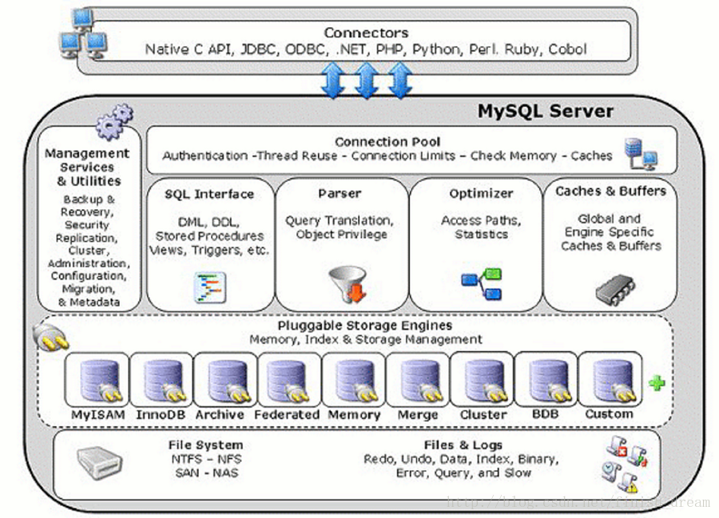
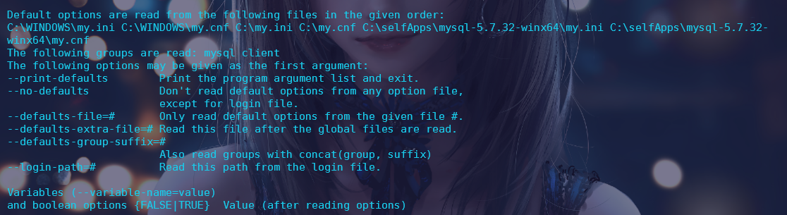
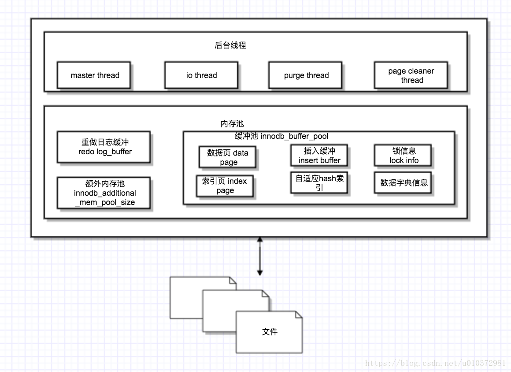
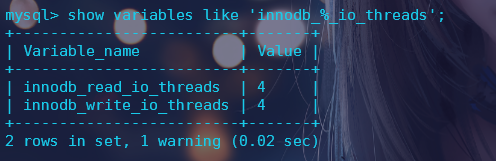
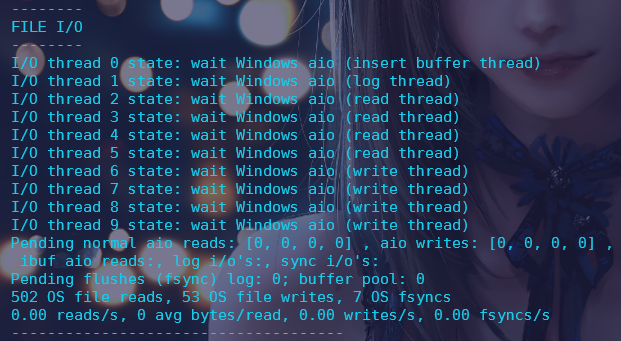

# InnoDB存储引擎

## 一、MySQL架构基础

### 1、MySQL存储体系结构



**两个概念：**

- **数据库实例**：数据库实例是位于用户与操作系统之间的一层数据管理软件，用户对数据库的任何操作(即对文件模型的操作)都是通过数据库实例来完成的。
- **数据库**：数据库是文件集合，是依照某种数据模型组织起来并存放于二级存储器中的数据集合。(一级存储器指计算机内存。二级存储器指计算机中除内存外的所有其它存储器)

从上图可以看出，MySQL的存储体系主要包含一下部分：

- 连接池组件：管理客户端连接
- 管理服务和工具组件：服务状态管理、提供备份与恢复、安全等工具管理
- sql接口组件：定义DML、DDL操作
- 解释器组件：查询语句解析
- 优化器组件：优化查询、分析查询
- 缓冲组件：提供存储引擎或全局的caches和buffers
- 插件式存储引擎
- 物理文件系统

**存储引擎是基于表，而不是基于数据库的。**所以创建表时才需要指定所用的存储引擎。

### 2、MySQL的连接方式

#### 2.1 TCP/IP

​	常用的连接方式。

```shell
 mysql -uroot -proot
```

#### 2.2命名管道和共享内存

#### 2.3Unix域套接字

```shell
mysql -uroot -S /tmp/mysql.sock
```

### 3.MySQL的配置文件

​	MySQL提供了配置文件的方式供用户以一种便捷的方式来指定设置一些常用选项。

```shell
#以mysql命令查看支持的配置文件位置及选项
mysql --help
```

例如，在Windows下执行上述命令后可以查看支持的配置文件读取位置：



MySQL支持的配置文件格式一般如下：

```
#定义client组，表示该组下的所有配置将被所有mysql客户端程序读取
[client]
#该端口配置代表客户端连接时使用的端口，若mysqld选项组下未配置端口的话，那么mysqld服务将使用该端口启动
port=3306
socket=/tmp/mysql.sock

#定义mysqld组，表示该组下的配置将只被mysqld服务读取
[mysqld]
#该选项组下配置的port选项将覆盖client选项组下的port选项(代表mysql服务使用该端口启动)
port=3306
socket=/tmp/mysql.sock
key_buffer_size=16M
max_allowed_packet=8M

[mysql]
#port=9999

[mysqldump]
quick
```

## 二.Innodb存储引擎

​	Innodb存储引擎的特点总的来说包含以下几点：行锁设计、支持MVCC、支持外键、一致性非锁定读等等。

### 1.Innodb体系架构



如图所示，Innodb存储引擎包含若干后台线程、重做日志缓冲以及多个内存块组成的内存池。其中：后台线程：负责刷新内存池中的数据，保证缓冲池中的数据是最近的数据；同时将已修改的数据刷新到磁盘。

​	Innodb存储引擎是多线程的模型，因此其维护多个不同的线程处理不同的任务。

#### 1.1 IO Thread

​	Innodb存储引擎中大量使用了AIO来处理IO请求，IO Thread主要用来处理这些IO请求的回调，这些IO Thread总共可分为4类：`write thread `、` read thread`、` insert buffer thread`、` log IO threacd`。

​	通过` innodb_read_io_threads`和` innodb_write_io_threads`参数可以调整read thread和write thread的个数。(两种io thread默认都是4个)

```mysql
-- 查看innodb中io thread的情况（其中\G控制打印格式，按列打印）
show engine innodb status\G;
-- 查看innodb存储引擎当前的read thread和write thread的个数
show variables like 'innodb_%_io_threads'\G;
```





**这两个thread参数不支持动态调整，需要把这两个参数写入my.cnf文件，重启MySQL才会生效。**

#### 1.2 Purge Thread

​	数据库事务提交后，此时重做日志(undolog)可能不再需要，此时就需要对已经分配的undo页进行回收。在Innodb1.1版本前该回收动作是由Master Thread来进行的，在Innodb版本1.1之后，可以通过单独的Purge Thread来回收，以此来减轻Master Thread的工作，避免阻塞Master Thread线程，从而提高CPU利用率以及提升存储引擎的性能。

```mysql
-- 查看当前innodb设置的purge threads的个数
show variables like 'innodb_purge_threads';
```


该参数调整需要在配置文件中进行调整。

#### 1.3 Page Cleaner Thread

​	Page Cleaner Thread是在innodb存储引擎1.2.x版本引入的。其作用是将之前脏页的刷新操作都放入到单独的线程中来进行。目的是为了减轻Master Thread的压力和减少对用户请求的阻塞。

#### 1.4Master Thread

​	Master Thread是Innodb存储引擎中一个非常核心的后台线程。其主要的作用是负责将缓冲池中的数据异步刷新到磁盘，保证数据的一致性，主要包括脏页的刷新、合并插入缓冲、undo页的回收等工作。

### 2.内存池

​	
