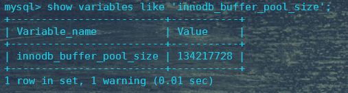
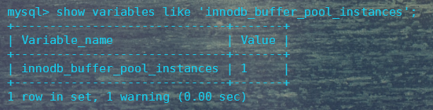
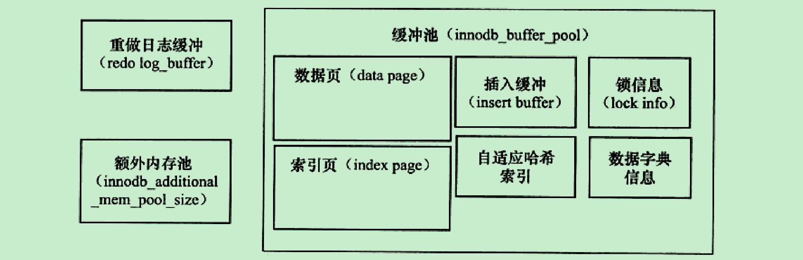
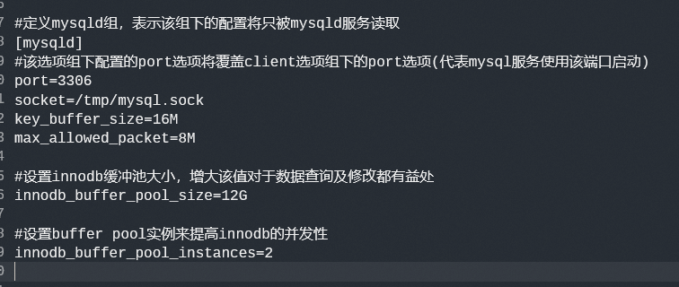
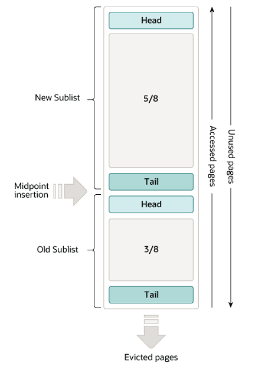
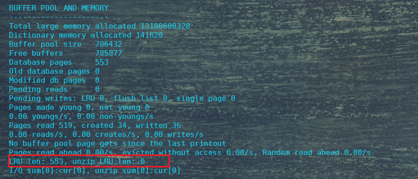

# InnoDB存储引擎

## (一)MySQL架构基础

### 1. MySQL存储体系结构


**两个概念：**

- **数据库实例**：数据库实例是位于用户与操作系统之间的一层数据管理软件，用户对数据库的任何操作(即对文件模型的操作)都是通过数据库实例来完成的。
- **数据库**：数据库是文件集合，是依照某种数据模型组织起来并存放于二级存储器中的数据集合。(一级存储器指计算机内存。二级存储器指计算机中除内存外的所有其它存储器)

从上图可以看出，MySQL的存储体系主要包含一下部分：

- 连接池组件：管理客户端连接
- 管理服务和工具组件：服务状态管理、提供备份与恢复、安全等工具管理
- sql接口组件：定义DML、DDL操作
- 解释器组件：查询语句解析
- 优化器组件：优化查询、分析查询
- 缓冲组件：提供存储引擎或全局的caches和buffers
- 插件式存储引擎
- 物理文件系统

**存储引擎是基于表，而不是基于数据库的。**所以创建表时才需要指定所用的存储引擎。

### 2. MySQL的连接方式

#### 2.1 TCP/IP

​	常用的连接方式。

```shell
 mysql -uroot -proot
```

#### 2.2 命名管道和共享内存

#### 2.3 Unix域套接字

```shell
mysql -uroot -S /tmp/mysql.sock
```

### 3. MySQL的配置文件

​	MySQL提供了配置文件的方式供用户以一种便捷的方式来指定设置一些常用选项。

```shell
#以mysql命令查看支持的配置文件位置及选项
mysql --help
```

例如，在Windows下执行上述命令后可以查看支持的配置文件读取位置：


MySQL支持的配置文件格式一般如下：

```
#定义client组，表示该组下的所有配置将被所有mysql客户端程序读取
[client]
#该端口配置代表客户端连接时使用的端口，若mysqld选项组下未配置端口的话，那么mysqld服务将使用该端口启动
port=3306
socket=/tmp/mysql.sock

#定义mysqld组，表示该组下的配置将只被mysqld服务读取
[mysqld]
#该选项组下配置的port选项将覆盖client选项组下的port选项(代表mysql服务使用该端口启动)
port=3306
socket=/tmp/mysql.sock
key_buffer_size=16M
max_allowed_packet=8M

[mysql]
#port=9999

[mysqldump]
quick
```

## (二)Innodb存储引擎

​	Innodb存储引擎的特点总的来说包含以下几点：行锁设计、支持MVCC、支持外键、一致性非锁定读等等。

### 1. Innodb体系架构


如图所示，Innodb存储引擎包含若干后台线程、重做日志缓冲以及多个内存块组成的内存池。其中：后台线程：负责刷新内存池中的数据，保证缓冲池中的数据是最近的数据；同时将已修改的数据刷新到磁盘。

​	Innodb存储引擎是多线程的模型，因此其维护多个不同的线程处理不同的任务。

#### 1.1 IO Thread

​	Innodb存储引擎中大量使用了AIO来处理IO请求，IO Thread主要用来处理这些IO请求的回调，这些IO Thread总共可分为4类：`write thread `、` read thread`、` insert buffer thread`、` log IO threacd`。

​	通过` innodb_read_io_threads`和` innodb_write_io_threads`参数可以调整read thread和write thread的个数。(两种io thread默认都是4个)

```mysql
-- 查看innodb中io thread的情况（其中\G控制打印格式，按列打印）
show engine innodb status\G;
-- 查看innodb存储引擎当前的read thread和write thread的个数
show variables like 'innodb_%_io_threads'\G;
```


**这两个thread参数不支持动态调整，需要把这两个参数写入my.cnf文件，重启MySQL才会生效。**

#### 1.2 Purge Thread

​	数据库事务提交后，此时重做日志(undolog)可能不再需要，此时就需要对已经分配的undo页进行回收。在Innodb1.1版本前该回收动作是由Master Thread来进行的，在Innodb版本1.1之后，可以通过单独的Purge Thread来回收，以此来减轻Master Thread的工作，避免阻塞Master Thread线程，从而提高CPU利用率以及提升存储引擎的性能。

```mysql
-- 查看当前innodb设置的purge threads的个数
show variables like 'innodb_purge_threads';
```


该参数调整需要在配置文件中进行调整。

#### 1.3 Page Cleaner Thread

​	Page Cleaner Thread是在innodb存储引擎1.2.x版本引入的。其作用是将之前脏页的刷新操作都放入到单独的线程中来进行。目的是为了减轻Master Thread的压力和减少对用户请求的阻塞。

#### 1.4 Master Thread

​	Master Thread是Innodb存储引擎中一个非常核心的后台线程。其主要的作用是负责将缓冲池中的数据异步刷新到磁盘，保证数据的一致性，主要包括脏页的刷新、合并插入缓冲、undo页的回收等工作。

​	Master Thread具有最高的线程优先级别。其内部由主循环(Loop)、后台循环(backgroud Loop)、刷新循环(flush Loop)、暂停循环(suspend Loop)组成，Master Thread会根据数据库运行状态在这四个循环之间进行切换。

##### 1.4.1 Loop

​	Loop被称为主循环，该循环中主要有两个操作：每秒钟操作和每十秒钟操作。

​	Loop循环中，每秒操作和每10秒操作的时间控制都是通过线程睡眠(thread sleep)来实现的。

​	Loop循环的每秒操作包括：

- **重做日志缓冲刷新到磁盘，即使这个事务还没有提交。(总是)**
- **合并插入缓冲。(可能)**
- **将缓冲池中的脏页刷新到磁盘。(可能)**
- **如果当前没有用户活动，则切换到后台线程。(可能)**

​     Loop循环的每十秒操作包括：

- **刷新100个脏页到磁盘(可能)；**

- **合并至多5个插入缓冲(总是)；**

- **将日志缓冲刷新到磁盘(总是)；**

- **删除无用的Undo页即full purge操作(总是)；**

- **刷新100个或者10个脏页到磁盘(总是)；**

  

### 2. 内存池

#### 2.1 缓冲池

​	在数据库系统中，缓冲池是位于磁盘与CPU之间的一块内存区域，用来弥补CPU速度与磁盘处理之间的速度差距。

​	在数据库读取数据页的过程中，首先将读取磁盘上的数据页，然后将数据页存放在内存中，称之为将页“FIX”在缓存中。当下次再读取数据页时，首先判断该页是否存在于缓冲池中，若在缓冲池中，称之为“该页在缓冲池中被命中”，此时直接读取该页即可，不需要再去磁盘上读取了。

​	而对于数据库数据的修改，通常是先修改缓存在缓冲池中的页，然后再以**checkpoint技术**刷新到磁盘上。

​	对于innodb存储引擎中，可以通过innodb_buffer_pool_size来设置缓冲池的大小。

```sql
#查看数据库innodb缓冲池大小
show variables like 'innodb_buffer_pool_size';
#查看数据库innodb缓冲池实例
 show variables like 'innodb_buffer_pool_instances';
```





innodb存储引擎的内存构成大致如下：



通过设置多个buffer pool 实例，每个实例占据总buffer pool size的一部分，每个buffer pool实例的构造都是相同的，都如上图的结构图所示。**分配多个buffer pool实例的目的是为了通过hash等方式将一些数据页均匀分散到不同的pool实例中，这样请求时根据hash关系即可访问特定的pool实例，而对其它pool实例完全没有影响，降低了数据库内部的资源竞争，提高了数据库的并发处理能力。**

```sql
#观察innodb中各buffer pool实例的情况
show engine innodb status;
```

如图所示，在配置文件中配置缓冲池大小和缓冲池实例的情况如下：



**注意，如果MySQL服务是以mysqld的方式启动的，则该两项配置都要放置在该mysqld配置组下才会生效。**

#### 2.2 LRU 、Free 、Flush列表

##### 2.2.1 LRU列表

​	缓冲池中存放的是各种类型的**数据页**，而innodb存储引擎是通过LRU算法来进行管理的(**只管理数据页，其它索引页等不是通过LRU管理的**)，即最频繁使用的页在LRU的前端、最少使用的页在LRU的尾端，当缓冲池不能存放新读取到的页时，将首先释放位于LRU尾端的页。

​	**innodb存储引擎中，存放的页的默认大小为16KB**.

​	在innodb存储引擎中，在传统LRU算法上进行了优化，加入了midpoint位置的概念。**即新读取到的页，并不是直接存放到LRU列表的首部，而是放入到LRU列表的midpoint位置，即midpoint insertion strategy算法。**在默认位置下，该位置在LRU列表长度的5/8处。

​	所以，innodb引擎操作数据的逻辑是：

1. 在操作数据库进行查询或修改数据时，首先innodb存储引擎按页读取数据到缓冲池中；
2. 然后将该数据页存放入LRU列表的5/8位置也即尾部的3/8位置(实际默认的位置是尾部的37%位置)；
3. 然后此时即可对该数据页进行操作了。

如图所示：



​	当页从LRU列表的old区移入到LRU列表young区的操作，被称为page made young；当因为innodb_old_blocks_time的设置而导致页没有被移入到young区的操作，被称为page not made young。

**为什么是LRU列表尾部的37%位置？**

**为什么不采用传统LRU算法？**

​	这是因为，如果采用传统的LRU算法，那么新读取的页将直接插入到LRU列表的头部，如果一次读取的页很多，那么势必将之前的页会挤出LRU列表，而在真实的使用场景中，使用mysqldump或者进行了全表扫描，就会发生这种情况，而这些操作显而易见都是一些低频操作，访问的数据参差不齐，在传统LRU算法的情况下，原先列表中所有的高频数据都将被清除出列表；而在改进后的LRU算法下，即使进行了全表扫描，新读取的页也只会存放在LRU列表尾部3/8处，影响的也只是原先的低频数据，并不会对LRU列表头部的高频数据产生影响。

Innodb存储引擎提供了两个参数供用户根据实际情况来配置LRU列表的热点数据与低频数据管理：

```sql
#innodb_old_blocks_pct用来配置LRU列表热端数据与冷端数据的分界线，即midpoint位置
show variables like 'innodb_old_blocks_pct';
#增大LRU热端长度，用于预估热点数据大于默认的63%时
set global innodb_old_blocks_pct=20;

#innodb_old_blocks_time用来配置新读取的页插入到midpoint位置后需要等待多长时间(毫秒)才能放到LRU热端
show variables like 'innodb_old_blocks_time';
#此种设置可以将新读取的页直接插入到LRU热端
set global innodb_old_blocks_time=0;
```

##### 2.2.2 unzip_LRU列表

​	Innodb除了支持以默认16KB大小管理页的方式，还支持对页进行压缩管理的方式。

​	Innodb支持将原本16KB的页压缩为1KB、2KB、4KB、8KB大小的页，这些压缩后的页的管理就不是通过LRU列表来管理了，而是通过unzip_LRU列表来管理的。

```sql
#查看unzip_LRU列表大小
show engine innodb status；
```



如上述方式即可查看unzip_LRU列表大小。

**注意，unzip_LRU列表是包含在LRU列表中的。**

unzip_LRU列表分配内存的方式如下(示例为从缓存中申请4KB大小的页)：

1. 检查4KB大小的unzip_LRU页，查看是否有空闲页存在；
2. 若有，则直接使用；
3. 若没有，则检查8KB大小的unzip_LRU列表，查看是否有空闲页；
4. 若有，则将一个8KB大小的页拆分为2个4KB大小的页，取其中一个使用；
5. 若没有，则从默认的LRU列表中取一个16KB大小的空闲页(可以是丢弃old区数据产生的空闲页)，拆分为1个8KB，2个4KB页供使用。

所以，**Innodb存储引擎管理压缩页的方式是通过unzip_LRU列表分别管理不同大小的压缩页，然后通过伙伴算法进行内存的分配。**

伙伴算法是Linux下常用于分配内存的一种算法，其核心思想就是，分配内存时，优先查找比需求内存大的最低一级的内存，然后一分为二，一份给应用程序，一份留作己用；当释放内存时，即上面的逆过程，需要找两块地址连续、大小相同的内存，然后合二为一形成一块更大的内存，因为这两块内存就好像伙伴一样，故而叫伙伴算法。 

##### 2.2.3 Free列表

​	mysql中innodb存储引擎是以页的方式来管理缓冲池的，所以innodb存储引擎在预先启动的时候就将分配的innodb buffer pool按页进行了拆分。

​	在初始启动时，innodb的LRU列表是空的，即没有任何的页。此时所有的页都存在与Free列表中。

​	当加载数据到缓冲池需要空白页进行存放时，此时innodb存储引擎会先查看Free列表中是否有空闲页，若有，则从Free列表中移出一个页到缓冲池中；若没有空闲页，此时才会触发LRU列表淘汰old页的操作。

##### 2.2.4 Flush列表

​	**Flush列表为脏页(dirty page)列表。**

​	**脏页即LRU列表的的被修改过的页但又没被刷新到磁盘的页，即内存中与磁盘上不一致的页。**	

​	Flush列表中的页代表即将被刷新到磁盘上的脏页，数据库会在合适的时刻通过checkpoint技术将Flush列表中的页刷新会磁盘。

​	**注意：脏页既会存在于LRU列表中，也会存在于Flush列表中。因为即使是脏页，它也是数据页，存在于内存中时也需要LRU列表来管理；而Flush列表只是又另维护了一个需要刷新到磁盘上脏页的列表而已。**

##### 2.2.5 pool instance各项参数含义

​	基于上述说明，我们来看一下buffer pool中每个实例中所包含的含义：

```sql
show engine innodb status；

INDIVIDUAL BUFFER POOL INFO
----------------------
---BUFFER POOL 0				#标识实例是哪一个
Buffer pool size   393216		 #当前实例所分配到的内存大小，数值是代表页数，实际大小为 393216 * 16KB = 6g
Free buffers       392952		 #当前缓冲池实例中free列表大小，即还有392952个空闲页
Database pages     263			 #当前LRU列表中页的数量
Old database pages 0			 #当前LRU列表中old端页的数量
Modified db pages  0			 #当前Flush列表中脏页的数量
Pending reads      0			 #
Pending writes: LRU 0, flush list 0, single page 0
Pages made young 0, not young 0	  #表示LRU列表old区和young区数据的移动情况
0.00 youngs/s, 0.00 non-youngs/s  #表示每秒page made young及page not made young的次数
Pages read 229, created 34, written 36
0.00 reads/s, 0.00 creates/s, 0.00 writes/s
No buffer pool page gets since the last printout
Pages read ahead 0.00/s, evicted without access 0.00/s, Random read ahead 0.00/s
LRU len: 263, unzip_LRU len: 0	 #LRU列表中页数，被压缩列表中页的数量，前者包含了后者
I/O sum[0]:cur[0], unzip sum[0]:cur[0]
```

**Free buffers和Database pages之和可能不等于Buffer pool size大小。**因为Buffer pool size中的页还可能用于索引、哈希页等。

**在上述输出中，应该还有一个重要的观察指标Buffer pool hit rate，代表缓冲池的命中率。通常该值不应该小于95%，如果该值小于95%，很可能是由全表扫描导致LRU列表被污染了，即热点数据由于大表全表扫描被刷出了LRU列表，导致数据缓存命中率下降。**

#### 2.3 重做日志缓冲(redo log buffer)

​	重做日志缓冲不属于innodb缓冲池结构中。**其主要作用是用来记录重做日志信息(即数据页修改信息)的。**

​	innodb存储引擎在LRU列表中的页被修改了之后(产生了脏页)，并不会立即放入Flush列表，通过checkpoint技术书信到磁盘上。而是会先将修改信息以重做日志信息的方式存放到重做日志缓冲中，让后重做日志缓冲以一定频率刷新到磁盘上后，该页才会通过checkpoint技术从Flush列表中刷新到磁盘上。

```sql
#查看重做日志缓冲大小
show variables like 'innodb_log_buffer_size';
```

​	重做日志缓冲区的大小一般以M计数，通常情况下默认大小为8M或16M大小，该大小已满足一般应用使用，这是因为Innodb存储引擎对重做日志缓冲的刷新触发的条件基本不会使重做日志缓冲需要很大的缓存空间：

1. Master Thread每一秒将重做日志缓冲刷新到重做日志文件；
2. 每个事务提交时都会将重做日志缓冲刷新到重做日志文件；
3. 当重做日志缓冲池小于1/2时，重做日志缓冲刷新到重做日志文件。

#### 2.4 额外的内存池

​	在Innodb存储引擎中，内存的管理是通过一种内存堆的方式来进行管理的。

​	一些数据结构本身的内存分配，就是从这个额外的内存池中进行分配的，当该区域的内存不够时，此时就会向缓冲池申请了。

​	例如，分配了缓冲池，但是缓冲池实例本身的缓冲帧、缓冲控制对象(记录了LRU、锁、等待等信息)等都是从额外的缓存池分配内存的。

​	因此，在申请了很大的缓冲池内存时，也因考虑相应的增加这个值。

```sql
#查看额外的缓存池大小
show variables like 'innodb_additional_mem_pool_size';
#或者
show variables like '%pool_size%';
```

该额外内存大小Innodb并没有提供默认值，故而在实际应用中该值需结合实际情况自己设定。

### 3. checkpoint技术

​	当数据库发生DML操作，delete或者update数据时，缓冲池中的页即成了被修改的页，即**脏页**。

​	Innodb存储引擎会将缓冲中的脏页刷新到磁盘，为避免在刷新过程中，数据库发生宕机导致数据丢失，Innodb存储引擎会采用Whrite Ahead Log的策略，即当事务提交时，先写重做日志，再刷新到磁盘。

​	如果想不要发生脏页刷新磁盘这个操作，那么就需要满足：

- 缓冲池足够大，能缓存所有的数据
- 重做日志可以无限增长

满足上述两个条件，就可以保证在不刷新磁盘的情况下数据也不会丢失。但是实际上，由于内存、硬盘等硬件资源毕竟是有限的，而且用很大的重做日志来进行数据恢复也是需要花费很长时间的。

​	故而，处于缓冲池中的脏页数据必须要以一定的机制刷回到磁盘中，并且该机制还要兼顾以下几点：

- 减少通过重做日志恢复数据的时间
- 缓冲池是有限的，在缓冲池不够用时能触发刷新操作
- 重做日志文件也不可能无限增大(重做日志是循环使用的，当脏页被刷新到磁盘上后，这部分对应的重做日志就没用了，可以被覆盖写入，但如果当前重做日志文件已达极限，且没有可被覆写的地方了，此时重做日志不可用)，故重做日志不可用时要能刷新磁盘

这种技术即**checkpooint**技术。

​	在Innodb存储引擎中，checkpoint分为两种：

- sharp checkpoint ：在数据库即将关闭时，将所有的脏页全部checkpoint到磁盘上，这是默认的工作方式，即参数innodb_fast_shutdown=1;
- fuzzy checkpoint：每次刷新脏页时不是全部刷新，而是只刷新一部分脏页到磁盘，这是Innodb存储引擎内部使用的刷新方式。

  在Innodb存储引擎中，在以下几种情况下会发生fuzzy checkpoint：

- 


​	
