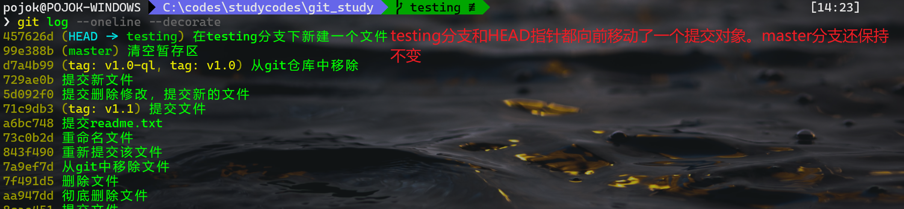
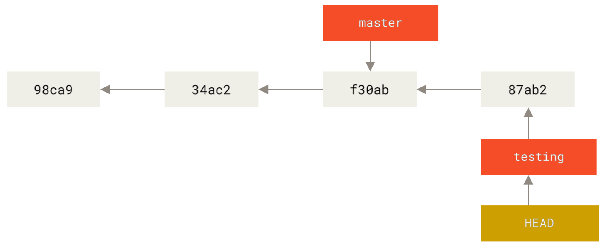

# git分支

## 1.分支简介

​	git保存的不是文件的变化或差异，而是一系列不同时刻的快照信息(git使用glob对象来保存快照信息)。

​	git的提交操作会被保存为一个提交对象，其内容包含：

- 包含一个指向暂存内容的指针

- 包含了提交的基本信息，如提交者的姓名、邮箱等

- 包含了一个指向父提交对象的指针(首次提交时没有该指针)

  在进行` git commit`提交操作时，git在内部帮我们做了这些事：

- 计算每个子目录的校验和，并将这些校验和保存为一个树对象

- 然后git创建一个本次提交的提交对象，然后有一个指针引指向上面的树对象

  所以，git仓库中一般存在5个对象：3个blob快照对象、一个树对象、一个commit提交对象。


如果是仓库的第一次提交，那么该提交对象没有指向父对象的指针。如果提交后做了一些修改然后继续提交，那么此时该提交对象就包含一个指向父对象的指针。


​	git的分支，本质上仅仅是指向提交对象的可变指针。

​	git的master分支和其它分支并无区别，仅仅只是git在默认的时候创建了它，并且很少有人去改动它的名称。而分支会随着每次提交操作版本的提升而向前移动。

​	

## 2.分支创建

​	git创建的分支其实就是在当前提交对象上创建了一个新的指针。

```powershell
#创建一个testing分支
git branch testing
```


git通过一个叫HEAD的指针来标识当前所处于的分支。


## 3.分支切换

​	切换分支使用` git checkout`命令。

```powershell
#切换分支到testing
git checkout testing
```

切换分支后，HEAD指针就指向当前所在的分支。

​	如果此时我们在当前分支想做一些修改，并进行提交，此时HEAD指针及当前testing分支都会向前移动指向新的提交对象，而此时master分支还指向原先的提交对象，我们做一下修改然后通过` git log --decorate`看一下。



此时git中的结构如图：



而如果此时切换回master分支，可以再通过`git log --decorate`来看一下。


因为testing分支指向的提交已经脱离了master主干，所以这里看不到testing分支上的提交信息，但是此时可以看到HEAD指针又指向了master分支，此时的结构为：


**注意：切换分支会导致工作目录中的文件被改变。如果是切换会一个较旧的分支，工作目录会恢复到该分支最后一次提交时的样子。**

如果此时在master分支上做一些修改并提交，此时的git结构为：


git结构出现了分叉，此时运用` checkout`命令可以在两个分支之间随意切换。

运用` git log --decorate --all --graph`命令可以帮我们分析此时git的指向结构：


由于git的分支实质上仅是包含所指提交对象的校验和(长度为40的SHA-1字符串)，所以它的创建和销毁都非常高效。创建一个分支就相当于在一个文件中写入41个字符串，40的校验和和1个换行符。

```powershell

#创建testing2分支并立即切换到该分支下
git checkout -b testing2
```


## 4.分支的新建与合并

​	模拟项目实际的问题，当开发进行时突然有一个紧急问题需要修补，此时git的处理流程应为：

1. 切换到线上分支；
2. 为这个紧急任务新建一个分支，并在其中修复它
3. 测试通过后，切换回线上分支，然后合并这个修复分支到主干上，然后将本地仓库推送到线上；
4. 切换回最初的工作继续


假设我们当前git仓库中有如上两个分支：其中master是主分支，testing是我们当前工作的分支。

```powershell
#首先我们先切换到master分支，然后针对提交的issue新开一个分支
#将当前master分支的内容切出一个iss53分支
git checkout -b iss53
```


此时，master分支和iss53分支维护的是同一个快照。

```powershell
#接下来，在iss53分支上做一些修改，并提交
#然后将iss53分支上的修改合并到master分支上
#首先切换回主分支上，然后使用git merge来将iss53分支合并到当前所在分支master分支
git merge iss53
```

**注意，在切换分支时，git会将当前工作区的内容恢复为该分支最后一次提交后的样子。git会组织这样的操作，会让先提交再切换。--force参数可以使我们强制切换。**


如上图所示，iss53分支被合并到了master分支上。在合并信息中出现了**Fast-forward**这个词。

**Fast-forward**:git在合并两个分支时，如果顺着一个分支走下去可以到达下一个分支，那么git在合并两者时，就会简单的把版本落后的那个分支的指针向前推进，而不做其它处理，因为这种合并操作没有需要解决的分歧，这就是"Fast-forward"。

```powershell
#此时iss53的代码已经被合并到了master分支上，此时可以删除该iss53分支
git branch -d iss53
#此时，我们可以继续进行原先在testing分支上的工作，如果想把iss53中的改动包含到testing分支中，可以将master分支合并到testing分支上，也可以等待testing分支完成后在统一合并到master分支上

#然后我们完成了在testing分支上的工作，此时需要将testing分支合并到master分支上，因为master和testing分支早已分叉，所以此时合并并不能采用Fast-forward的方式
#切换到master分支上，将testing分支合并进来
git merge testing
```


此时的分支合并情况是这样的，不仅没有使用Fast-forward方式，还出现了冲突。git在进行此类型的合并时是这样做的：

​	git对于这种出现分叉后又各自修改提交过后的分支的合并，git会使用这两个分支末端所指的快照（C4、C5）以及这两个分支的公共祖先（C2）来做一个简单的三方合并。和之前将分支指针向前推进所不同的是，Git 将此次三方合并的结果做了一个新的快照并且自动创建一个新的提交指向它。


```powershell
#最后分支合并完后，即可以删除testing分支
git branch -d testing 
```

## 5.解决合并冲突

​	如上面显示的，在合并过程中，出现了冲突，并且git无法自动合并它们，需要我们手动解决后再提交。

​	此时，可以通过` git status` 查看文件状态，由unmerged标记的文件代表该文件中存在冲突，需要手动修改。

​	修改过程中根据实际情况进行修改，也可以通过` git mergetool`打开设置的默认的合并工具，如meld，工具会引导我们一步步完成冲突的解决。

​	当冲突被解决后，即可调用`git add`命令，将文件标记为已解决冲突的状态。

​	最后，当所有冲突都解决完后，运行` git commit`将合并结果提交即可。

## 6.分支管理

​	本节主要是一些常见的分支管理工具。

​	` git branch`命令主要用来显示一些分支信息，如果不加任何参数，则将列出当前仓库具有的分支。


​	上图中分支名称前面的*表示当前正处于哪个分支，也即HEAD指向的分支，也即当前正在检出的分支。

​	` git branch -v`可以将每个分支的最后一次提交信息显示出来。


​	` git branch --merged`和` git branch --nomerged`可以过滤出哪些分支合并到了当前分支上，哪些分支还没有。其后可以跟上分支的名称来显示的查看某个分支的合并于未合并情况，而不必显示的checkout到那个分支。


**注意，此处过滤的仅是当前还存在的分支，已删除的分支则不会显示再过滤列表中。**

​	对于未合并的分支，如果运用` git branch -d`删除时，则将得到一个失败的结果，如果真要想丢掉那个分支中所作的所有修改，则可以将d变为D来强制删除那个分支。

## 7.git分支开发工作流

​	Git使用简单的三方合并方式来处理分支合并。

​	在复杂或大型项目中，同属维护多个分支是比较好的实践，每个分支做特定的事情，比方master分支只合并已经稳定的代码。


​	除此之外，我们可以在项目中解决特定的问题时创建短期分支，git中分支的创建是一件很简单的事情。

## 8.远程分支

