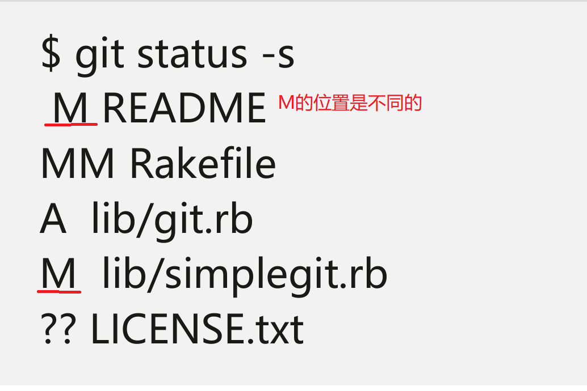
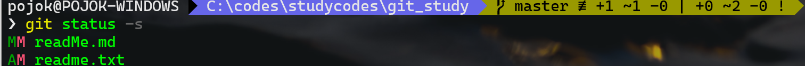
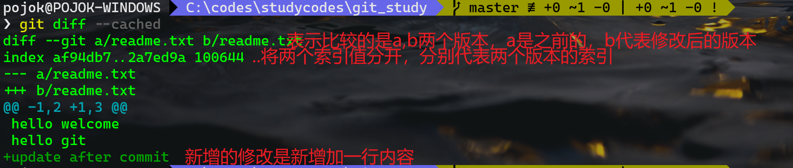

# git学习

[TOC]


## 1.git的安装

## 2.git初始配置

### 2.1 git配置文件信息

​	git的配置主要通过`git config`来进行配置,通过该工具可以对git的一些行为及外观进行配置。

​	这些配置文件的位置为：

- 在Linux及MAC上：

  - /etc/gitconfig：所有通过` git config --system `设置的配置都将存储在该文件中，该配置全局有效，读取该配置文件的配置时同理需要架上` --system` 选项。
  - ~/.gitconfig或~/.config/git/gitconfig:该文件中的配置只对当前用户目录代表的用户有效，所有通过` git config --global`选项设置的配置都将保存在该文件中，查看时同理。
  - 当前git仓库中的配置文件(即.git/gitconfig)：所有在当前git仓库中使用` git config --local`选项进行的配置都将保存在该文件中，该配置只对当前git仓库有效，查看配置同理。

  **注意：上述描述的三种配置，都是遵循局部优先的规则。**

- 在windows上：
  - 全局配置文件为：C:/Program Files/Git/etc/gitconfig，不过该文件有权限限制。
  - 用户配置文件及仓库配置文件同上。

可以通过以下命令来显示当前电脑上所有的配置信息：

```powershell
git config --list --show-origin 
# 参数含义：
# --list 				列出所有配置信息
# --show-origin 		 列出每项配置的来源
```


### 2.2配置用户信息

​	在git中配置用户信息(该信息必须有，随每次的注释信息一起提交)，采用` git config`来配置，具体配置为：

```powershell
#其中的--global代表该配置的范围,如果要为每个项目单独配置的话需要进入到该项目目录
git config --global user.name "张三"
git config --local user.email zhangsan@example.com
```

### 2.3设置git使用的编辑器信息

​	git主要在进行注释时使用编辑器，，如果未配置，则git将使用操作系统默认的编辑器。

```powershell
#以下命令配置Emacs来作为git的编辑器
git config --global core.editor emacs

#可以通过以下命令来查看git支持的编辑器

```

### 2.4检查git的配置信息

```powershell
#通过--list参数来列出当前所有配置的属性
git config --list

#通过加上具体的配置项来查看当前系统中对其的配置信息,也可以加上--show-origin来显示该项配置具体配置在哪里了
git config core.editor
git config --show-origin core.editor
```


**注意，在查询所有的配置信息时，可能会出现重名的配置，此时git会使用它找到的最后一个配置。**

### 2.5 git帮助信息

```powershell
#获取git config的帮助信息,以下三种方式都可以
git help config
git config --help
man git-config
```

## 3.git基础

### 3.1获取git仓库

​	git获取仓库的方式有两种：

- 通过` git init`手动创建一个原先不存在的仓库(本地创建)

  ` git init`的使用：

```powershell
#首先需要进入一个空的文件夹或时一个已经存在的项目目录中
#然后通过执行git init初始化一个git仓库
git init
#注意该命令执行后会将当前执行文件夹所包含的子文件及子文件夹递归的纳入git版本控制中
#执行该命令后会在当前目录下生成一个.git文件夹，里面包含了git仓库的所有信息
```

**初始化后仅仅只是生成了一个git仓库，但是还未有任何文件被纳入这个仓库中。**

- 从服务器上克隆(clone)一个仓库(服务器创建)

  从服务器上克隆仓库用到的命令是` git clone`。

  **注意：区别于subversion等版本控制系统，clone操作会将服务器上当前分支对应的仓库完整的克隆一份到本地，而SVN的checkout操作只是将当前仓库中的文件复制到本地而已。**

```powershell
#使用git clone <url> 来克隆一个仓库到本地
#这会在本地当前执行该命令的地方创建一个名为spring-framework(一般该名称如果未指定就是.git之前的那个名称)的文件夹，该仓库下的所有内容都会存储到该文件夹下
git clone https://github.com/spring-projects/spring-framework.git

#可以手动指定克隆后仓库存储的位置,如最后的spring参数，就代表克隆后仓库存储文件夹名称，该参数可以是相对路径(相对当前执行路径)或者是一个绝对路径，
git clone https://github.com/spring-projects/spring-framework.git spring
```

### 3.2检查文件状态

​	一般来说，仓库中目录中的文件有如下几个状态：


可以通过` git status`查看当前仓库中的文件状态。

` git status`命令还可以通过携带一些参数，使得状态信息输出更加符合自己的需要：

```powershell
#以简短的方式输出信息，-s可以替换为--short
 git status -s
 #输出的信息中，有一定的格式，如下图(标记状态是有两栏的，左栏代表暂存区状态，右栏代表工作区状态)
 # ??代表其后跟的文件是新创建的，未被跟踪的
 # A 代表其后跟的文件是新增加到暂存区的文件，使用git add将文件添加到暂存区后，并且该文件没有进行过一次提交
 # AM 代表在暂存区中是第一次提交暂存区状态，在工作区中又进行了修改
 # M 代表文件被修改过
 # MM 代表该文件被修改过，处于暂存区，但还未提交，并且该文件在暂存区时又被修改过
```





### 3.3git add

 	` git add`命令具有多个功能：

- 使用该命令可将一个新创建的文件纳入到git版本控制中(跟踪新文件)
- 将已跟踪并被修改后的文件加入到暂存区
- 合并时将有冲突的文件标记为已解决状态

总的来说，该命令的作用就是：**精确的将内容添加到下一次提交中**。

```
#该命令的格式为git add <file>
git add readme.txt
#也可以使用.来代替<file>，代表将当前文件夹下在.gitignore规则外的所有文件进行处理
git add .
```

如果将一个文件添加到暂存区而没有进行提交，此时再更改这个文件内容，则会发生如下情况(一个文件既处于暂存区又在工作区)：


从这里可以看出，git的暂存区中暂存的只是最后一次进行` git add`操作添加的文件的版本，在这之后修改了文件而没有进行add操作，这一版本的文件只能存在于工作区，并且下一次提交时也不会被提交。

### 3.4 git中忽略文件

​	要在git中指定被仓库版本控制忽略的文件，可以创建一个.gitignore文件，该文件可以创建在git仓库中的不同文件夹下，其作用范围就在该文件夹及其子文件夹下。

.gitignore文件中的格式规范：

- 所有空行或者#开头的行都会被.gitignore文件忽略（注释行）
- 可以使用标准的glob模式，该模式会递归的应用到该文件夹及其子文件夹
- 匹配模式可以以/开头防止递归
- 匹配模式可以以/结尾指定目录
- 要忽略指定模式之外的文件或目录，可以在模式之前加上!(取反)

其中glob模式(shell简化了的正则表达式)有：

- *匹配零个或多个任意字符
- [abc]匹配任意一个在方括号内的字符，之间是或的关系
- ？匹配任意一个字符
- [0-9]匹配0到9之间的数字，包含0和9，该种匹配模式就是用来指定范围的
- **匹配任意中间目录


 ### 3.5 git diff

​		通过` git diff`命令可以帮助我们获取以下信息：

- 当前做的哪些更新操作尚未被暂存，会显示具体的修改信息
- 有哪些更新已被暂存，准备下次提交

```powershell
#使用git diff很简单只需进入git仓库，然后执行命令就可以了
git diff
```

**git diff可以通过文件补丁的格式更加具体的显示出哪些行发生了变化。**


上图是通过` git status`的输出，再来看看` git diff`的输出：


此命令比较的是工作目录中当前文件和暂存区域快照之间的差异，也就是修改之后还没有暂存起来的变化。

` git diff`本身只显示尚未暂存成功的改动，而不是自上次提交以来所作的所有改动。所以在上图中，通过` git diff`显示出的内容只包含readMe.md中的改动，这是因为只有该文件存在未被加入到暂存区的内容。

` git diff --cached`命令可以查看当前暂存区与上一次提交之后的差异性，从上面` git status`输出可以看出，当前暂存区中只有readme.txt这个文件，所以，这里只显示出了这个文件的变更。



100644中100代表普通文件，644代表文件权限。

该命令还可以使用插件来调用外部程序来查看变化，比如meld。使用`git difftool --tool-help`来查看支持的插件，并且可以通过config将使用插件信息写入配置文件中，再使用时直接使用` git difftool`命令即可调用配置的插件进行显示了。

```powershell
#设置diff插件
git config --global difftool.meld.path=C:\\selfApps\\meld\\meld.exe

#设置merge插件
 git config --global mergetool.meld.path=C:\\selfApps\\meld\\meld.exe
```

### 3.6提交更新

​	`git commit`会将当前正在暂存区的内容提交到本地git仓库中。

```powershell
#可以使用config来配置提交时默认使用的编辑器来编辑注释
git config --global core.editor emacs

#提交当前暂存区的内容到本地仓库
git commit -m "第一次提交"

#其中-m参数的含义是提交注释，如果注释只有一行内容时，可以使用该参数来直接指定注释内容，而不必打开编辑器

#提交时可以增加-a参数，来将当前被跟踪文件(包括暂存区和工作区的文件已修改的文件)一起提交，处于工作区的文件会先被移入到暂存区然后提交
git commit -a -m "将工作区和暂存区的文件一起提交"
```

每次的项目提交都是对当前项目的一次快照，以后可回退到这个版本。

### 3.7移除文件

​	要再git中移除文件，就需要将该文件脱离git的版本控制清单，即将其从暂存区域移除，然后提交。

​	移除文件有两种操作：

- 永久删除该文件，在git仓库即本地磁盘上都没有该文件了

```powershell
#当移除存在于暂存区的文件,-f(force)，使用该方式删除的文件不可被恢复
git rm -f readme.txt

#要移除处于本地仓库的快照文件,先移除，然后提交
git rm readme.txt
git commit -m "删除快照文件"

#移除处于工作区的文件，先删除本地磁盘文件，然后添加暂存区，最后提交更改
rm readme.md
git add.
git commit -m "删除工作区文件"
```

- 将文件从git版本库中移除，但还在本地磁盘保留源文件

```powershell
#加上--cached参数或--storaged,将该文件从暂存区删除，然后提交修改即可
git rm --cached readme.txt
```

### 3.8git仓库中移动文件

​	类比于Linux系统，git从移动文件也就是重命名文件，使用mv命令来实现。

```powershell
#将fileNameA重命名为fileNameB
git mv fileNameA fileNameB

#事实上，执行上面一条命令，git底层会执行以下三条命令
#mv fileNameA fileNameB
#git rm fileNameA
#git add fileNameB
```

### 3.9查看git仓库提交历史

```powershell
#通过以下命令即可输出该仓库的提交历史记录，不加参数的情况下，git会按事件先后顺序输出日志，并且最新的在最上面
git log

#可以通过增加diff命令的输出内容在日志中,-p(patch)补丁，-2显示最新的两条内容
git log -p -2

#总结性的日志输出，会将提交日志根据文件进行归类统计输出
git log --stat

#控制日志输出的信息，--pretty具有多个可选值
git log --pretty=short
#oneline:将每次的提交日志信息放在一行显示
#short、full、fuller显示格式一致，但显示的详情程度不同
#format:已自定已的格式显示日志输出

#图标输出日志信息
git log --graph

#查看各分支指向的提交对象，--decorate起作用
git log --decorate --oneline
```


### 3.10撤消操作

#### 3.10.1重新提交

​	有时在提交之后，发现有几个文件漏掉提交了，或者提交注释写错了，这时可能想修正本次提交，但是又不想新建一次提交快照，则可以使用命令：

```powershell
#该命令会将暂存区的文件进行提交，如果自上次提交以来还未对任何文件做出修改，那么还将保存上次的提交快照版本，修改提交信息，此时第二次提交将会替代第一次提交
git commit --amend
```

**修补提交并不是用新的提交替换原先旧的提交，从效果上来说，就像旧的提交从没出现在仓库中一样。**

#### 3.10.2取消暂存文件

​	取消暂存的文件，就是将暂存区的文件移出版本控制中：

```powershell
#采用reset重置的方式，重置是一个危险的命令
git reset HEAD readme.txt
#采用restore的方式
 git restore --staged readme.txt
```

#### 3.10.3撤消对文件的修改

​	撤消修改，将对文件的修改还原成最近一次版本记录时的状态。

```powershell
#采用checkout的方式，checkout也是一个危险的命令，git会用该文件最近的一个提交版本来覆盖当前
git checkout readme.txt

#采用restore的方式
git restore readme.txt
```

### 3.11查看远程仓库

​	远程仓库是相对于本地仓库来说的，这里的“远程”并不特指网络的远端。

​	查看本地配置的远程仓库地址：

```powershell
#进入到一个本地仓库，运行该命令会显示是否有一个远程仓库与当前本地仓库关联
git remote

#可以通过-v参数显示更多信息,如果关联的远程仓库不止一个，该命令可以将其全部列出
git remote -v
```


### 3.12添加远程仓库

​	前述`git clone`可以克隆一个远程仓库，克隆下来的本地仓库将自动和该远程仓库进行关联。我们也可以手动为本地` git init`的仓库添加远程仓库。

```powershell
#git remote add <shortname> <url>
git remote add origin https://github.com/pojokchen/git_studys.git
#其中的<shortName>代表对这个远程仓库的简写，添加成功后可以通过该简写代替仓库地址
#<url>代表的就是仓库的地址
```

### 3.13从远程仓库拉取数据

​	拉取命令可以从远程仓库中拉取本地仓库没有的数据，并且将远程仓库的所有分支引用拉取到本地。

```
#拉取数据从远程仓库
git fetch origin
```

**注意：` git fetch`只是将数据下载到本地的仓库，而不会将文件自动合并到本地仓库中，需要手动合并。该问题可通过` git pull` 来解决。**

### 3.14推送本地仓库到远程

 	通过`git push`可将本地仓库文件推送到远程仓库。

```powershell
#git push <remote> <branch>
#<remote> 添加远程仓库时指定的名称，默认为origin
#<branch> 指定推送数据到远程哪个分支
git push origin master
```

### 3.15查看远程仓库

```powershell
#查看远程仓库信息 git remote show <remotename>
git remote show origin
```


### 3.16远程仓库的重命名与移除

```powershell
#重命名远程仓库，将本地设置的origin名称改为ori，改的只是添加远程仓库时的那个shortName
 git remote rename origin ori
 
#删除一个远程仓库，一旦删除，本地所有对这个远程仓库的引用及配置信息都将被删除
git remote remove ori
```

### 3.17打标签

​	通过打标签，可以用来标示某次历史提交是很重要的，常常用来标记版本的发布。

```powershell
#列出标签,可加上-l(--list)选项
git tag 

#创建轻量标签，该标签就像一个不会改变的分支，只是一个特定提交的引用
git tag v1.0-ql

#创建附注标签，附注标签是git数据库的一个完整对象，将包含打标签者的名称，电邮地址等信息
git tag -a v1.4 -m "my version is v1.4"

#查看附注标签信息
git show v1.0

#打历史标签，对于过去提交忘记打标签可以采用该种方式,后面的71c9db37d是校验和前几位，唯一代表该次提交
git tag -a v1.1 71c9db37d
```


### 3.18推送标签到远程

​	默认情况下，本地创建的标签是不会提交到远程仓库的，这时需要显示的推送标签到远程仓库。

```powershell
#git push origin <tagname>
git push ori v1.1
#origin 是远程仓库的名称
#<tagname> 标签名称
```

### 3.19删除标签

1. 删除本地标签

   ```powershell
   #删除本地标签
   git tag -d v1.0
   ```

2. 删除远程标签

   ```powershell
   #推送空标签名到远程来删除远程标签,git push <remote> :/refs/tags/<tagname>
   git push origin :/refs/tags/v1.0
   
   #采用远程delete的方式删除,git push <remote> --delete <tagname>
   git push origin --delete v1.0
   ```

### 3.20检出标签

​	检出标签使用` git checkout`命令，该命令会使检出的仓库处于游离态( detached head),在该状态下，如果修改了某些文件然后提交的话，标签不会发生变化，这些改变也将不会在文件中体现出来，除非使用特定的commit id去访问他们。因此，如果要修复标签版本中的一些错误，需要检出并新建一个分支。

​	**游离态**：这里的游离态是指，当我们检出一个标签，并在这个标签上做出了一些修改、提交，此时我们切换到了master或其它分支上，而这个时候我们再想切换到原先那个标签上的提交时，做不到了。因为原先那个标签没有想分支名这么直观的东西供我们操作，只有一个commit ID可以供我们找到那个提交(实时上那些提交很快会被git垃圾回收掉)但是提交历史什么的都是不完整的，所以这里游离态表示一旦HEAD改变当前指向，那么该对象将永远无法再被HEAD引用到了。

```powershell
#检出特定标签的文件
git checkout v2.0

#检出文件到一个新的分支,其中version2是一个新的分支，v2.0是要检出的标签名
git checkout -b version2 v2.0
```

如果检出到了新的分支然后进行了改动，此时该改动提交就和原标签不同了。

### 3.21git别名

