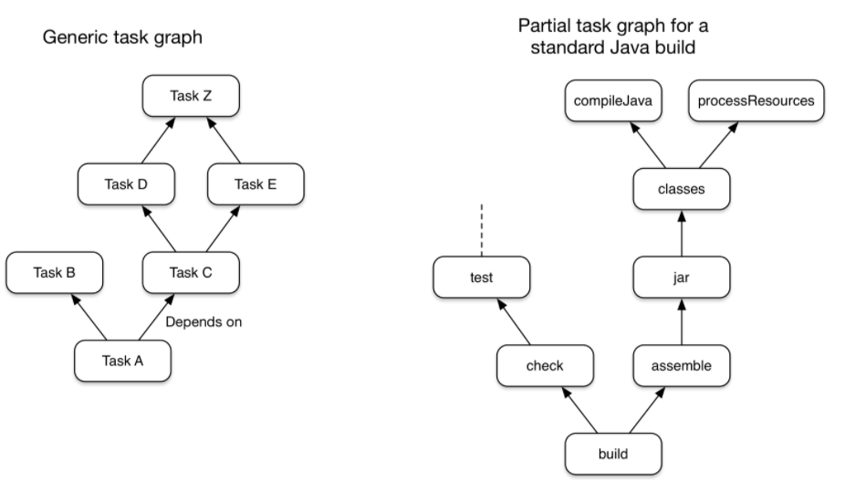
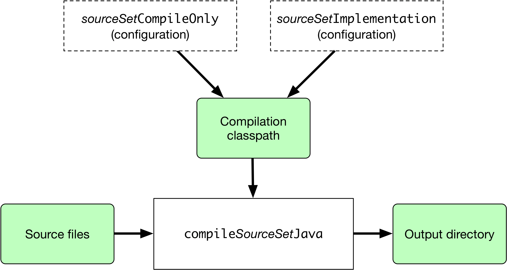

# gradle学习

## 一、介绍

​		gradle是一款开源的自动构建工具，类似于maven和ant，gradle的构建脚本由Groovy或者是Kotlin编写。

1. Gradle是一款通用的构建工具。它可以用来构建任何软件，但是其有一个限制是它的依赖管理当前只能使用与maven和ivy兼容的存储仓库及文件系统，其它的诸如c语言等依赖的库是不支持的。

2. Gradle的核心模块是任务。Gradle基于任务的概念创建了一个有向无环图，该图中包含一系列小任务,各任务之间存在依赖关系，通过运行在这个图上的任务来完成构建。

   

   每个task本身包含三个方面：执行的动作、输入及输出。

3. Gradle构建有一些固定的阶段。Gralde的构建一般经历三个阶段：

   - 初始化：设置运行环境及决定运行目标。
   - 配置任务视图，决定执行的任务及任务执行顺序。
   - 执行任务试图。

4. Gradle提供了多种方式来扩展构建。

5. Gradle的构建脚本针对API进行操作。(因为Gradle是运行在JVM之上的，构建脚本中也可以使用标准的Java API)

## 二、gradle的安装和配置

​	Windows下：

​		在官网下下载对应的zip包，然后需要配置环境变量，在windows中配置path环境变量，如图所示：


下载下的gradle包解压后的目录情况如下：


bin目录中提供了两个命令：

​	gradle和gradle.bat

在命令行中输入:

```
gradle -v
```

即可查看是否gradle配置成功。（注意配置要在cmd窗口重启之后才能生效。）

## 三、构建Java应用

### 1.初始化任务

#### 1.1使用初始化任务初始化项目

​	在一个空文件夹中，通过 ` gradle init`来初始化一个Gradle构建的项目。其执行(交互式执行)过程如下所示：

```

$ gradle init    #执行初始化任务
<-------------> 0% EXECUTING [68ms]

Select type of project to generate:
  1: basic
  2: application
  3: library
  4: Gradle plugin
Enter selection (default: basic) [1..4] 2

<======-------> 0% EXECUTING [68ms]
<======-------> 50% EXECUTING [272ms]
   <======-------> 50% EXECUTING [366ms]
<======-------> 50% EXECUTING [565ms]
<======-------> 50% EXECUTING [767ms]
EX<======-------> 50% EXECUTING
<======-------> 50% EXECUTING [1s]


Select implementation language:
  1: C++
  2: Groovy
  3: Java
  4: Kotlin
  5: Scala
  6: Swift
Enter selection (default: Java) [1..6] 3

<======-------> 50% EXECUTING [3s]
<======-------> 50% EXECUTING [5s]
<======-------> 50% EXECUTING [7s]
------> 50% EXECUTING [4s]
==Split functionality across multiple subprojects?:
  1: no - only one application project
  2: yes - application and library projects
Enter selection (default: no - only one application project) [1..2] 1

<======-------> 50% EXECUTING [7s]
<======-------> 50% EXECUTING [9s]
<======-------> 50% EXECUTING [11s]
<======-------> 50% EXECUTING [12s]
<======-------> 50% EXECUTING [14s]
Select build script DSL:
  1: Groovy
  2: KotlinECUTING [15s]
Enter selection (default: Groovy) [1..2] 1

<======-------> 50% EXECUTING [15s]
<======-------> 50% EXECUTING [17s]
  <======-------> 50% EXECUTING [19s]
   Select test framework:
  1: JUnit 4
  2: TestNG
  3: Spock
  4: JUnit Jupiter
Enter selection (default: JUnit 4) [1..4] 1

<======-------> 50% EXECUTING [19s]
<======-------> 50% EXECUTING [21s]
  Project name (default: gradle-study):

<======-------> 50% EXECUTING [22s]s]
<======-------> 50% EXECUTING [24s]
  <======-------> 50% EXECUTING [26s]
---<======-------> 50% EXECUTING [27s]
Source package (default: gradle.study): com.cyz.demo   #这里输入包的路径
<======-------> 50% EXECUTING [28s]
<======-------> 50% EXECUTING [30s]
  <======-------> 50% EXECUTING [32s]
---<======-------> 50% EXECUTING [33s]
<======-------> 50% EXECUTING [35s]s]
<======-------> 50% EXECUTING [37s]
I<======-------> 50% EXECUTING [39s]
--<======-------> 50% EXECUTING [40s]

> Task :init
Get more help with your project: https://docs.gradle.org/7.0/samples/sample_building_java_applications.html

BUILD SUCCESSFUL in 42s
2 actionable tasks: 2 executed
```

通过该init任务生成的项目结构如下所示：

```
.
|-- app
|   |-- build.gradle	#gradle的构建脚本文件
|   `-- src			#标准的Java源代码目录结构
|       |-- main
|       |   |-- java
|       |   |   `-- com
|       |   |       `-- cyz
|       |   |           `-- demo
|       |   |               `-- App.java
|       |   `-- resources
|       `-- test	#标准的Java测试源代码目录结构
|           |-- java
|           |   `-- com
|           |       `-- cyz
|           |           `-- demo
|           |               `-- AppTest.java
|           `-- resources
|-- gradle		#生成的gradle wrapper文件存放位置
|   `-- wrapper
|       |-- gradle-wrapper.jar
|       `-- gradle-wrapper.properties
|-- gradlew			# gradle wrapper启动脚本
|-- gradlew.bat		# gradle wrapper启动脚本
`-- settings.gradle
```

#### 1.2.生成的settings.gradle文件

​		通过init任务生成的settings.gradle文件如下所示：

```
/*
 * This file was generated by the Gradle 'init' task.
 *
 * The settings file is used to specify which projects to include in your build.
 *
 * Detailed information about configuring a multi-project build in Gradle can be found
 * in the user manual at https://docs.gradle.org/7.0/userguide/multi_project_builds.html
 */

rootProject.name = 'gradle-study'
include('app')
```

其中的含义为：

- rootProject.name：该项设置为构建定义了一个固定的名称，如果是一个多人协作项目，可能会导致实际存放文件夹名称的改变，所以设置一个固定的构建名称，使之可以忽略实际目录名称。
- include('app')：该项定义当前构建由一个名为xxx的子项目组成，该子项目中包含了**build.gradle**构建脚本，故可以通过include(...)来引入其它的子项目参与构建。

#### 1.3.build.gradle文件

​	每个gradle项目(不论是单项目还是多项目)应用，都包含一个build.gradle文件，如下所示(列出了部分元素)：

```
plugins {
    // 应用一个application插件，以支持使用Java构建CLI应用程序(命令行应用程序)
    id 'application'
}

repositories {
    // 定义mavenCentral为依赖仓库
    mavenCentral()
}

dependencies {
    // 定义junit4作为测试依赖
    testImplementation 'junit:junit:4.13.1'

    // 定义应用程序使用的依赖
    implementation 'com.google.guava:guava:30.0-jre'
}

application {
    // 定义该应用程序的主启动类
    mainClass = 'com.cyz.demo.App'
}
```

### 2.运行生成的程序

#### 2.1使用运行任务命令运行程序

​	使用` gradle run`命令来运行刚才初始化的项目，Gradle通过在项目build.gradle脚本中application构建块中定义的mainClass知道了运行时主类所在位置，执行了` gradle run`命令便会通过该主类启动应用程序。

```
gradle run
Starting a Gradle Daemon, 1 incompatible and 1 stopped Daemons could not be reused, use --status for details

> Task :app:run #执行了任务 run
Hello World!
BUILD SUCCESSFUL in 13s
2 actionable tasks: 1 executed, 1 up-to-date
```

**如果使用的是gradlew来执行任务，则在第一次执行时会有一点延迟，这是因为gradle在下载gradlew相关文件，下载后其位置将存放在~/.gradle/wrapper/dists文件夹下**。

#### 2.2捆绑应用程序

​	在上面的build.gradle文件中plugins构建块定义了使用application插件，该插件中预先定义捆绑了一些任务，例如其中的文件归档任务，该任务的结果导致在app\build\distributions\目录下生成了相关归档文件，如下所示：

```
$ ls app/build/distributions/
app.tar  app.zip
```

## 四、构建Java或者JVM应用

### 1.基础

​	Gradle的构建最重要的就是build.gradle脚本文件，一个最简单的构建脚本如下所示：

```groovy
plugins {
    //定义项目应用的插件是Java库插件，该插件替代了原先的Java插件
    id 'java-library' 
}

java {
    toolchain {
        //使用toolchain指定项目使用jdk版本
        languageVersion = JavaLanguageVersion.of(11)
    }
}

//指定项目的version
version = '1.2.1'
```

其中Java Library Plugin的应用同样捆绑了一些预定义的任务：

- 编译源代码任务（）
- 编译测试源代码任务
- 测试任务
- jar归档任务，打包一个.jar文件
- javadoc任务

虽说上述构建脚本中定义不是必须的，但是官方推荐的。

### 2.通过Source sets定义源代码相关信息

​	**Source sets**是Gradle为了支持Java应用构建而提出的一种新的概念。即对于Java应用来说，其源代码、资源文件通常逻辑性的按照类型(例如源代码、测试单元、集成测试)等来组织的，而每个逻辑单元都有其各自的依赖项、不同的类路径等。**构成Source sets的文件不必位于同一路径下**。

​	**Source sets将编译的下述几个方面联系在了一起(即源集包含了下述几个方面)：**

- 源文件在哪
- 编译的类路径在哪及所需的依赖
- 编译后的文件在哪

基于**Source sets**的概念，Gradle对于Java应用的编译定义了如下几个任务，其包含在插件java-library插件中：




图中，绿色部分代表应用源集(Source sets)本身。

Java库插件会自动的为项目或插件定义的每个源集——compile*SourceSet*Java创建一个编译任务；同样，对于项目中的资源文件源集(例如properties文件集合)，也会创建一个编译任务。

**默认来说，Gradle对Source sets有一套约定的配置，包含源代码位置、测试代码位置、类路径、编译后文件位置等，其约定的配置为：**

- 源代码：位于项目

### 3.依赖管理

#### 1.介绍

​	Gradle内置了对依赖管理的支持，下图显示了Gradle对依赖管理的基本概念(引用Gradle官网)：


#### 2.配置基础Gradle依赖管理

​	Gradle基本的在build.gradle中提供了两个构建块用来配置Gradle的依赖管理。

- repositories{} ：该构建块用来声明依赖项所使用的远程仓库，从上图可以看出，Gradle使用的远程仓库支持MAVEN仓库及IVY仓库。
- dependencies {}：该构建块用来声明项目具体的依赖项，即依赖的jar包。

下图展示了这两个构建块在build.gradle文件中的运用：

```groovy
repositories {
    mavenCentral() //配置使用的远程仓库为mavenCentral
}

dependencies { //配置依赖项
    //配置了一个hibernate依赖,配置上类似于maven，具有group、artifactId、version等信息
    implementation 'org.hibernate:hibernate-core:3.6.7.Final' 
}
```

上面dependencies构建块中配置了implementation选项，该选项用来声明后面紧跟的依赖的作用域，可配置的选项有：

- compileOnly:声明依赖只用于compile范围，不能用于runtime范围(**类似于provided，只编译且依赖不传递，不参与打包**)
- implementation:声明依赖用于compile和runtime(**该选项限定声明的依赖只能当前项目访问，而依赖当前项目的项目是无法访问到该选项声明的依赖的相关方法的**)
- runtimeOnly：声明依赖只用于runtime，不能用于compile(**类似于apk，只在打包时有效，不参与编译**)
- testCompileOnly:声明依赖只用于测试compile
- testImplementation:声明依赖用于测试compile和测试runtime
- testRuntime:声明依赖只用于测试runtime

**对于Java-library插件，额外的提供了两个配置项：**

- api：声明依赖用于compile和runtime，**且该依赖可以参与依赖快递**
- compileOnlyApi:声明依赖只用于compile而不参与runtime(打包时不包含)，**该依赖可以传递**

#### 3.配置仓库地址

1. ​	**添加自搭建的远程maven仓库**

   ```groovy
   repositories {
       maven {
           // 在这个位置查找POM文件或依赖项(通常来说只配置该项即可)
           url "http://repo2.mycompany.com/maven2"
           // 如果在上述地址只找到pom描述，而没有具体的jar，可配置jar存储的位置(该项配置是为了应对pom文件与jar分开存储)
           artifactUrls "http://repo.mycompany.com/jars"
           artifactUrls "http://repo.mycompany.com/jars2"
       }
   }
   ```

2. **添加本地maven仓库**

   ```groovy
   repositories {
       mavenLocal()
   }
   ```

   **Gradle拥有自己的依赖缓存，所以不需要特别声明本地仓库，从远端仓库解析拉取的依赖会缓存在gradle自身的缓存内**。

   Gradle官方推荐在添加本地缓存之前仔细阅读https://docs.gradle.org/current/userguide/declaring_repositories.html#sec:case-for-maven-local。

3. **配置maven仓库过滤选项**

   ```groovy
   repositories {
       maven {
           url "https://repo.mycompany.com/releases"
           mavenContent {
               releasesOnly() //声明该仓库只拉取release版本的jar
           }
       }
       maven {
           url "https://repo.mycompany.com/snapshots"
           mavenContent {
               snapshotsOnly() //声明该仓库只拉取snapshots版本的jar
           }
       }
   }
   ```

4. 配置aliyun仓库--build.gradle

   ```groovy
   repositories {
       maven { url 'http://maven.aliyun.com/nexus/content/groups/public/'}
       maven { url 'http://maven.aliyun.com/nexus/content/repositories/jcenter'}
   }
   ```

5. 配置aliyun仓库--init.gradle

   ```
   #在系统环境变量中配置GRADLE_USER_HOME属性，设置gradle的家目录
   #在GRADLE_USER_HOME/.gradle/下创建init.gradle文件
   allprojects{
       repositories {
           google()
           def ALIYUN\_REPOSITORY\_URL = 'http://maven.aliyun.com/nexus/content/groups/public'
           def ALIYUN\_JCENTER\_URL = 'http://maven.aliyun.com/nexus/content/repositories/jcenter'
           all { ArtifactRepository repo ->
               if(repo instanceof MavenArtifactRepository){
                   def url = repo.url.toString()
                   if (url.startsWith('https://repo1.maven.org/maven2')) {
                       project.logger.lifecycle "Repository ${repo.url} replaced by $ALIYUN\_REPOSITORY\_URL."
                       remove repo
                   }
                   if (url.startsWith('https://jcenter.bintray.com/')) {
                       project.logger.lifecycle "Repository ${repo.url} replaced by $ALIYUN\_JCENTER\_URL."
                       remove repo
                   }
               }
           }
           maven { url ALIYUN\_REPOSITORY\_URL }
           maven { url ALIYUN\_JCENTER\_URL }
       }
   }
   ```

6. **自定义gradle插件仓库**

   **注意，该配置需要在settings.gradle文件中配置**

   ```groovy
   pluginManagement {
       repositories { //多个仓库之间按顺序查找
           maven { //自定义maven插件仓库
               url './maven-repo'
           }
           gradlePluginPortal() //gradle提供的插件仓库
           ivy { //自定义ivy插件仓库
               url './ivy-repo'
           }
       }
   }
   
   
   ```

7. **统一配置整个项目的依赖仓库**

   ​	如果项目中存在多个模块多个build.gradle文件，则可以在项目的settings.gradle文件中统一配置项目使用的依赖，而不用在每个build.gradle文件中配置。

   ​	如果settings.gradle和build.gradle同时配置了依赖仓库，则build.gradle优先。

   ```groovy
   dependencyResolutionManagement {
       repositories {
           mavenCentral()
       }
   }
   ```

### 4.编译代码

​	Gradle对项目结构有有默认的约定：

- 源代码：*src/main/java*
- 测试源代码：*src/test/java*

#### 1.自定义文件及文件夹位置

​		通过在build.gradle中配置源集，可以更改默认的源代码位置、资源文件位置、编译输出位置等。

```groovy
sourceSets {
    main { //配置项目源代码路径
         java {
            srcDirs = ['src']
         }
    }

    test { //配置项目测试代码路径
        java {
            srcDirs = ['test']
        }
    }
}
```

如果不想更改项目默认的配置路径，而只是想将其它的路径作为源代码路径或测试代码路径添加到源集中，则可以使用如下配置：

```groovy
sourceSets {
    main {
        java {
            srcDir 'thirdParty/src/main/java'
        }
    }
}
```

**这里体现出gradle一种默认的约定，srcDirs设置属性将直接替换值；而采用srcDir方法将附加某种逻辑。**

#### 2.定义编译选项

​	compileJava` 和       `compileTestJava都属于JavaCompile类型的任务，可以通过JavaCompile提供的一些属性来更改编译选项，例如：

```groovy
compileJava {
    options.incremental = true
    options.fork = true
    options.failOnError = false
}
```

