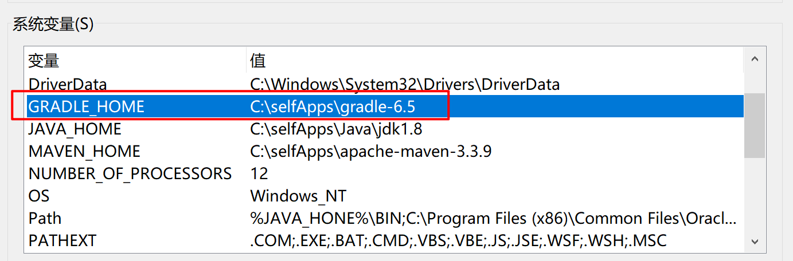
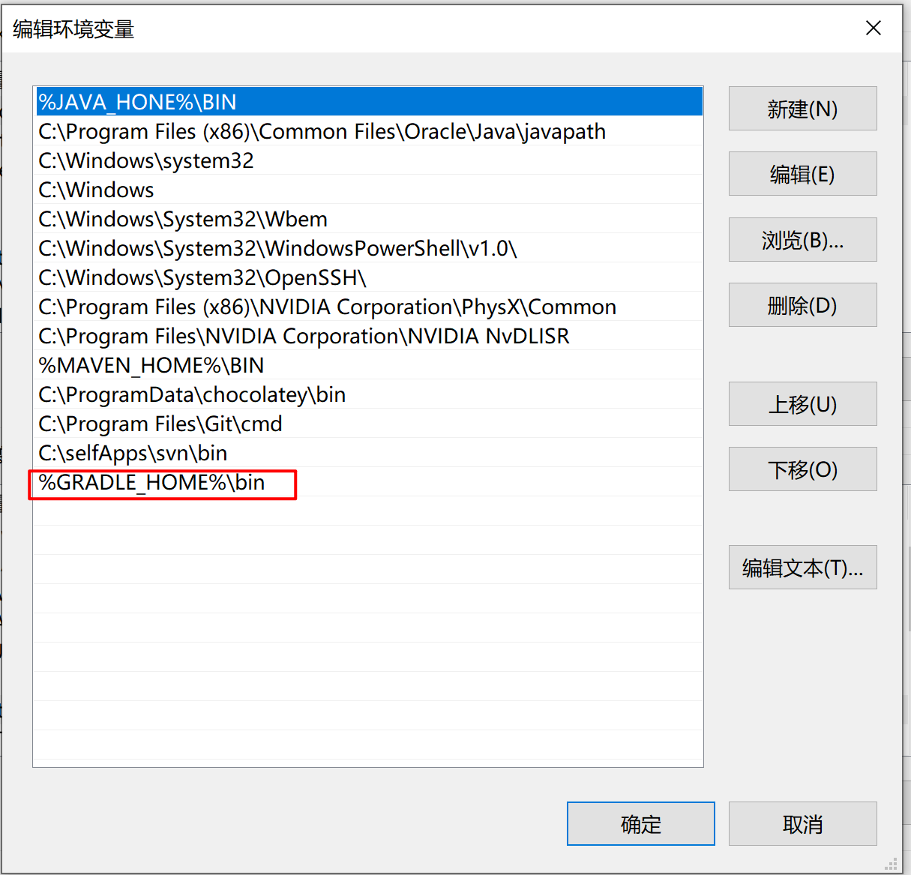
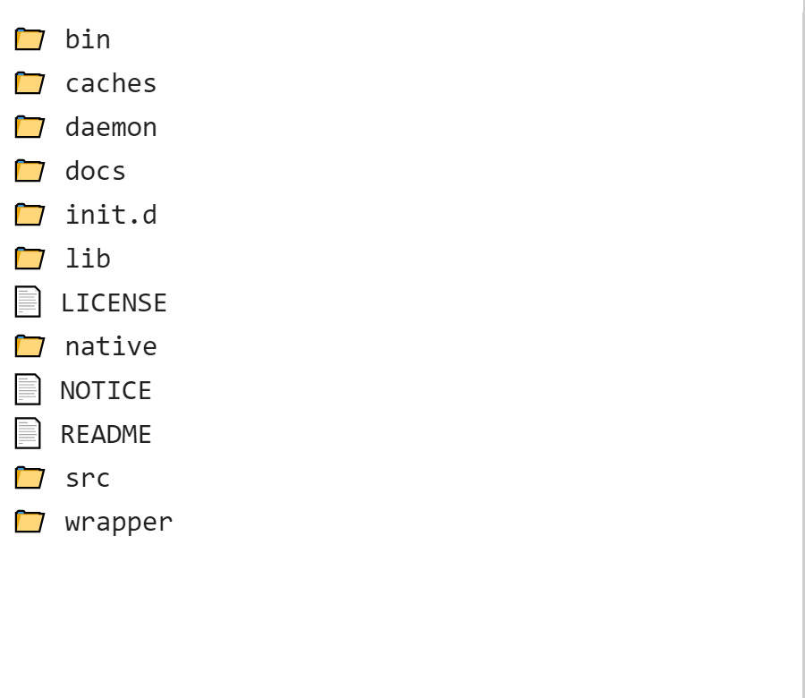
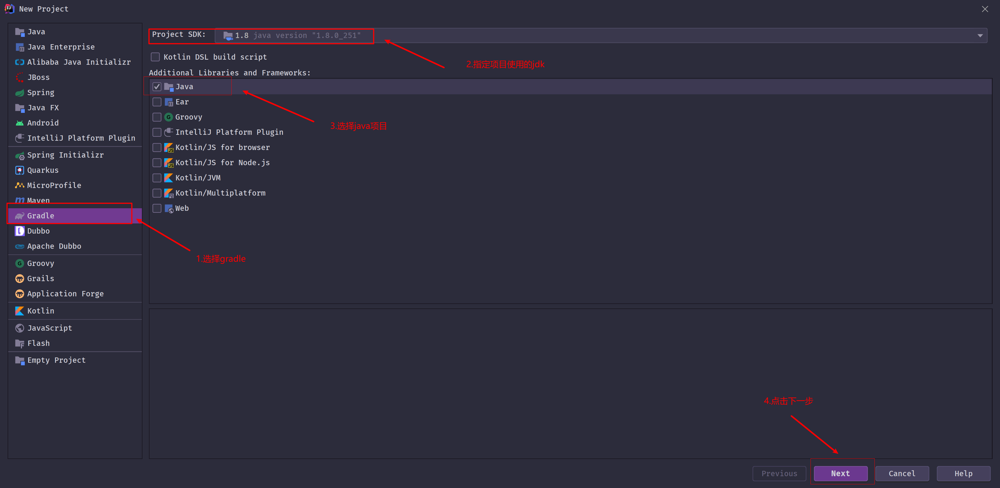
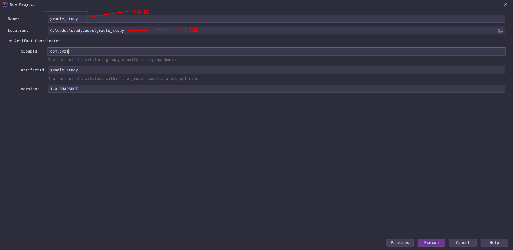
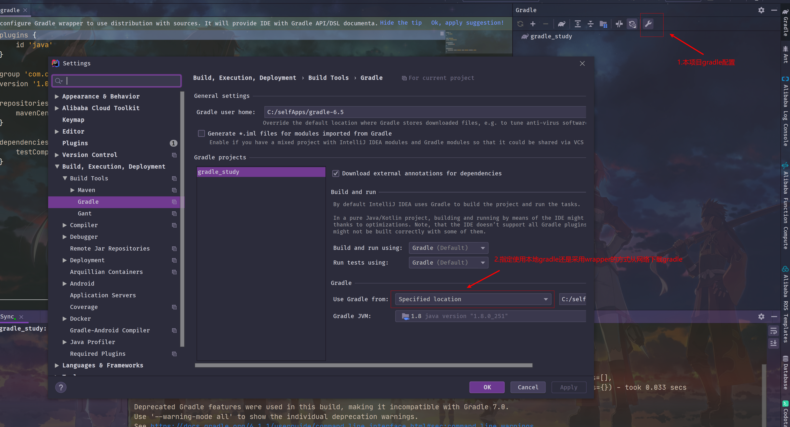
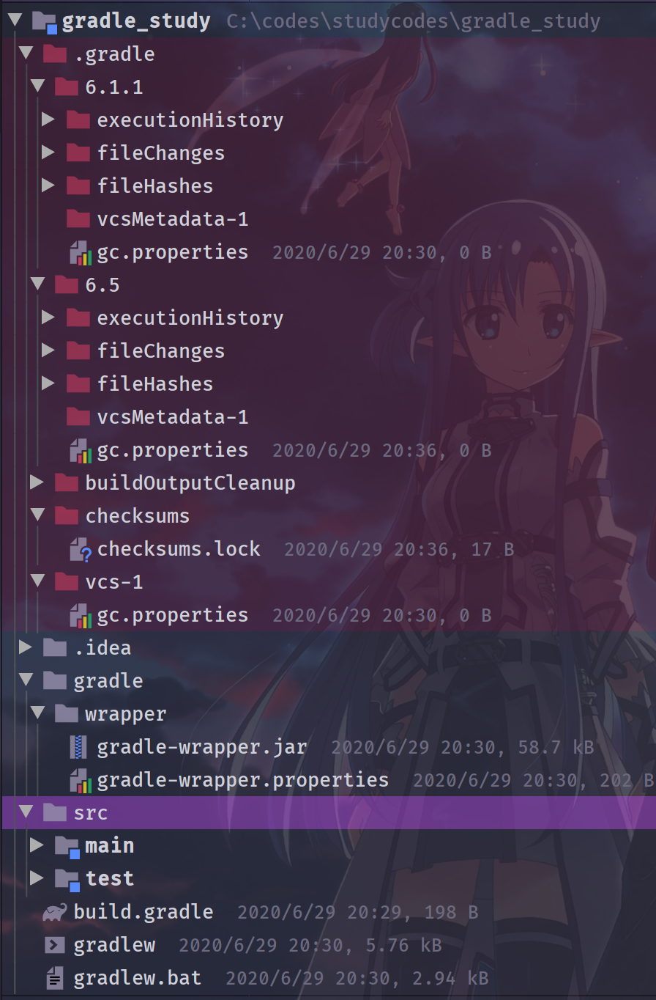
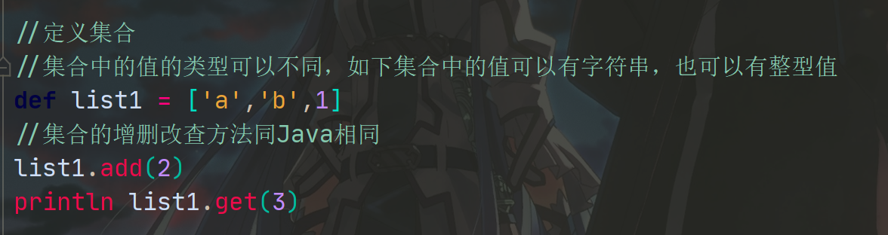
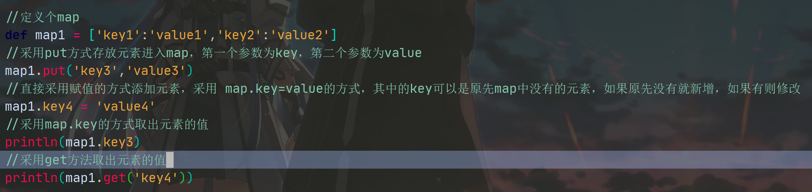
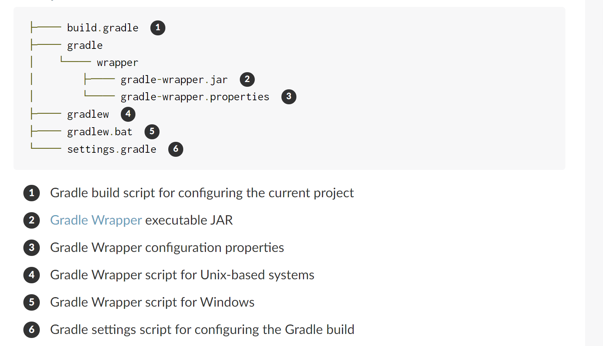

# gradle学习

## 介绍

​	gradle和ant和maven一样，是一款项目管理工具。它使用DSL语言来编写。

## gradle的安装和配置

​	Windows下：

​		在官网下下载对应的zip包，然后需要配置环境变量，在windows中配置path环境变量，如图所示：




下载下的gradle包解压后的目录情况如下：



bin目录中提供了两个命令：

​	gradle和gradle.bat

在命令行中输入:

```
gradle -v
```

即可查看是否gradle配置成功。（注意配置要在cmd窗口重启之后才能生效。）

## 创建gradle项目

如下图示：



在点击下一步后：



在完成创建项目后，要对项目进行初始化，可通过如下图的配置来对项目初始化所用gradle进行一些配置：



## gradle项目目录详解

```
├── .gradle 项目级别缓存目录
│   ├── 4.8 某一版本的gradle的缓存目录
│   ├── 4.9 
│   └── ⋮
├── build 项目构建打包的artifacts将会存放在该目录下
├── gradle	
│   └── wrapper  gradle的wrapper文件和相关jar包存放路径
├── build.gradle or build.gradle.kts gradle的构建脚本文件
├── gradle.properties 项目级别的gradle属性配置文件
├── gradlew 使用gradle-wrapper的执行构建文件
├── gradlew.bat 同上
└── settings.gradle or settings.gradle.kts 项目配置文件（gradle用来记录项目的配置信息）
```

具体生成的Java项目的实例如下：(下图采用idea自动生成)



## groovy简单上手

### groovy基本输出语句


### groovy中定义集合



### groovy中定义map



### groovy中的闭包

​	在gradle中，把groovy的一个闭包当作一个参数来使用。

```groovy
//闭包
def d1 = {
    println "hello 闭包"
}

//带参数
闭包
def d2 = {
    v ->
    println "hello ${v}"
}

//定义一个方法，参数需要一个闭包
//Closure是闭包类型
def method1(Closure closure){
    closure() //执行闭包的代码
}

//定义个方法，参数需要一个带参数的闭包
def method2(Closure clourse){
    closure("小马")
}

//调用method方法
method1(d1)
method2(d2)
```

## gradle教程

### 创建构建扫描

​	构建扫描脚本是一类可共享的、集中的配置记录，可以帮助人们更好的观察在构建过程中发生了什么，为什么这样做。

​	运用构建扫描插件，我们可以推送自己的构建扫描脚本到 [https://scans.gradle.com](https://scans.gradle.com/) 。

#### 自动应用构建扫描插件

​	从grandle4.3版本之后，我们可以直接启用构建扫描，而不需要添加另外的配置在build.script中。

​	当使用命令行参数 --scan后，即可将构建扫描插件自动的运用。如下所示：

```
$ ./gradlew build --scan
> Task :compileJava
> Task :processResources NO-SOURCE
> Task :classes
> Task :jar
> Task :assemble
> Task :compileTestJava
> Task :processTestResources NO-SOURCE
> Task :testClasses
> Task :test
> Task :check
> Task :build

BUILD SUCCESSFUL
4 actionable tasks: 4 executed

Publishing a build scan to scans.gradle.com requires accepting the Gradle Terms of Service defined at https://gradle.com/terms-of-service. Do you accept these terms? [yes, no] yes

Gradle Terms of Service accepted.

Publishing build scan...
https://gradle.com/s/czajmbyg73t62
```

​	当然，即使我们可以无需配置的自动运用的构建扫描。但是，我们依然可以对构建扫描的一些选项进行配置，可以在构建脚本或是初始化脚本中进行配置。

#### 为项目启动构建扫描

​	从gradle2.x到5.x之间，我们需要应用com.gradle.build-scan插件在我们项目根目录下的build.script脚本中；而在gradle6.0之后，我们需要在settings脚本中应用com.gradle.enterprise插件。

#### 同意license

​	为了推送我们的build scan到一个构建网站，我们需要接受license。我们可以在命令行中处理，也可以在settings.gradle脚本中写明：

```groovy
plugins{
    id "com.gradle.enterprise" 
    version "3.3.4"
}

gradleEnterprise {
    //配置企业服务地址
    server = "https://gradle-enterprise.mycompany.com"
    //默认情况下需要SSL认证，配置该属性后可以推送到未进行SSL认证的网站（不安全）
    allowUntrustedServer = true
    buildScan { //这个是在没有指定server的情况下，默认推送到gradle这个网站，这时需要同意license，否则每次推送时都会被询问
        termsOfServiceUrl = 'https://gradle.com/terms-of-service'
        termsOfServiceAgree = 'yes'
    }
}
//这种配置方式在build.script文件和settings.script文件中都是可用的
```

### 新建一个gradle构建

#### 初始化项目

​	首先新建一个空的文件夹，该文件夹后续即为这个项目的根目录。然后进入这个文件夹中，然后执行gradle init命令，该命令用来将一个空的文件夹初始化为一个gradle项目，在执行完成之后，会在该空的文件夹中添加必要的gradle组件。初始化后的文件夹结构大致是这样的：

```gradle
gradle init
```



#### 创建任务

​	gradle通过groovy语言来定义或配置一个任务。一个项目包含着许多的任务，每个任务完成一件特定的事情。

​	gradle内置了一些任务库，我们可以直接使用，例如：copy任务。

​	在build.gradle文件中，可以这样编写来创建一个任务：

```groovy
task copy(type: Copy, group: "Custom", description: "Copies sources to the dest directory") {
    from "src"
    into "dest"
}
//其中group和description是可以省略的。
```

​	通过执行命令来执行这个任务：

```
./gradlew copy //执行copy任务
```

#### 应用插件

​	通过在build.gradle文件中写入plugins语法，可以应用一些基本的插件，plugins必须要写在文件的开头。

```groovy
plugins {
    id "base"
}
```

### 构建一个java库文件

