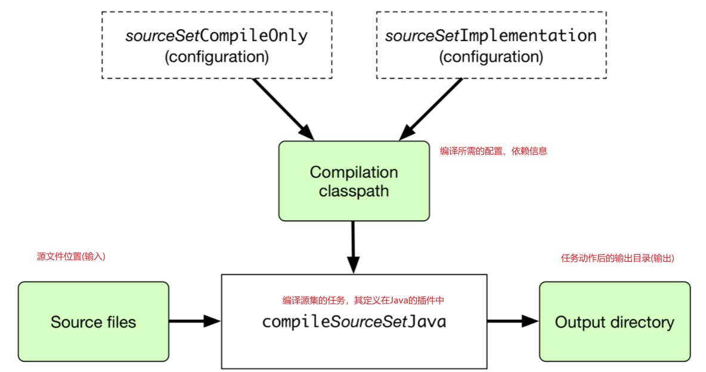

# Gradle学习

## 一、介绍

​	Gradle是一个开源的构建工具，其被设计用来支持任何类型的构建，其通过一系列的构建任务(Task)来完成构建。其主要有如下几个特点：

- 高性能:Gradle通过缓存技术、动态判断任务状态变动等特性来减少构建过程中不必要的开销，以提供高性能的构建；
- 基于JVM的:Gredle的运行基于JVM，但是其不限于只是构建Java项目；
- Gradle是便于使用的:Gradle借鉴了很多Maven中的概念，并以一种约定的方式提供了构建的便利性，减少了不必要的配置(约定优于配置的思想),使得可以使用一些插件就可以完成一个精简的Gradle构建,同时，Gradle也提供了配置方式以覆盖默认配置；
- 可扩展：可以通过提供自定义的任务(Task)或构建模型(Model)来对Gradle构建进行扩展；
- 多种IDE支持；
- Gradle支持监控构建:Gradle提供了build scans技术，可以提供构建过程中的大量信息，可以通过这些信息发现排查构建过程中的潜在问题。

## 二、Groovy DSL入门

​	Gradle的构建脚本(build script)是采用DSL(领域特定语言)来定义的，Gradle中的DSL主要基于Groovy和Kotlin这两种语言，也即可以在Gradle的构建脚本中采用这两种语言的格式来进行编写，本节主要介绍在Gradle中Grooy的语言结构。

### 1.Gradle中的对象

​	Groovy是语言是面向对象的语言，所以Groovy的对象中还有属性和方法，但是在Gradle的Groovy中，某些情况下，有些对象是隐式存在的(例如Project对象)，特别是构建脚本的顶层对象，所以，在Gradle的构建脚本中，我们可以看到这种情况：

```groovy
version = '1.0.0.GA'

configurations {
    ...
}
```

​	其中，version是Project的属性，而configurations()是Project的方法，在构建脚本中，隐式的使用了Project对象的属性和方法。

​	一般的，在Gradle的构建脚本中，如果发现某一个属性或方法找不到它定义的位置，那么这个属性或方法一般是定义在Project对象中。

### 2.Groovy中的属性

​	在Gradle的中,使用Groovy操作对象属性的方式一般有下面几种。

```groovy
<obj>.<name>                // 通过 对象.属性名 获取属性值
<obj>.<name> = <value>      // 给对象的某个属性赋值
"$<name>"                   // 引用一个属性获取其值
"${<obj>.<name>}"           // 同上

//例：
version = '1.0.1'				//获取Project对象中的version属性的值
myCopyTask.description = 'Copies some files' //给myCopyTask对象的属性description赋值

file("$buildDir/classes")		//使用占位符插值的方式引用一个变量
println "Destination: ${myCopyTask.destinationDir}"	//引用占位符插值的方式引用myCopyTask对象的destinationDir属性
```

上面提到了` 占位符插值`即` $`,用来在字符串中引用一个属性以动态改变字符串中的部分值。在Groovy中，字符串的定义可以通过**单引号**来定义，也可以通过**双引号**来定义,但是` 占位符插值`替换的方式只能用于由**双引号**定义的字符串中，其使用方式如下：

```groovy
def name = 'hello word!'

def a = 'this is $name'  //错误的形式，这里的$name将以原本的形式输出，不会动态替换
def map = [age:18,name:'zhangsan']
def x = "this is $map.name" //不带{}的插值运算常用于引用 A.B的形式中

def b = "this is ${1+2}" //带{}的插值运算常用于引用表达式中
```

在Gradle的构建脚本中，如果发现某个属性未指定特定的对象(即不是以<obj>.<name>访问的)，那么这个属性的所属对象只能是如下几种情况中的一种：

- 该属性代表一个同名的任务实例
- 该属性是Project对象的一个属性
- 该属性是项目其它地方定义的一个属性
- 是所在代码块(闭包)的一个隐式属性
- 在脚本中预先定义的本地变量

#### 2.1.Gradle的API文档中的Properties

​	在Gradle中使用的Groovy语言，因为是基于Java的，所以类比于Java，Groovy中也有类的定义，类中有多个属性，而每个属性同样有getxxx()和setxxx()方法，所以，在Gradle的API描述中，没有单独对属性进行说明，这是因为在Gradle的Groovy中，对属性的访问，其实就是对其getxxx()和setxxx()方法的调用，如下所示：

```groovy
//下面每组操作都是等价的
project.getVersion()
project.version

project.setVersion('1.0.1')
project.version = '1.0.1'
```

**注意，在Groovy中，对属性的引用，Groovy会默认将其转换为对其对应的get和set方法的调用。**

#### 2.2Gradle中的外部属性

​	所有的外部属性的定义都需要使用固定的命名空间"ext"来定义。当外部属性被定义后，就可以在定义该属性的整个对象范围内都可以使用了，可以读取值或写入值。如下：

```groovy
project.ext.prop1 = "foo"
task doStuff {
    ext.prop2 = "bar"
}
subprojects { ext.${prop3} = false }


ext.isSnapshot = version.endsWith("-SNAPSHOT")
if (isSnapshot) {
    // do snapshot stuff
}
```

### 3.Groovy中的集合类型

​	Groovy中的集合类型中，常用的有List和Map。

​	Map：

​	Groovy中的Map的定义是一种键值对的形式 `def map = ['上海': 'shanghai', '广州': 'guangzhou',]`

```groovy
def map = ['上海': 'shanghai', '广州': 'guangzhou',]
//访问map元素的方式
def a = map.上海
def b = map.get('广州')
def c = map['上海']
println("$a $b $c") //字符串的插值运算

```

​	List：

​	定义一个空集合 `def list = []` ，或者显示的定义 `ArrayList<Integer> list = []`

```groovy
//定义一个List
ArrayList<Integer> list = []
//添加元素
(1..10).each {
    list.add(it)
}
//遍历List
list.each {
    print(it)
}
//带有下标的遍历
list.eachWithIndex { int entry, int i ->
    print("value${entry} 下标${i}")
}
//通过下标访问元素
def res = list[0]
print(res)

```

​	List中的语法糖操作：

```groovy
//定义一个集合
def list = ["张三","lisi","wang五"]
//这里[集合]*的意思是取出集合中的所有元素，然后分别调用.后的方法
println list*.length() //[2, 4, 5]
```

### 4.Groovy中的方法

​	Groovy中的方法一般定义在一个对象中，定义了对象的一些行为，调用时通过对象进行调用，方法的调用方式有如下几种：

```groovy
<obj>.<name>()              // 调用无参数的方法
<obj>.<name>(<arg>, <arg>)  // 调用含有一个或多个参数的方法
<obj>.<name> <arg>, <arg>   // 调用含有一个或多个参数的方法,并且不用括号
 
//例：
myCopyTask.include '**/*.xml', '**/*.properties' //include方法，两个参数，没使用括号

ext.resourceSpec = copySpec()   // `copySpec()` comes from `Project` //调用无参数的方法

file('src/main/java')		//调用一个参数的方法,省略了对象名
println 'Hello, World!'		//一个参数的方法，省略了括号
```

**注意：在无参数的方法中，调用时总是需要加上括号的来表明这是一个方法，所以建议总是在方法调用时添加括号，无论括号是否可以省略。**

**注意：在Gradle中，如果一个方法的名称和某个集合类型的属性同名，那么，调用该方法将会向这个集合属性中添加元素，而直接操作这个属性将会导致重新赋值。**

​	除此之外，在Groovy的语法中，对于method有这样的定义。首先，所有的method都是public的，当然，你也可以添加像Java中那样的方法修饰符，但是不添加就是public的；其次，Groovy中的method支持return关键字来表述方法的返回值，但是Groovy中的method默认把最后一行执行当作返回值，所以也可以不显示指定return也可以返回。

Groovy中的方法参数类型除了可以是基本类型(如String)外，也可以是一个Map或是一个闭包(后面会说明),其定义方式如下：

```groovy
//Map为参数：
def method1(Map<Object, Object> map, String name) {
    println map.get("id")
    println map['id']
    println map.id
    println(name)
}

//1.调用参数是Map的方法


//method1(["id":"java"],'name')

//Groovy中的语法糖，当方法参数是Map时，调用时可以去掉[]，只保留值
//method1('id':'java','name')

//Groovy中的语法糖,调用方法时可以省略括号
//method1 'id': 'java', 'name'

//闭包为参数
//定义含有多个参数，其中一个参数是闭包的方法
def method2(String name, Closure closure) {
    //调用闭包获取返回值赋值给love
    def love = closure()
    //没有显示指定return，最后也会返回
    name + love
}

//2.传递一个闭包作为参数


//闭包这个参数可以动态传递，也可以预先定义好进行传递
def c = {
    return "喜欢李四"
}
//这种调用方式下就不能省略参数的括号了 也即方法调用时省略括号是只有直接调用时才可以，嵌套调用是不可以的
//println(method2 "张三",c)
//省略括号直接调用
method2 "张三",c
//加上括号调用
method2("张三",{
    return "喜欢李四"
})
//当闭包是方法的最后一个参数是，可以将闭包提取到括号外部
method2("张三"){
    "喜欢李四"
}


//3. 定义只有一个闭包作为参数的方法


def method3(Closure closure) {
    closure()
}
//Groovy的语法糖，当方法参数只有一个闭包时，可以将闭包参数移到括号外面
method3(){
    
}
//Groovy的语法糖，当方法参数只有一个闭包时，可以省略方法调用时的括号，直接空格然后传递闭包参数
method3 {
    
}
```

#### 4.1 Gradle中的方法

​	从上面可知，在Groovy中，方法的参数可以是闭包类型的。

​	在Gradle中，对于方法参数包含闭包类型时，有特别的说明：

​	当方法参数包含闭包时，可以通过闭包的实现(闭包配置的对象)来确定该方法的作用。

#### 4.2 Gradle中的连续调用

​	连续调用即当一个方法返回一个对象时可以不用预先定义一个变量来接收这个方法的返回值，而是可以直接调用返回值对象中的方法，这样只要所有方法的返回值都是一个对象，那就可以一直调用下去，直到完成功能返回。代码如下：

```groovy
//假设使用Gradle中Project对象的相关方法，其调用关系如下
evaluationDependsOn('.').findProject('/').findByName('spring-kernel-lecture')
//上面包含了三个方法
	//evaluationDependsOn()
	//findProject()
	//findByName()
//这三个方法的返回值都是一个对象
```

​	**而在Groovy的语法中，因为方法的调用有语法糖的存在，即可以去掉()进行方法调用。**那么上面的连续调用，就变成了如下的样子：

```groovy
//下面每个方法之间通过一个空格相隔，其最后结果与上面的一致
evaluationDependsOn "." findProject '/' findByName 'spring-kernel-lecture'
```

### 5.Groovy中的闭包

​	闭包中可以包含代码逻辑，闭包中最后一行语句，表示该闭包的返回值，不论该语句是否冠名return关键字。

​	如果c是无参数闭包，那么它的标准调用方法是c.call(),它的简洁调用方法是c()。

​	闭包可以赋值给某一个具体的变量，然后在代码中各处引用这个闭包变量。

​	Groovy中的闭包是一个类，调用闭包就是相当于创建一个闭包实例对象,对于相同闭包创建出来的实例，其对象是不同的。

​	闭包的使用如下代码所示：

```groovy
//无参闭包
def a = {
    println 1+2
}
a.call()
a()

//有参闭包
def closure = {name ,age->
    println "$name 的年龄是 $age"
}

closure.call("张三",18)
closure("张三",18)

//闭包中的隐式参数it，当闭包中没有手动指定参数时可以通过it来获取(所以可以传递参数)
def closure = {it ->
    println it    
}

closure.call()

//但是，如果手动加上->的话，那么闭包中的隐式参数就不起作用了
def magicNumber = { -> 42 }
```

#### 5.1闭包中的引用对象

​	翻看Groovy的源代码中，Closure类中有三个重要的成员变量，thisObject、owner和delegate，这三个成员变量的属性都是Object类型的。

- ​	thisObject：指向了定义这个闭包的封闭类的实例；
- ​    owner：指向了定义这个闭包的封闭对象,可以是类的实例也可以是闭包对象；
-    delegate：delegate 指向的是闭包所使用的用户自定义对象。默认情况下，delegate 被设置成 owner 。我们可以通过 `delegate` 关键字和 `getDelegate` 方法来使用委托对象。

#### 5.2Gradle中的闭包委托对象

​	在Gradle中，当一个属性或方法没有明确所属对象时，一般可以在Project对象中查找该属性或方法的定义；除此之外，也有可能该属性或方法的定义是在闭包对应的*delegate* 对象中定义的。来看下面一个例子：

```Groovy
copy {
    into "$buildDir/tmp"
    from 'custom-resources'
}
```

​	在上面的例子中，copy是一个方法，可以在Project对象中找到其定义，该方法只有一个参数就是闭包，所以调用时传递了具体的闭包；在闭包中，又包含了两个方法和一个属性，into()，from()和buildDir，其中buildDir属性也可以在Project对象中找到其定义，而这里的into()和from()方法就是来源于上面所说的闭包的委托对象中。

​	对于方法中的闭包参数，我们可以通过两种方式来确定其类型(即传递的委托对象是谁):

- 对于` Action`方法参数，可以查看类型的参数来确定。

  ​	例如，对于Project中的` copy(Action<? super CopySpec>)`方法，其` Action`对应的委托对象就是CopySpec。

- 对于闭包参数，需要查看API文档说明来确定。

  ​	但是对于闭包为参数的方法来说，其一般都有一个`Action`为参数的方法，通常来所，这两个方法的委托对象是一样的。

### 6.Groovy中的变量定义

```groovy
def <name> = <value>        // 定义不含类型的变量(变量类型根据值的内容自动推导)
<type> <name> = <value>     // 类型定义变量
    
//例：
def i = 1
String errorMsg = 'Failed, because reasons'
```

### 7.例:分析Gradle构建脚本中Groovy的使用

​	接下来，看一个实际的例子观察Groovy在Gradle中的使用。

```groovy
//buildscript是Project对象中的一个方法，其参数只有一个闭包,这个闭包的委托对象查看文档可知是ScriptHandler
buildscript {
    //这里的repositories即为ScriptHandler的一个方法，参数也是一个闭包
    repositories {
        maven { url "http://maven.aliyun.com/nexus/content/groups/public/" }
        maven {
            url 'https://maven.aliyun.com/repository/google'
        }

        maven {
            url 'https://maven/aliyun.com/repository/jcenter'
        }

        mavenCentral()
    }


}

//apply也可以认为是Project中的一个方法，其实际是Project从PluginAware中继承过来的
//apply方法的参数这里使用的是一个Map类型，这里使用了Groovy提供的语法糖，对于Map类型的参数可以使用去除[]，去除()等语法
apply plugin: 'java'
apply plugin: 'idea'

//plugins {
//    id 'java'
//    id 'idea'
//}

//Project中的属性
project.group = 'com.cyz'
project.version = '1.0-SNAPSHOT'
//下面这两种方式和上面其实是一样的，因为下面调用的是属性特有的get和set方法，而上面两种是直接给属性赋值
group 'com.cyz'
version '1.0-SNAPSHOT'

//同上
sourceCompatibility = 11
targetCompatibility = 11

//同buildscript
repositories {
    maven { url "https://maven.aliyun.com/nexus/content/groups/public/" }
    maven {
        url 'https://maven.aliyun.com/repository/google'
    }

    maven {
        url 'https://maven/aliyun.com/repository/jcenter'
    }

    mavenCentral()
}

//这里的dependencies也是Project中的方法，其参数是一个闭包，该闭包的委托对象是DependencyHandler
dependencies {

    //这里的implementation并不是dependencies的委托对象中的某个方法或属性
    //因为在方法调用传递闭包作为参数的过程中，闭包中的逻辑除了可以使用委托对象或Project的属性或方法
    //还可以使用插件中添加的额外的属性或方法，或任务
    //这里的implementation就是使用了JavaPlugin插件中定义的implementation任务
    implementation(
            "org.springframework:spring-core:5.2.5.RELEASE",
            "org.springframework:spring-aop:5.2.5.RELEASE",
            "org.springframework:spring-beans:5.2.5.RELEASE",
            "org.springframework:spring-context:5.2.5.RELEASE",
            "org.springframework:spring-context-support:5.2.5.RELEASE",
            "org.springframework:spring-web:5.2.5.RELEASE",
            "org.springframework:spring-orm:5.2.5.RELEASE",
            "org.springframework:spring-aspects:5.2.5.RELEASE",
            "org.springframework:spring-webmvc:5.2.5.RELEASE",
            "org.springframework:spring-jdbc:5.2.5.RELEASE",
            "org.springframework:spring-instrument:5.2.5.RELEASE",
            "org.springframework:spring-tx:5.2.5.RELEASE",

    )
    implementation 'org.apache.commons:commons-lang3:3.12.0'
}

/*project.getTasks().withType(JavaCompile,{it->
    options.encoding = 'utf-8'
    def opt = getOptions()
    opt.setEncoding("utf-8")
})*/
//下面的设置最初的形式和上面一样，这里就是属性的get方法的运用
tasks.withType(JavaCompile) {
    options.encoding = 'utf-8'
    def opt = getOptions()
    opt.setEncoding("utf-8")
}

//这里用了groovy集合List中的语法糖
//[compileJava, javadoc, compileTestJava]*代表遍历取出集合中的每个元素
//然后分别调用每个元素的options方法
//然后再分别调用每个元素的encoding属性进行操作
[compileJava, javadoc, compileTestJava]*.options*.encoding = "UTF-8"

```

## 三、Gradle基础概念

### 1.Gradle中关于构建脚本的一些概念

​	Gradle的构建过程主要都存在于一个构建脚本(build script)中，该构建脚本也可以称之为一个配置脚本。这是因为Gradle构建脚本主要的作用就是将其中的内容映射为一个` Project `对象(该对象被称为构建脚本的委托对象)，除了` Project` 外，还有其它的一些委托对象，对应不同的脚本：

| Type of script  | Delegates to instance of                                     |
| --------------- | ------------------------------------------------------------ |
| Build script    | [`Project`](https://docs.gradle.org/current/dsl/org.gradle.api.Project.html) |
| Init script     | [`Gradle`](https://docs.gradle.org/current/dsl/org.gradle.api.invocation.Gradle.html) |
| Settings script | [`Settings`](https://docs.gradle.org/current/dsl/org.gradle.api.initialization.Settings.html) |

​	可以看出，Gradle主要维护了三种脚本，Gradle为每种脚本都会生成对应的委托对象，委托对象中的属性和方法都可以在对应的脚本中直接使用。

​	除此之外，每种脚本还实现了一个` Script`接口，同理，该接口中的属性和方法也可以在脚本中直接使用。

#### 1.1Project委托对象

Project是Gradle中构建脚本(Build Script)对应的代理对象，该对象与构建脚本文件(build.gradle文件)之间是一对一的关系。

在Gradle构建初始化期间，Gradle会为每一个参与构建的项目组装一个Project对象,其主要过程如下：

- 首先为整个Gradle构建创建一个Settings委托对象；
- 扫描解析` settings.gradle`脚本，如果该脚本存在，则根据脚本内容配置Settings委托对象；
- 通过配置好的Settings委托对象去创建层级状的Project委托对象；
- 最后，扫描解析build.gradle文件来配置Project委托对象，并对Project对象之间的父子依赖关系进行处理。

**一个项目本质上是一系列任务(Task)对象的集合。**每个任务会完成一定的功能，例如，编译源代码，打包war包等。

#### 1.2Gradle委托对象

​	通过Project对象可以获取一个Gradle对象，该对象用来设置或获取Gradle运行实例的一些信息及相关操作。例如，获取当前运行Gradle实例的Home目录等。

#### 1.3Settings委托对象

​	Settings委托对象与settings.gradle脚本一一对应，其被创建用来创建构建使用的Project对象。

### 2.基于任务的构建模型

​	Geadle将其构建通过一系列任务(Task)建模为了一个有向无环图(DAGS)，即Gradle的构建本质上是将一组任务按照顺序及依赖关系组织在一起，以创建这个有向无环图，Gradle在进行构建工作时，会按照这个有向无环图中定义的任务及其顺序进行一次执行。

​	下面是引用官网的DAGS示例图：


**注意，类似的任务视图可能是由使用者自定义的，也可能是引用的插件中集成好的，可以通过Task的任务依赖技术来将这两种视图有机的结合在一起。**

### 3.Gradle的构建阶段

​	Gradle完成整个构建会经历如下三个阶段：

- 初始化阶段(Initialization)

  Gradle在构建的初始化阶段会为构建设置必要的环境变量，并且决定本次构建将会由哪些Project参与构建。

  **这个阶段会加载Gradle的基础环境，并且扫描解析settings.gradle构建脚本**。

- 配置阶段(Configuration)

  Gradle的配置阶段主要是根据构建脚本中的内容解析每个Task信息，然后创建任务的有向无环图，并且确定每个任务在这个有向无环图中的执行顺序。

  **这个阶段主要是在初始化阶段确定了参与构建的Project后，找到该Project对应的build.gradle构建脚本，然后扫描解析整个构建脚本，进行任务视图的配置**

- 执行阶段(Execution)

  结束配置阶段，运行用户指定的任务等。

注意，在Gradle执行的各个阶段中，由于构建的过程是可以统一配置的(代码可以统一编写)，尤其是在Gradle构建阶段的配置阶段和执行阶段，常常需要用户去定义相关动作，那么这个时候，将各阶段构建脚本的内容区分开就显的很重了，对此，Gradle推荐以下做法：

- 首先，Gradle推荐在构建脚本中，避免复杂的构建逻辑，而是将这些复杂的构建逻辑单独以类的形式在项目的buildSrc目录下进行编写，相当于一个单独的模块，其编写模式同Java代码，然后将这部分复杂的构建逻辑以插件的形式进行发布，而构建脚本中只需要引用插件即可，例如：

  以下代码假设需要在build.gradle中定义一个Task，完成复杂的任务：

  ```groovy
  if (project.findProperty('releaseEngineer') != null) {
      tasks.register('release') {
          doLast {
              logger.quiet 'Releasing to production...'
  
              // release the artifact to production
          }
      }
  }
  ```

  遵照上面的建议，我们将这块代码抽取到buildSrc下的一个Java类中，如下：

  ```Java
  package com.enterprise;
  
  import org.gradle.api.Action;
  import org.gradle.api.Plugin;
  import org.gradle.api.Project;
  import org.gradle.api.Task;
  import org.gradle.api.tasks.TaskProvider;
  
  public class ReleasePlugin implements Plugin<Project> {
      private static final String RELEASE_ENG_ROLE_PROP = "releaseEngineer";
      private static final String RELEASE_TASK_NAME = "release";
  
      @Override
      public void apply(Project project) {
          if (project.findProperty(RELEASE_ENG_ROLE_PROP) != null) {
              Task task = project.getTasks().create(RELEASE_TASK_NAME);
  
              task.doLast(new Action<Task>() {
                  @Override
                  public void execute(Task task) {
                      task.getLogger().quiet("Releasing to production...");
  
                      // release the artifact to production
                  }
              });
          }
      }
  }
  ```

  然后在build.gradle脚本中应用：

  ```groovy
  plugins {
      id 'com.enterprise.release'
  }
  ```

- 其次，在脚本中定义任务时，可以通过`oLast {}` 和 `doFirst {}`块来将配置阶段定义与执行阶段定义分隔开，具体内容参看【Gradle的构建脚本】章节。 

## 四、Gradle与其它构建工具的比较

​	待续。

## 五、Gradle的构建脚本

​	每个Gradle的构建都包含若干的Project，每个Project代表的含义是不尽相同的，可能代表一个动作(例如打包一个jar包)，也可能代表一个web应用本身，Project是一个抽象意义上的概念，其具体的作用是需要使用这来赋予这个Project需要做的事情来决定的。

​	Gradle 可以在项目上执行的工作由一项或多项任务(Task)定义，任务代表构建执行的一些原子工作,例如编译源码、打包jar包等。

### 1  编写Hello World

​	在前面的描述中我们提到，在Gradle中是通过一系列的任务(Task)来完成构建任务的，那么其具体的执行过程是怎么样的呢？

​	由前面可知，Gradle会将整个构建过程划分为三个阶段，其中在配置阶段，Gradle会根据build.script脚本中定义的各种任务，配置出了一系列任务的有向无环图,，此时Gradle就知道了此时这个项目中任务的各种信息，那在这之前，Gradle必须先知道这个build.script脚本的位置，才能完成一系列后续的操作，所以：

- 首先，我们需要先启动Gradle，即启动Gradle的进程，Gradle通过一个` gradle`命令进行启动
- 然后，Gradle会默认在当前目录下查找`build.gradle`文件
- 找到该文件后，Gradle就根据该文件中的定义，对Project进行配置，构建任务视图等操作
- 最终，Gradle的配置阶段完成，用户执行特定任务

接下来，按照下面步骤，运行一个简单的Task：

1. 创建一个空目录(例如gradle-demo)，并进入其中

2. 在当前目录(gradle-demo)下创建一个build.gradle空文件

3. 然后在文件中写入如下内容：

   ```groovy
   task("hello") {
       println "I'm in configuration, Hello Gradle!"
       
       doLast{
           println "I'm in execution, Hello Gradle!"
       }
   }
   ```

4. 然后，在控制台运行命令`gradle -q hello`，观测输出。


上面的四步做了什么呢？

​	首先，我们建立了一个最简单的Gradle项目(是的，里面除了一个构建脚本什么都没有)；然后我们在构建脚本中创建了一个简单的任务，任务名称叫"hello"，对其进行了配置，首先打印了一句话，然后添加了一个action到这个任务中；最后，我们运行了`gradle -q hello`命令，执行了这个任务，运行了添加到任务中的action。

### 2. 构建脚本中的Task

#### 2.1 定义Task

​	在Gradle的构建脚本中，可以通过两种方式定义任务，如下：

```groovy
//使用Project的方法创建Task
task("hello") {
    println "I'm in configuration, Hello Gradle!"

}

//使用TaskContainer的方法创建Task
tasks.register("copy", Copy) {
    from(file('srcDir'))
    into(buildDir)
}

//还可以通过循环的方式来一次性定义多个任务
4.times { counter ->
    tasks.register("task$counter") {
        doLast {
            println "I'm task number $counter"
        }
    }
}
tasks.named('task0') { dependsOn('task2', 'task3') }
```

​	如上两种方式的区别：

- 使用第一种方式定义的任务，最终将最为Project对象的一个属性,而第二种方式创建的任务将注册到TaskContainer中，而TaskContainer可以通过`Project.getTasks()`方法获取；
- 使用第一种方式定义的任务只可以通过传递一个闭包参数来配置任务，而第二种方式注册的任务除此之外还可以传递TaskType类型(提供给自定义编写任务时使用)等参数；

​    在TaskContainer中，除了提供了多个重载的register方法外，还提供了一系列create方法，用来创建任务，但是Gradle官方推荐使用register方法来定义任务。

​	**注意，Task定义时，其名称必须唯一。**

#### 2.2 配置Task

​	Gradle提供了多种方式来对定义的任务进行配置，如下所示：

```groovy
// 1.定义任务的同时对任务进行配置,使用的方法是:
//register(String name, Class<T> type, Action<? super T> configurationAction)
tasks.register("myCopy", Copy) {
    from 'resources'
    into 'target'
    include('**/*.txt', '**/*.xml', '**/*.properties')
}


//2.先根据named(String name)方法定位到任务,该方法会返回一个TaskProvider对象
//然后再利用TaskProvider提供的configure(Action<? super T> action)方法对任务进行配置
tasks.named("myCopy").configure {
    from 'resources'
    into 'target'
    include('**/*.txt', '**/*.xml', '**/*.properties')
}

//3.可以将定义的一个任务赋值给一个变量，然后在稍后的时刻对其进行配置
def myCopy = tasks.register("myCopy", Copy)
myCopy.configure{
    from 'resources'
    into 'target'
    include('**/*.txt', '**/*.xml', '**/*.properties')
}
```

**注意：任务的配置动作发生在Gradle三个构建阶段的配置阶段，也就是说，所有写在任务配置代码块中的代码,在Gradle构建的配置阶段，就都会执行**。

#### 2.3 传递任务构造参数

​	Task除了可以动态的在构建脚本中进行创建外，我们还可以通过Java类的方式来创建，此时只需要继承DefaultTask 即可，既然是Java类，那Gradle也支持在使用该Task时通过构造参数的方式来进行参数传递，**但是，Gradle要求，需要传递参数的构造参数必须使用`@javax.inject.Inject`**注解进行标注，代码如下：

```groovy
//首先使用Java类的方式定义一个任务类型
abstract class CustomTask extends DefaultTask {
    final String message
    final int number

    @Inject
    CustomTask(String message, int number) {
        this.message = message
        this.number = number
    }
}
//然后在脚本中使用该任务并传递参数
//其中，参数列表是可变参数，按照顺序传递到构造函数中
tasks.register('myTask', CustomTask, 'hello', 42)
```

​	**注意，构造参数传递时，参数值不允许为null**。

#### 2.4配置任务依赖

​	在Gradle中同样提供了多种方式来配置Task之间的依赖关系，使用`dependsOn`(Task接口中的一个属性)来配置Task之间的依赖关系。

​	Task的依赖即指，定义依赖的任务在执行之前，需要先执行被依赖的任务。(Gradle通过该配置来构建任务的有向无环图)

​	Task的依赖配置如下：

```groovy
//1.通过dependsOn tasks.任务名称 的方式，可以配置依赖于同一Project下的其它任务
tasks.register('a') {
    dependsOn tasks.b

    println "I'm task a!"
}

tasks.register('b') {
    println "I'm task b!"
}

```

上面通过` gradle a`命令执行，输出如下:


#### 2.4指定任务执行顺序

​	可以通过以下的方式，指定两个任务之间执行的先后顺序：

```groovy
def taskX = tasks.register('taskX') {
    doLast {
        println 'taskX'
    }
}
def taskY = tasks.register('taskY') {
    doLast {
        println 'taskY'
    }
}
taskY.configure {
    mustRunAfter taskX
}
```

其中` mustRunAfter`就是用来指定任务顺序的属性，其它可用的属性有：

- mustRunAfter:指定当前配置的任务必须在指定任务之后运行(参数可传递任务列表)
- shouldRunAfter:同上

指定任务执行顺序并不等同于任务之间的依赖关系，**并且可能任务不会按照这个顺序执行.**

#### 2.5 配置任务的其它属性

​	Gradle还为任务提供了其它属性的配置，例如，描述信息，所属任务组等，具体看下面表格:

| 属性            | 作用                                                         | 默认值                               |
| --------------- | ------------------------------------------------------------ | ------------------------------------ |
| name            | 用来指定任务的唯一名称                                       | 默认值为空，该值必须在任务定义时指定 |
| description     | 任务的描述信息,该值主要用来描述任务的作用，无实际意义        | 默认值为null,可以不指定              |
| group           | 定义任务所属组,相同组的任务将会被归类到一起                  | 默认值为null                         |
| type            | 指定任务的类型信息(即创建任务的类)                           | 默认为DefaultTask                    |
| action          | 指定任务执行时的动作                                         | 默认为null                           |
| overwrite       | 指定是否默认替代已存在的任务，如果为true，那么在定义任务时，同名任务后加载任务将会替代先前的任务 | false                                |
| dependsOn       | 指定任务的依赖关系                                           | 默认为空列表                         |
| constructorArgs | 传递的构造参数                                               | 默认为null                           |

```groovy
tasks.register("myCopy", Copy) {
    from 'resources'
    into 'target'
    include('**/*.txt', '**/*.xml', '**/*.properties')
    group 'build'
    description 'This is a example task!'
}
```


#### 2.6 Task执行时的输出指标

​	从上面的几个图例中可以看出，在控制台中执行每个task输出时，都会有一个指标标识，这次任务的执行情况，在任务执行完成后，可能会输出的指标有如下几个：

- (no label)/EXECUTED ： 代表有几个任务被执行了
- UP-TO-DATE：代表该任务执行的结果(即输出)较上次执行并没有发生改变,其产生的可能有以下几种：
  - 该任务的输入和输出确实没发生改变
  - 该任务通知Gradle其执行结果不会发生改变
  - 该任务只有依赖而没有具体的动作，同时所有的依赖的任务的执行指标都是UP-TO-DATE
  - 该任务既没有动作也没有依赖项
- FROM-CACHE：该做任务的执行结果来自于上次执行完成之后的缓存
- SKIPPED：该任务通过"only if"或者控制台指定被跳过执行了
- NO-SOURCE:该任务不需要执行动作，因为没有源信息，例如编译任务没找到.java文件(即指定了源代码目录，但是源代码目录是空的，所以不需要编译)

### 3. 构建脚本详解

#### 3.1构建脚本的编写语言

​	Gradle通过DSL语言来在脚本中描述构建，其构建语言可以使用Groovy 和Kotlin。

​	**Gradle会强制性的以UTF-8的形式读取每个构建脚本文件。**

#### 3.2构建脚本中使用Project对象

​	前面已经对Project对象进行过描述，知道其是build.gradle脚本的委托对象，每个build.gradle脚本会对应一个Project委托对象，所以，我们可以在build.gradle脚本中使用Project对象的任意属性和方法。其中常用的属性如下(其它属性及方法参照附录):

| 属性名称      | 类型                                                         | 默认值                                 |
| :------------ | :----------------------------------------------------------- | :------------------------------------- |
| `project`     | [Project](https://docs.gradle.org/current/dsl/org.gradle.api.Project.html) | Project对象实例                        |
| `name`        | `String`                                                     | 项目目录的名称                         |
| `path`        | `String`                                                     | 项目的绝对路径                         |
| `description` | `String`                                                     | 项目的描述信息                         |
| `projectDir`  | `File`                                                       | 包含当前build.gradle文件的目录绝对路径 |
| `buildDir`    | `File`                                                       | `*projectDir*/build`目录               |
| `group`       | `Object`                                                     | 默认未指定,项目的groupId               |
| `version`     | `Object`                                                     | 默认未指定,项目版本号                  |
| `ant`         | [AntBuilder](https://docs.gradle.org/current/javadoc/org/gradle/api/AntBuilder.html) | AntBuilder实例                         |

#### 3.3构建脚本中定义变量

​	在脚本中使用`def`关键字定义变量,如下：

```groovy
def dest = 'dest'

tasks.register('copy', Copy) {
    from 'source'
    into dest
}
```

#### 3.4构建脚本中使用用户定义属性

​	通过使用`ext`关键字或块来定义用户定义属性.

​	Gradle中所有的增强对象(例如Project或者Task或者SourceSet中等)都可以通过该字段来定义额外属性,而`def`只可以在Project中定义.

```groovy
plugins {
    id 'java-library'
}

ext {
    springVersion = "3.1.0.RELEASE"
    emailNotification = "build@master.org"
}

sourceSets.all { ext.purpose = null }

sourceSets {
    main {
        purpose = "production"
    }
    test {
        purpose = "test"
    }
    plugin {
        purpose = "production"
    }
}

tasks.register('printProperties') {
    doLast {
        println springVersion
        println emailNotification
        sourceSets.matching { it.purpose == "production" }.each { println it.name }
    }
}
```

#### 3.5 脚本中注册并使用任务

​	如上一节描述,在Gradle的构建脚本中，我们可以定义多个任务，并对任务进行配置，来完成必要的工作，本节不在赘述。

#### 3.6构建脚本中使用Ant的任务

​	Gradle十分支持使用Ant中定义的任务,并且使用起来也很方便,Gradle提供了一个`AntBuilder`对象以方便使用Ant的任务,其使用方式如下:

```groovy
tasks.register('loadfile') {
    doLast {
        def files = file('C:\\Users\\pojok\\Pictures\\wallpapers').listFiles()
        files.each { File file ->
            if (file.isFile()) {
                ant.loadfile(srcFile: file, property: file.name)
                println " *** $file.name ***"
                println "${ant.properties[file.name]}"
            }
        }
    }
}
```

#### 3.7构建脚本中使用默认任务

​	Gradle允许在构建脚本中定义若干个默认任务，当运行Gradle而没有指定运行的任务时，这些定义的默认任务将会被执行。

```groovy
defaultTasks 'clean', 'run'

tasks.register('clean') {
    doLast {
        println 'Default Cleaning!'
    }
}

tasks.register('run') {
    doLast {
        println 'Default Running!'
    }
}

tasks.register('other') {
    doLast {
        println "I'm not a default task!"
    }
}
```

#### 3.8 在构建脚本中使用外部依赖

​	Gradle允许在构建脚本中通过` buildScript{}`块来配置构建的外部依赖。为什么构建需要外部依赖？

​	因为Gradle的构建脚本是通过Grrovy或者Kotlin语言来编写的，两种语言都是基于JVM的语言，并且与Java类似，那么其执行时就需要经过编译后才能去运行；而当我们需要在构建脚本中编写一些复杂的逻辑需要用到外部依赖的jar包时，就可以通过` buildScript{}`来配置外部依赖了。

​	**其实` buildScript{}`就是Gradle提供用来配置构建的类路径的。**其使用配置如下：

```groovy
import org.apache.commons.codec.binary.Base64

//通过buildScrip来配置jar包依赖
buildscript {
    repositories {
        mavenCentral()
    }
    dependencies {
        classpath group: 'commons-codec', name: 'commons-codec', version: '1.2'
    }
}

//在任务中使用该jar包中的API
//注意上面的import语句
tasks.register('encode') {
    doLast {
        def byte[] encodedString = new Base64().encode('hello world\n'.getBytes())
        println new String(encodedString)
    }
}
```

​	在构建过程中，在某个Project中声明的依赖，在其所有子项目中都可以使用，而不用再进行配置。

### 4. 在构建脚本中应用plugin

​	Gradle本身只提供了基本的构建功能，而其大部分的构建功能的完成都是靠插件的扩展来完成的，例如Java插件等。

​	在Gradle中，将插件按照其存在形式，被分为了两种：

- 二进制插件：二进制插件可以通过实现Plugin接口以编程方式编写，也可以使用 Gradle 的 DSL 语言以声明方式编写。二进制插件可以在构建脚本中编写使用也可以以jar包的方式引用使用。
- 脚本插件：本插件是额外的构建脚本，可进一步配置构建并通常实施声明性方法来操作构建。

通常来所，插件最先开始的时候都是以script plugin的方式出现的，因为其容易编写，而随着插件不断的升级，功能越来越多，逐步发展为了一个二进制插件，用以项目之间共享使用。

​	Gradle中的插件根据来源不同，可以分为官方核心插件和非官方插件；而根据存在形式的不同，又可以分为二进制插件和脚本插件等，下面就不同形式的插件在构建脚本中的应用进行说明。

#### 4.1 二进制插件

​	Gradle的二进制插件分为官方插件和社区插件，其应用方式有所不同，如下：

```groovy
//build.gradle
//通过这种方式应用了一个官方插件——Java插件
plugins {
    id 'java-gradle-plugin'
    id 'maven-publish'
    id 'ivy-publish'
}

//通过这种方式应用了一个社区插件--bintray
plugins {
    id 'com.jfrog.bintray' version '1.8.5'
}
```

​	通过上面也能看出来，如果应用的官方插件，可以以一种简写的名称来应用，而如果应用的是第三方插件，那么就需要写插件的完整名称。

**要注意，`plugins`块在整个build.gradle脚本中一般处于最先编写的位置，除了`buildScript`{}在它之前之外。**

​	在上面应用插件的例子中，有两点限制:

- 上面指定的值中，包括 id的值或者version的值，都智能是常量值，不能使用变量

​    Grandle中提供了`pluginManagement {}`来允许在settings.gradle或者初始化脚本中进行对插件的集中管理，例如配置插件仓库等信息。

```groovy
//在settings.gradle中
pluginManagement {
    plugins {
        //在settings.gradle中允许引用变量值来集中定义插件版本号，其中插件版本号变量可以在gradle.properties中定义
        //以这种方式定义的插件，在build.gradle中使用时允许不指定版本号
        id 'com.example.hello' version "${helloPluginVersion}"
    }
    resolutionStrategy {
    }
    repositories {
        maven {
            url './maven-repo'
        }
        gradlePluginPortal()
        ivy {
            url './ivy-repo'
        }
    }
}
rootProject.name = 'plugin-management'

//在init.gradle中
settingsEvaluated { settings ->
    settings.pluginManagement {
        plugins {
        }
        resolutionStrategy {
        }
        repositories {
        }
    }
}
```

​	除了上述应用插件的方式，Gradle还有一种之前保留的应用插件的方式，如下：

```groovy
//build.gradle
//通过pluginId的方式应用
apply plugin: 'java'
//通过类的方式应用
apply plugin: JavaPlugin
```

​	Gradle还允许在`buildScript{}`中通过声明依赖的方式，来引用以jar包发布的构建中的插件，如下：

```groovy
buildscript {
    repositories {
        gradlePluginPortal()
    }
    dependencies {
        classpath 'com.jfrog.bintray.gradle:gradle-bintray-plugin:1.8.5'
    }
}

apply plugin: 'com.jfrog.bintray'
```

#### 4.2脚本插件

​	脚本插件是自动解析的，可以从本地文件系统或远程位置的脚本中应用。文件系统位置相对于项目目录，而远程脚本位置使用 HTTP URL 指定。多个脚本插件（任一形式）可以应用于给定的目标。

```groovy
//build.gradle
apply from: 'other.gradle'
```

### 5. 在构建脚本中使用日志

​	Geadle中提供的日志级别有：ERROR,QUITE,WARNING,LIFECYCLE,INFO,DEBUG

​	其使用方式如在Java中使用一样，如下：

```groovy
ogger.quiet('An info log message which is always logged.')
logger.error('An error log message.')
logger.warn('A warning log message.')
logger.lifecycle('A lifecycle info log message.')
logger.info('An info log message.')
logger.debug('A debug log message.')
logger.trace('A trace log message.') 


logger.info('A {} log message', 'info')
```

## 六、Gradle的构建生命周期

​	在前面的描述中我们知道，Gradle的构建过程分为了三个阶段：初始化阶段、配置阶段和执行阶段。

​	Gradle通过一个脚本settings.gradle来决定当前构建是单个项目构建还是多项目构建，我们可以通过配置将项目的一些信息写入到这个脚本中。**该脚本即是Gradle在初始化阶段主要读取和解析的脚本文件。**

​	当我们在项目目录中执行Gradle的构建时，其会去查找这个settings.gradle脚本，如果没找到，则会通过以下方式继续查找：

- 在当前项目的父目录中查找settings.gradle文件
- 如果没找到该文件，那么就将当前项目当作单项目构建来进行构建
- 如果找到了该文件，Gradle会检查当前项目是否被定义在了settings.gradle文件中，如果当前项目已经在脚本中进行定义，就执行多项目构建，包括子项目；如果当前项目没有在脚本中定义,则执行当前项目的单项目构建

当Gradle通过settings.gradle检测到当前项目是一个项目的子项目时，会构建当前项目及其依赖的项目；如果当前项目只是一个单项目，只会执行单项目构建；如果当前项目实际是一个多项目，而其没有在settings.gradle中进行定义，那么也没有其项目依赖相关的信息，所以也会执行当前项目的单项目构建。

​	Gradle通过命名规约的方式，默认查找settings.gradle文件用来在Gradle构建生命周期的初始化阶段执行，正如上面描述的，gradle通过settings.gradle文件来配置Gradle项目的初始化，定义项目结构。

​	对于多项目构建来说，settings.gradle脚本是必选的，而对于单项目构建来说，settings.gradle是可选的。

​	对于settings.gradle中的配置项，查看附录的Settings对象的API文档。

## 七、创建Java构建(单项目)

​	Gradle使用了约定优于配置的思想来完成Java构建，并且从Maven中借鉴了相关的概念，比如，Gradle构建的Java项目默认与Maven的项目结构是保持一致的。

​	在Java项目中，我们打包工程的方式有如下几种，gradle都提供了相应的插件支持：

- Java库文件：即将项目打包为一个单纯的jar包，其不能直接运行，而只是作为依赖项被其它项目进行依赖引用，该项目使用Gradle官方库的`Java Library Plugin`插件即可，其插件id为java-library；
- Java应用：即将项目打包为一个以Jar包形式存在的不通过Tomcat等web容器即可运行的Java应用(不同于Spring Boot应用，其本质上也是基于web容器的)，Gradle会生成Jar包的同时额外创建一些可以通过命令行启动的脚本文件等，其使用的插件是Gradle官方提供的`Application Plugin`，插件id为application；
- Java web应用：即将项目打包为一个war包或Spring Boot形式的fat Jar，可以通过web容器运行的应用，其中以war包形式存在的构建需要使用Gradle官方提供的` War Plugin`，其插件id为war；而要打包为Spring Boot应用，需要使用Spring官方开发的插件`spring-boot-gradle-plugin`(截止当前最新版本是2.5.4),，其插件id为org.springframework.boot。

下面以构建Java库项目的方式，介绍在构建Java项目中的一些公共的功能。

### 1.构建简单的Java库项目

​	下面是一个最简单的Java库项目的build.gradle脚本，可以通过`gradle init`来初始化一个空的Java库项目。

```groovy
//build.gradle
//指定该项目使用的插件是 Java Library Plugin
plugins {
    id 'java-library'
}

//配置java toochains工具，这是由Java插件提供的特定的功能
java {
    toolchain {
        languageVersion = JavaLanguageVersion.of(11)
    }
}

//指定项目的版本号
version = '1.2.1'
```

​	通过使用`Java Library Plugin`，可以使用以下功能：

- 一个编译 src/main/java 下所有 Java 源文件的 compileJava 任务
- 一个编译 src/test/java下所有源文件的compileTestJava任务
- 从 src/test/java 运行测试的测试任务
- 一个 jar 任务，将 src/main/resources 中的主要编译类和资源打包到名为 <project>-<version>.jar 的单个 JAR 中
- 为主要类生成 Javadoc 的 javadoc 任务

### 2.配置项目的源集信息

​	项目的源集信息(`SourceSets`),就是用来描述项目代码位置、测试代码位置、资源文件位置等信息的对象，其提供了多个方法供我们设置一些属性来配置项目的源集信息。

​	如下图所示为处理Java源代码源集编译的处理流程图，其使用的任务是compileSourceSetJava:



​	如下图所示为处理Java中资源文件源集的处理流程图，其使用的任务是process*SourceSet*Resources：


​	通过配置项目的源集信息，我们可以配置项目的源代码、资源文件的位置等信息，同时，也可以添加额外的源代码位置信息，配置如下：

```groovy
//build.graddle
//配置Java项目中main目录和test目录的位置
sourceSets {
    main {
         java {
            srcDirs = ['src']
         }
    }

    test {
        java {
            srcDirs = ['test']
        }
    }
}

//通过Gradle的约定，属性同名方法添加值的特性
//给项目添加额外的源代码位置
sourceSets {
    main {
        java {
            //属性设置用来替换，方法用来增加值
            srcDir 'thirdParty/src/main/java'
        }
    }
}
```

### 3.配置项目的依赖信息

​	在gradle.build中简单的配置项目依赖如下：

```groovy
//通过repositories来声明仓库地址
repositories {
    mavenCentral()
}

//通过dependencies块来声明依赖信息，类似于Maven
dependencies {
    implementation 'org.hibernate:hibernate-core:3.6.7.Final'
}
```

​	注意到上述的`dependencies{}`块中，包含了`implementation`配置项，其由插件配置，通过`configuration{}`进行配置，该配置项用来配置Java项目的依赖关系，下面是其它类似配置项的对比：

| 配置项名称         | 作用                                                         | 提供插件            |
| ------------------ | ------------------------------------------------------------ | ------------------- |
| compileOnly        | 配置只在编译过程起作用的依赖，运行期不需要，会由应用环境提供 | Java Plugin         |
| implementation     | 配置依赖在编译器和运行期都起作用(其依赖的依赖项不会传递给当前应用依赖的项目) | Java Plugin         |
| runtimeOnly        | 配置依赖只在运行时有效                                       | Java Plugin         |
| api                | 类似于implementation配置，但是依赖的依赖会传递给当前应用依赖的项目 | Java Library Plugin |
| ompileOnlyApi      | 类似于compileOnly配置，其依赖项也会传递                      | Java Library Plugin |
| testCompileOnly    | 同compileOnly，用于测试类路径                                | Java Plugin         |
| testImplementation | 同implementation，用于测试类路径                             | Java Plugin         |
| testRuntimeOnly    | 同runtimeOnly，用于测试运行时                                | Java Plugin         |

#### 3.1Gradle中的依赖管理

​	依赖管理是一种以自动化方式声明、解决和使用项目所需的依赖的技术。

​	Gradle的依赖管理如图所示：

​	

​	从上图可以看出，Gradle总是从Local Cache中获取依赖信息，当Cache中没有该依赖信息时，它会尝试从本地仓库、Maven仓库和Ivy仓库去查找依赖，下载依赖，下载的依赖就会存储在本地缓存中。

#### 3.2声明依赖仓库

##### 3.2.1 简单声明依赖仓库

​	现在软件构建范围内，常用的构建工具都支持依赖仓库来集中存储管理依赖，以供检索下载，常用的依赖库由[Maven Central](https://docs.gradle.org/current/userguide/declaring_repositories.html#sub:maven_central)和[Google Android](https://docs.gradle.org/current/userguide/declaring_repositories.html#sub:maven_google)等仓库，Gradle内置了对这两个仓库的标记，可以在项目中快速使用,如图：


​	Gralde中内置几种常用的依赖仓库信息，并提供了便捷的使用方式；同时提供了[RepositoryHandler](https://docs.gradle.org/current/dsl/org.gradle.api.artifacts.dsl.RepositoryHandler.html)运行用户指定自定义的仓库信息等，其使用方式如下：

```groovy
//在build.gradle脚本中通过repositories方法声明依赖，通过该方法的配置块配置仓库信息
repositories {
    //通过指定仓库url的方式声明仓库
    maven { url "https://maven.aliyun.com/nexus/content/groups/public/" }
    maven {
        url 'https://maven.aliyun.com/repository/google'
    }

    maven {
        url 'https://maven/aliyun.com/repository/jcenter'
    }

    //gradle内置了如下几种仓库信息,可以不经配置直接使用
    //使用Maven中央仓库
    mavenCentral()

    //使用google仓库
    google()

    //使用jcenter仓库,在7.0.0以上gradle中已不推荐使用
    jcenter()
}
```

​	Gradle运行同时声明多个仓库，用于在一个仓库不能找到全部依赖的情况下；Gradle会按照仓库声明的先后顺序来检索仓库查找依赖，当找到一个依赖时，即停止查找。

​	Gradle只允许在build.gradle中声明的仓库地址起作用，换言之，像在Maven依赖的POM中定义的仓库地址，将会被Gradle忽略，用来保护应用的依赖都来自于用户可信的依赖仓库。

​	Gradle支持解析不同来源的依赖，包括格式和连接性方面，我们可以通过以下范围来设置查找依赖：

- 格式
  - 支持Maven格式的依赖仓库
  - 支持Ivy格式的依赖仓库
  - 支持本地目录格式的仓库,其不同于本地Maven仓库
- 连接性
  - 经认证的存储库
  - 各种远程协议仓库，例如 HTTPS、SFTP、AWS S3 和 Google Cloud Storage

##### 3.2.2本地目录(Flat  derictory)仓库

​	某些项目可能更喜欢将依赖项存储在共享驱动器上或作为项目源代码的一部分而不是二进制存储库产品,故其可能只有依赖本身信息，而没有像Maven中POM一样的描述信息，Gradle也支持从文件系统中通过自动解析的方式解析依赖，如下：

```groovy
repositories {
    flatDir {
        dirs 'lib'
    }
    flatDir {
        dirs 'lib1', 'lib2'
    }
}
```

​	Gradle解析这类依赖不通过诸如Maven中的POM描述信息，而是通过目录信息动态的生成依赖的描述信息，这个过程是Gradle自已完成的，用户不能干预，故其格式可能没法统一。

​	**注意，当Maven仓库或其它仓库与本地目录仓库同时存在时，相同的依赖Gradle会优先使用Maven等仓库中的依赖**。

##### 3.2.3单独设置仓库Jar包位置

​	前面描述了Gradle中支持通过指定Url的方式来配置仓库，当依赖的描述信息(例如POM)与依赖的实体构件(如Jar包)存在于相同位置时，该Url配置即可满足仓库需要；但是当描述信息与实体构件不在同一个位置时，可以通过如下配置来分别指定不同位置：

```groovy
repositories {
    maven {
        // 在这查找 POMs 和 jar包等
        url "http://repo2.mycompany.com/maven2"
        // 当上述位置未找到jar包时，在如下位置查找jar包
        artifactUrls "http://repo.mycompany.com/jars"
        artifactUrls "http://repo.mycompany.com/jars2"
    }
}
```

##### 3.2.4 配置本地仓库

​	本地仓库不同于上述的本地目录仓库，本地仓库实际上也是一个Maven仓库，其中包含了POM信息等，配置方式如下：

```groovy
repositories {
    mavenLocal()
}
```

​	Gradle 使用与 Maven 相同的逻辑来识别本地 Maven 缓存的位置。如果在 settings.xml 中定义了本地存储库位置，则将使用该位置。

​	在*USER_HOME*/.m2下的settings.xml配置优先于*M2_HOME*/conf，如果没找到settings.xml配置，那么Gradle使用*USER_HOME*/.m2/repository作为本地仓库位置。

​	**注意，Gradle不建议使用本地仓库，因为配置了本地仓库，Gradle会使用其作为Gradle的依赖缓存，那将导致一些危险(本地仓库中POM可以手动修改)**,Gradle建议只在如下两种情况下去使用本地仓库：

- 本地既存在Maven项目，也存在Gradle项目，为了维持Maven与Gradle的互操作性，可以使用Maven本地仓库
- 在多项目中，各项目之间存在依赖关系，为了使A项目的变化应用到B项目中，而且使用Gradle无法保证时，可以使用Maven本地仓库桥接的方式

##### 3.2.5仓库验证信息

```groovy
//私有仓库，携带验证信息
repositories {
    maven {
        url "http://repo.mycompany.com/maven2"
        credentials {
            username "user"
            password "password"
        }
    }
}

//使用httpheader的方式验证
repositories {
    maven {
        url "http://repo.mycompany.com/maven2"
        credentials(HttpHeaderCredentials) {
            name = "Private-Token"
            value = "TOKEN"
        }
        authentication {
            header(HttpHeaderAuthentication)
        }
    }
}
```

#### 3.3 配置依赖信息

```groovy
dependencies {
    runtimeOnly group: 'org.springframework', name: 'spring-core', version: '2.5'
    runtimeOnly 'org.springframework:spring-core:2.5',
            'org.springframework:spring-aop:2.5'
    runtimeOnly(
        [group: 'org.springframework', name: 'spring-core', version: '2.5'],
        [group: 'org.springframework', name: 'spring-aop', version: '2.5']
    )
    runtimeOnly('org.hibernate:hibernate:3.0.5') {
        transitive = true
    }
    runtimeOnly group: 'org.hibernate', name: 'hibernate', version: '3.0.5', transitive: true
    runtimeOnly(group: 'org.hibernate', name: 'hibernate', version: '3.0.5') {
        transitive = true
    }
}
```

### 4.编译源代码

​	对于编译代码，Gradle提供了约定配置，以便于用户开箱即用，其约定的配置如下：

- 将生产源代码放在*src/main/java* directory目录下
- 将测试源代码放在*src/test/java*目录下
- 通过`compileOnly` 或 `implementation`配置项配置生成代码相关依赖信息
- 通过`testCompileOnly` 或 `testImplementation`配置项配置测试代码相关依赖
- 为生产代码运行 `compileJava `任务，为测试运行 `compileTestJava`

Gradle除了基于约定配置来进行编译代码的动作，也允许用户手动更改配置信息，例如源代码位置，测试代码位置等，其配置参看第二节——配置项目的源集信息。

​	对编译任务的配置，除了可以配置代码位置外，还可以更改编译的一些可选项，例如编译兼容的JDK版本等，如下：

```groovy
compileJava {
    //定义编译Java使用的JDK兼容版本
    options.release = 7
    
    //开启增量编译
    options.incremental = true
    //子进程编译开启
    options.fork = true
    //
    options.failOnError = false
}


```

### 5.管理资源文件

​	Gradle以一种约定的方式将资源文件打包到Jar包中，资源文件的位置默认在*src/[sourceSet]/resources*。

### 6.清理编译目录

​	通过`clean{}`可以用来清理编译目录，即build目录。

### 7.启用 Java 预览功能

​	预览功能建议只在个人demo中使用，不建议在生产环境中使用。

```groovy
tasks.withType(JavaCompile) {
    options.compilerArgs += "--enable-preview"
}
tasks.withType(Test) {
    jvmArgs += "--enable-preview"
}
tasks.withType(JavaExec) {
    jvmArgs += "--enable-preview"
}
```

### 8.使用Java工具集

​	通常来说，Gradle使用当前运行Gradle的JDK版本来执行构建，但是，通过使用Java工具及，我们可以更改构建过程中JDK相关的行为，如下：

```groovy
java {
    toolchain {
        //指定构建执行的JDK版本
        languageVersion = JavaLanguageVersion.of(11)
        //指定JDK的发型厂商版本,如下使用的是AdoptOpenJDK
        vendor = JvmVendorSpec.ADOPTOPENJDK
    }
}

//为特定任务指定JDK版本
tasks.withType(JavaCompile).configureEach {
    javaCompiler = javaToolchains.compilerFor {
        languageVersion = JavaLanguageVersion.of(8)
    }
}

//通过在gradle.properties文件中配置可以指定JDK的安装路径
//org.gradle.java.installations.paths=/custom/path/jdk1.8,/shared/jre11
```

## 八、创建Java构建(多项目)


## 九、运行Gradle构建

​	

## 十、Gradle扩展


## 十一、Gradle的命令行界面

在Gradle中，Gradle运行的主命令有`gradle`/`gradlew`,其中`gradle`使用本地安装的Gradle执行；而`gradlew`使用Gradle Wrapper运行。

​	如下的演示中，将使用`gradle`命令(除非特殊说明),其参数在两个命令上都适用。

### 1.命令格式

​	Gradle命令行的一般格式如下：

```groovy
gradle [taskName...] [--option-name...]
```

​	对如上格式的一些说明：

- 多个任务之间以空格隔开
- 多个选项之间以空格隔开，并且对选项赋值时推荐=号
- 对于布尔值的选项，在选项前加前缀--no-代表选项关闭，不带前缀代表选项开启

```
--console=plain
--build-cache
--no-build-cache
```

### 2.执行任务

```shell
//1.执行根项目的任务——myTask
gradle :myTask

//2.执行子项目的任务
gradle :my-subproject:taskName
gradle my-subproject:taskName

//3.可以通过直接指定任务名称来为所有的子项目都执行该任务
gradle test

//4.当在一个子项目目录下执行任务时，可以省略项目名，其执行的任务只对当前项目有效
cd my-subproject
gradle taskName

//5.可以指定多个任务名，来一次性执行多个任务
gradle test deploy

//6.从执行的任务及其依赖视图中，排除某个任务的执行
gradle dist --exclude-task=test

//7.忽略任务执行的缓存，强制执行任务
gradle test --rerun-tasks
```

### 3.Gradle中的公共任务

​	以下是内置和大多数主要 Gradle 插件应用的任务约定：

```shell
//1.构建项目，执行检查任务并且将产生的输出进行归目
gradle build

//2.执行应用程序
gradle run

//3.执行检查
gradle check

//4.执行构建清理任务
gradle clean
```

### 4.创建项目构建

​	Gradle提供了以下方式来创建项目构建：

```shell
//1，交互式创建新项目构建
gradle init

//2.指定项目类型创建
gradle init --type java-library

//3.通过wrapper的方式创建
//wrapper的方式还可以指定其它选项--gradle-distribution-url --gradle-distribution-sha256-sum
gradle wrapper --gradle-version=4.4 --distribution-type=all 
```

## 十二、从其它构建迁移


## 附录

### 1.Project对象

#### 1.1属性

##### 1.1.1 Project原生的属性

| Property                                                     | Description                                                  |
| ------------------------------------------------------------ | ------------------------------------------------------------ |
| [`allprojects`](https://docs.gradle.org/current/dsl/org.gradle.api.Project.html#org.gradle.api.Project:allprojects) | 包含该项目及其子项目的一个集合。该属性只读，用来获取Project对象集合。 |
| [`ant`](https://docs.gradle.org/current/dsl/org.gradle.api.Project.html#org.gradle.api.Project:ant) | 获取一个`AntBuilder`对象，可以用这个对象来执行ant的一些操作。 |
| [`artifacts`](https://docs.gradle.org/current/dsl/org.gradle.api.Project.html#org.gradle.api.Project:artifacts) | 获取一个将项目产生的构建分配给配置对象的处理器               |
| [`buildDir`](https://docs.gradle.org/current/dsl/org.gradle.api.Project.html#org.gradle.api.Project:buildDir) | 设置项目的构建目录，最终项目产生的所有构件(编译文件、打包文件等)都将放到这个目录下. 默认的构建目录 在 `projectDir/build` |
| [`buildFile`](https://docs.gradle.org/current/dsl/org.gradle.api.Project.html#org.gradle.api.Project:buildFile) | 以文件(File)的形式获取这个Project对应的build script.         |
| [`buildscript`](https://docs.gradle.org/current/dsl/org.gradle.api.Project.html#org.gradle.api.Project:buildscript) | 获取当前Gradle用于处理构建脚本的处理器，可以通过该处理器去获取构建脚本的详情信息，或者用其来设置管理用于编译和执行项目构建脚本的类路径(适用于自定义任务且依赖于外部jar包等情况下) |
| [`childProjects`](https://docs.gradle.org/current/dsl/org.gradle.api.Project.html#org.gradle.api.Project:childProjects) | 获取当前Project的直接字Project.                              |
| [`configurations`](https://docs.gradle.org/current/dsl/org.gradle.api.Project.html#org.gradle.api.Project:configurations) | 获取当前项目的配置容器，可以做一些操作。                     |
| [`defaultTasks`](https://docs.gradle.org/current/dsl/org.gradle.api.Project.html#org.gradle.api.Project:defaultTasks) | 设置该Project的默认任务名称，当构建开始后，如果某一任务没有指定任务名称，将会使用该指定内容. |
| [`dependencies`](https://docs.gradle.org/current/dsl/org.gradle.api.Project.html#org.gradle.api.Project:dependencies) | 获取当前项目的`dependencyHandler `，可以使用该handler添加依赖等. |
| [`dependencyLocking`](https://docs.gradle.org/current/dsl/org.gradle.api.Project.html#org.gradle.api.Project:dependencyLocking) | 获取配置的依赖锁定对象                                       |
| [`description`](https://docs.gradle.org/current/dsl/org.gradle.api.Project.html#org.gradle.api.Project:description) | 设置对项目的描述文档信息.                                    |
| [`extensions`](https://docs.gradle.org/current/dsl/org.gradle.api.Project.html#org.gradle.api.Project:extensions) | 添加扩展信息，对插件开发有用                                 |
| [`gradle`](https://docs.gradle.org/current/dsl/org.gradle.api.Project.html#org.gradle.api.Project:gradle) | 获取指定当前Project构建的Gradle对象.                         |
| [`group`](https://docs.gradle.org/current/dsl/org.gradle.api.Project.html#org.gradle.api.Project:group) | 设置当前项目的组信息，通常组信息是由.隔开的路径信息，例如cn.com.cyz |
| [`logger`](https://docs.gradle.org/current/dsl/org.gradle.api.Project.html#org.gradle.api.Project:logger) | 获取当前Gradle中的`logger`对象，可以使用该对象来写日志信息.  |
| [`logging`](https://docs.gradle.org/current/dsl/org.gradle.api.Project.html#org.gradle.api.Project:logging) | 用来获取`LoggingManager `，可用于接收日志记录并控制此项目构建脚本的标准输出/错误捕获。默认情况下，System.out 在 QUIET 日志级别重定向到 Gradle 日志系统，System.err 在 ERROR 日志级别重定向 |
| [`name`](https://docs.gradle.org/current/dsl/org.gradle.api.Project.html#org.gradle.api.Project:name) | 设置该项目在Gradle中的名称.不应该通过该属性来保证项目的唯一标识. 应该使用[`Project.getPath()`](https://docs.gradle.org/current/dsl/org.gradle.api.Project.html#org.gradle.api.Project:path) 方法的返回值来标识项目的唯一性. |
| [`normalization`](https://docs.gradle.org/current/dsl/org.gradle.api.Project.html#org.gradle.api.Project:normalization) | 提供对配置输入规范化的访问                                   |
| [`parent`](https://docs.gradle.org/current/dsl/org.gradle.api.Project.html#org.gradle.api.Project:parent) | 获取项目的父项目对象.                                        |
| [`path`](https://docs.gradle.org/current/dsl/org.gradle.api.Project.html#org.gradle.api.Project:path) | 设置当前Project的唯一值                                      |
| [`pluginManager`](https://docs.gradle.org/current/dsl/org.gradle.api.Project.html#org.gradle.api.Project:pluginManager) | 获取`pluginManager`插件管理器对象.                           |
| [`plugins`](https://docs.gradle.org/current/dsl/org.gradle.api.Project.html#org.gradle.api.Project:plugins) | 获取应用到当前Project的Plugin容器(并不是脚本中的plugins{}).  |
| [`project`](https://docs.gradle.org/current/dsl/org.gradle.api.Project.html#org.gradle.api.Project:project) | 获取当前构建脚本对应的委托对象Project                        |
| [`projectDir`](https://docs.gradle.org/current/dsl/org.gradle.api.Project.html#org.gradle.api.Project:projectDir) | 以文件的形式返回当前项目所在的物理路径.                      |
| [`properties`](https://docs.gradle.org/current/dsl/org.gradle.api.Project.html#org.gradle.api.Project:properties) | 返回当前Project中可用的属性信息.                             |
| [`repositories`](https://docs.gradle.org/current/dsl/org.gradle.api.Project.html#org.gradle.api.Project:repositories) | 获取一个处理器，用于创建检索依赖项或者处理构建上传的仓库对象 |
| [`resources`](https://docs.gradle.org/current/dsl/org.gradle.api.Project.html#org.gradle.api.Project:resources) | 提供对特定于资源的实用程序方法的访问，例如创建各种资源的工厂方法。 |
| [`rootDir`](https://docs.gradle.org/current/dsl/org.gradle.api.Project.html#org.gradle.api.Project:rootDir) | 获取根项目的真实路径.                                        |
| [`rootProject`](https://docs.gradle.org/current/dsl/org.gradle.api.Project.html#org.gradle.api.Project:rootProject) | 获取根项目的Project对象.                                     |
| [`state`](https://docs.gradle.org/current/dsl/org.gradle.api.Project.html#org.gradle.api.Project:state) | 获取Project配置状态,正常还是失败等.                          |
| [`version`](https://docs.gradle.org/current/dsl/org.gradle.api.Project.html#org.gradle.api.Project:version) | 配置项目的版本信息，默认未指定                               |

##### 1.1.2常用插件添加的属性

- application插件

  | Property                                                     | Description                                                  |
  | ------------------------------------------------------------ | ------------------------------------------------------------ |
  | [`application`](https://docs.gradle.org/current/dsl/org.gradle.api.Project.html#org.gradle.api.Project:application) | 配置`JavaApplication`对象，该对象用来定义怎么组装应用程序.   |
  | [`applicationDefaultJvmArgs`](https://docs.gradle.org/current/dsl/org.gradle.api.Project.html#org.gradle.api.Project:applicationDefaultJvmArgs) | 运行应用程序时传递给JVM的参数数组                            |
  | [`applicationDistribution`](https://docs.gradle.org/current/dsl/org.gradle.api.Project.html#org.gradle.api.Project:applicationDistribution) | 分发内容的规范.                                              |
  | [`applicationName`](https://docs.gradle.org/current/dsl/org.gradle.api.Project.html#org.gradle.api.Project:applicationName) | 设置应用程序的名称.                                          |
  | [`executableDir`](https://docs.gradle.org/current/dsl/org.gradle.api.Project.html#org.gradle.api.Project:executableDir) | 设置存放可执行文件的目录                                     |
  | [`mainClassName`](https://docs.gradle.org/current/dsl/org.gradle.api.Project.html#org.gradle.api.Project:mainClassName) | 设置应用程序打包后main class信息(应用程序入口),在Gradle7.0中，官方建议使用getMainClass().set(...)代替该属性来设置main class信息. |

- Java插件

  | Property                                                     | Description                                                  |
  | ------------------------------------------------------------ | ------------------------------------------------------------ |
  | [`archivesBaseName`](https://docs.gradle.org/current/dsl/org.gradle.api.Project.html#org.gradle.api.Project:archivesBaseName) | 设置打包后文件的基本名称.                                    |
  | [`base`](https://docs.gradle.org/current/dsl/org.gradle.api.Project.html#org.gradle.api.Project:base) | 配置一个[`BasePluginExtension`](https://docs.gradle.org/current/dsl/org.gradle.api.plugins.BasePluginExtension.html) 对象 |
  | [`distsDirName`](https://docs.gradle.org/current/dsl/org.gradle.api.Project.html#org.gradle.api.Project:distsDirName) | 配置分发版本信息目录，项目路径的相对路径，默认值是distributions. |
  | [`distsDirectory`](https://docs.gradle.org/current/dsl/org.gradle.api.Project.html#org.gradle.api.Project:distsDirectory) | 获取生成 TAR 和 ZIP 档案的目录信息对象.                      |
  | [`docsDir`](https://docs.gradle.org/current/dsl/org.gradle.api.Project.html#org.gradle.api.Project:docsDir) | 返回一个文件，指向应该用于所有文档的根目录                   |
  | [`docsDirName`](https://docs.gradle.org/current/dsl/org.gradle.api.Project.html#org.gradle.api.Project:docsDirName) | 设置文档目录，可以是一个名称也可以是项目路径的相对路径.      |
  | [`java`](https://docs.gradle.org/current/dsl/org.gradle.api.Project.html#org.gradle.api.Project:java) | 配置[`JavaPluginExtension`](https://docs.gradle.org/current/dsl/org.gradle.api.plugins.JavaPluginExtension.html)对象 |
  | [`libsDirName`](https://docs.gradle.org/current/dsl/org.gradle.api.Project.html#org.gradle.api.Project:libsDirName) | 设置该项目依赖jar包的目录，项目路径的相对路径.               |
  | [`libsDirectory`](https://docs.gradle.org/current/dsl/org.gradle.api.Project.html#org.gradle.api.Project:libsDirectory) | 生成 JAR 和 WAR 档案的目录.                                  |
  | [`sourceCompatibility`](https://docs.gradle.org/current/dsl/org.gradle.api.Project.html#org.gradle.api.Project:sourceCompatibility) | 用于编译 Java 源代码的源代码兼容性设置                       |
  | [`sourceSets`](https://docs.gradle.org/current/dsl/org.gradle.api.Project.html#org.gradle.api.Project:sourceSets) | 配置sourceSet容器信息(例如源代码路径位置等)                  |
  | [`targetCompatibility`](https://docs.gradle.org/current/dsl/org.gradle.api.Project.html#org.gradle.api.Project:targetCompatibility) | 同sourceCompatibility属性.                                   |

- idea插件

  | Property                                                     | Description                                                  |
  | ------------------------------------------------------------ | ------------------------------------------------------------ |
  | [`idea`](https://docs.gradle.org/current/dsl/org.gradle.api.Project.html#org.gradle.api.Project:idea) | 配置一个[`IdeaModel`](https://docs.gradle.org/current/dsl/org.gradle.plugins.ide.idea.model.IdeaModel.html)对象，用于配置idea的工作空间、项目设置、模块信息等. |

- war插件

  | Property                                                     | Description                          |
  | ------------------------------------------------------------ | ------------------------------------ |
  | [`webAppDir`](https://docs.gradle.org/current/dsl/org.gradle.api.Project.html#org.gradle.api.Project:webAppDir) | 以文件的形式获取web目录信息          |
  | [`webAppDirName`](https://docs.gradle.org/current/dsl/org.gradle.api.Project.html#org.gradle.api.Project:webAppDirName) | 配置web目录信息，例如src/main/webapp |

#### 1.2方法

##### 1.2.1原生方法


### 2.Setting对象

#### 1.属性

#### 2.方法

### 3.Gradle对象

#### 1.属性

#### 2.方法

### 4.核心插件

#### 4.1.[Java插件](https://docs.gradle.org/current/userguide/java_plugin.html#java_plugin)

​	Java Plugin是Gradle提供的核心插件，提供了基本的编译代码及测试代码的构建块，其使用已经被Java Library Plugin或application插件替代。

##### 4.1.1 使用Java Plugin

​	该插件的使用方式如下：

```groovy
plugins {
    id 'java'
}

//或者

apply plugin : 'java'
```

##### 4.1.2 提供的普通任务(Task)

| Task Name                             | Task Type                                                    | Description                         |
| ------------------------------------- | :----------------------------------------------------------- | ----------------------------------- |
| compileJava/compileTestJava           | [JavaCompile](https://docs.gradle.org/current/dsl/org.gradle.api.tasks.compile.JavaCompile.html) | 使用JDK编译器编译源代码             |
| processResources/processTestResources | [Copy](https://docs.gradle.org/current/dsl/org.gradle.api.tasks.Copy.html) | 拷贝资源文件到指定目录中            |
| jar                                   | [Jar](https://docs.gradle.org/current/dsl/org.gradle.api.tasks.bundling.Jar.html) | 打包Jar文件，包含编译代码及资源文件 |
| javadoc                               | [Javadoc](https://docs.gradle.org/current/dsl/org.gradle.api.tasks.javadoc.Javadoc.html) | 生产API文档                         |
| test                                  | [Test](https://docs.gradle.org/current/dsl/org.gradle.api.tasks.testing.Test.html) | 运行测试代码                        |
| clean                                 | [Delete](https://docs.gradle.org/current/dsl/org.gradle.api.tasks.Delete.html) | 删除项目的编译目录(默认builds)      |
| cleanTaskName                         | [Delete](https://docs.gradle.org/current/dsl/org.gradle.api.tasks.Delete.html) | 删除指定任务的输出目录              |

##### 4.1.3构建生命周期任务

| Task Name       | Description                                             |
| --------------- | ------------------------------------------------------- |
| assemble        | 聚合项目中所有构件的聚合任务。此任务由 Base Plugin 添加 |
| check           | 执行验证任务的聚合任务，此任务由 Base Plugin 添加       |
| build           | 执行项目完整构建的聚合任务。此任务由 Base Plugin 添加   |
| buildNeeded     | 执行项目及其依赖的所有项目的完整构建                    |
| buildDependents | 执行项目和依赖它的所有项目的完整构建                    |

##### 4.1.4项目布局

​	Java Plugin 默认支持的项目布局如下：

- **src/main/java**：生产源代码位置
- **src/main/resources**：生产资源文件位置
- **src/test/java**：测试源代码位置
- **src/test/resources**：测试依赖资源文件位置

#### 4.2[Java Library插件](https://docs.gradle.org/current/userguide/java_library_plugin.html#java_library_plugin)

##### 4.2.1使用Java Library Plugin

```groovy
plugins {
    id 'java-library'
}

//或者

apply plugin : 'java-library'
```

#### 4.3[Application插件](https://docs.gradle.org/current/userguide/application_plugin.html#application_plugin)

##### 4.3.1使用

```groovy
plugins {
    id 'application'
}

//或者

apply plugin:'application'
```

##### 4.3.2配置插件

```groovy
//配置应用的主启动类
application {
    mainClass = 'org.gradle.sample.Main'
}

//配置运行时传递的JVM参数
application {
    applicationDefaultJvmArgs = ['-Dgreeting.language=en']
}

//配置启动脚本的存放路径
application {
    executableDir = 'custom_bin_dir'
}
```

##### 4.3.3Task

| Task Name    | Task Type                                                    | Description                                                  |
| ------------ | :----------------------------------------------------------- | ------------------------------------------------------------ |
| run          | [JavaExec](https://docs.gradle.org/current/dsl/org.gradle.api.tasks.JavaExec.html) | 启动应用                                                     |
| startScripts | [CreateStartScripts](https://docs.gradle.org/current/dsl/org.gradle.jvm.application.tasks.CreateStartScripts.html) | 创建特定于操作系统的脚本以将项目作为 JVM 应用程序运行        |
| installDist  | [Sync](https://docs.gradle.org/current/dsl/org.gradle.api.tasks.Sync.html) | 将应用程序安装到指定目录                                     |
| distZip      | [Zip](https://docs.gradle.org/current/dsl/org.gradle.api.tasks.bundling.Zip.html) | 创建一个完整的分发 ZIP 存档，包括运行时库和操作系统特定的脚本 |
| distTar      | [Tar](https://docs.gradle.org/current/dsl/org.gradle.api.tasks.bundling.Tar.html) | 创建一个完整的分发 TAR 存档，包括运行时库和操作系统特定的脚本 |

#### 4.4[War插件](https://docs.gradle.org/current/userguide/war_plugin.html#war_plugin)

​	war插件扩展了Java插件，添加了打包war包相关的任务并且禁用了打包成Jar文件的任务。

##### 4.4.1使用

```groovy
plugins {
    id 'war'
}
//或者
apply plugin:'war'
```

##### 4.4.2项目布局

​	除了在Java项目布局的基础上，还添加了webapps的默认存放位置**src/main/webapp**。

##### 4.4.3Task

| Task Name | Task Type                                                    | Description |
| --------- | :----------------------------------------------------------- | ----------- |
| war       | [War](https://docs.gradle.org/current/dsl/org.gradle.api.tasks.bundling.War.html) | 打包war包   |

##### 4.4.4添加的依赖配置项

​	该插件提供了额外的两个依赖配置项，用来配置依赖：

- `providedCompile`：编译时需要，打war包时不需要
- `providedRuntime`：运行时需要，打war包时不需要

#### 4.5[Maven Publish插件](https://docs.gradle.org/current/userguide/publishing_maven.html#publishing_maven)

​	Maven publish插件用来推送Maven格式的构件到Maven仓库，Maven Publish Plugin 是PublishingExtension 类型的扩展。

##### 4.5.1使用

```groovy
plugins {
    id 'maven-publish'
}

//或者

apply plugin： 'maven-publish'
```

##### 4.5.2添加的任务

| Task Name                                         | Task Type                                                    | Description                                                  |
| ------------------------------------------------- | :----------------------------------------------------------- | ------------------------------------------------------------ |
| generatePomFileFor*PubName*Publication            | [GenerateMavenPom](https://docs.gradle.org/current/dsl/org.gradle.api.publish.maven.tasks.GenerateMavenPom.html) | 为名为 PubName 的发布创建 POM 文件，填充已知元数据，例如项目名称、项目版本和依赖项。 POM 文件的默认位置是 build/publications/$pubName/pom-default.xml |
| publish*PubName*PublicationTo*RepoName*Repository | [PublishToMavenRepository](https://docs.gradle.org/current/dsl/org.gradle.api.publish.maven.tasks.PublishToMavenRepository.html) | 将 PubName 发布发布到名为 RepoName 的存储库。如果没有明确名称的存储库定义，则 RepoName 将是“Maven” |
| publishPubNamePublicationToMavenLocal             | [PublishToMavenLocal](https://docs.gradle.org/current/javadoc/org/gradle/api/publish/maven/tasks/PublishToMavenLocal.html) | 将 PubName 发布与发布的 POM 文件和其他元数据一起复制到本地 Maven 缓存（通常为 $USER_HOME/.m2/repository） |
| publish                                           |                                                              | 将所有定义的发布发布到所有定义的存储库的聚合任务。但是不包含将构件拷贝到本地库的功能 |
| publishToMavenLocal                               |                                                              | 将所有定义的发布复制到本地 Maven 缓存，包括它们的元数据（POM 文件等） |

