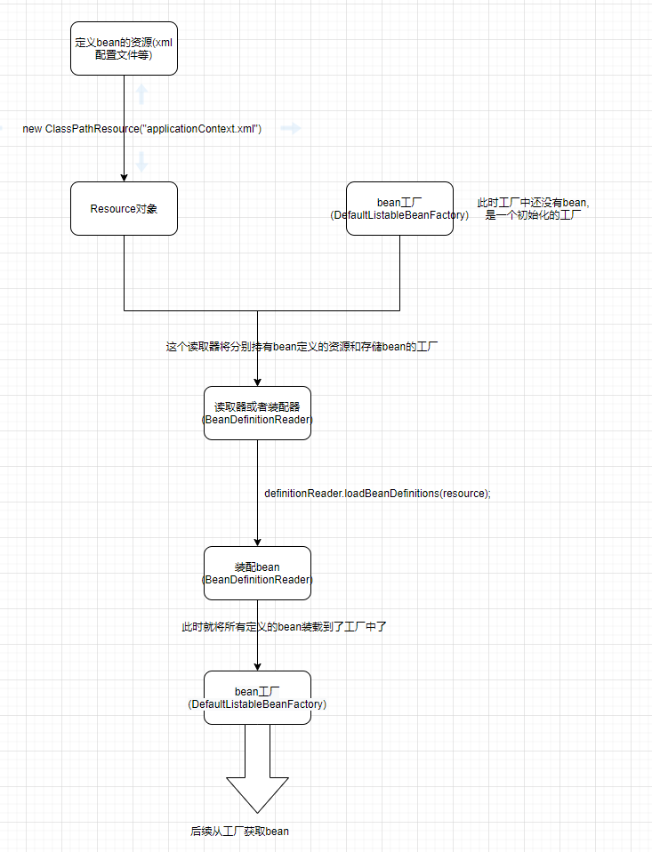
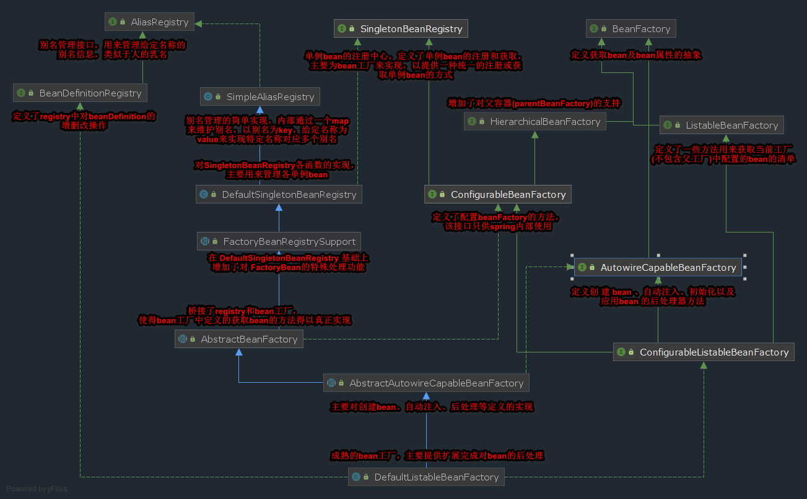
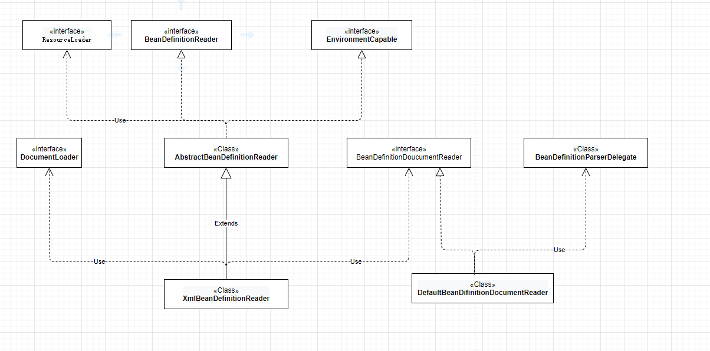
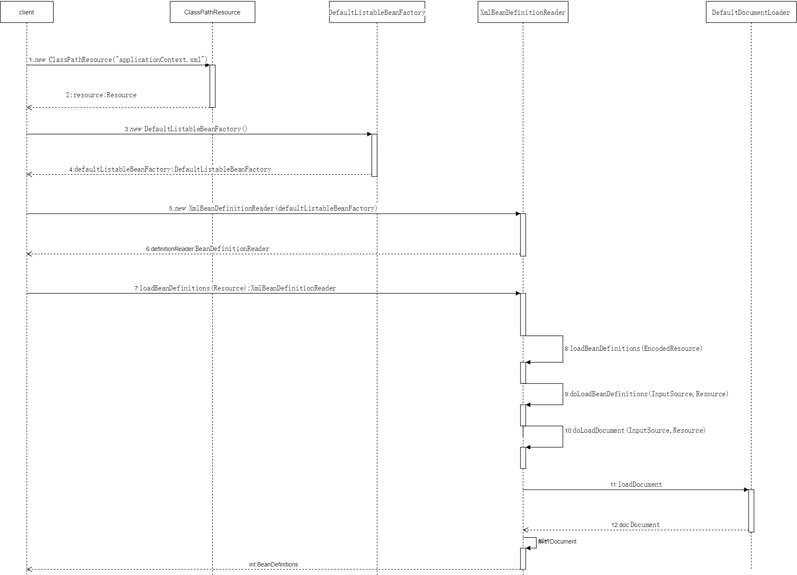
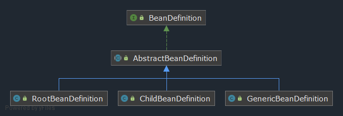
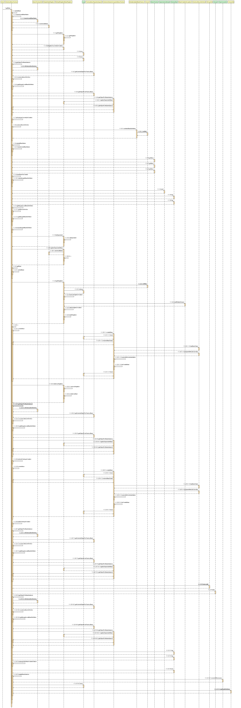

# Spring源码学习

## 1.IOC容器思想

spring中对于对象管理这块引入了一种IOC容器思想。IOC容器即来进行对象的创建、对象的存放、对象的管理等等一系列的事情。

在spring中，通过两种技术手段来实现这个思想：

- IOC控制反转：即spring接手了对象的创建，将对象的创建过程从调用者手中转移到了spring框架中，实现了创建对象这一操作的反转。
- DI依赖注入：在创建对象过程中，不可避免的会需要处理对象间的依赖关系，属性的注入等，在某些情况下，只有一些必要的属性注入后，此对象才是一个真正可用的对象，而DI这种手段就是用来处理对象的属性注入的。

只有经过**控制反转**及**依赖注入**后，对象的创建才真正的完成，再结合一系列的存储、管理等手段，形成了spring的IOC容器基础。

## 2.spring容器管理bean的模式及加载

spring加载bean有这么几步：

​	1.首先需要定义bean，采用xml或者注解的方式。

​	2.需要通过spring提供的资源接口Resource来获取xml配置资源。

​	3.需要声明一个spring工厂，该工厂用来掌控我们自定义配置的各种bean及bean之间的依赖关系。

​	4.需要定义个信息读取器，该读取器用来读取我们配置文件内的信息并将其封装为spring内部可识别的一种信息。

​	5.当读取器读取了我们定义额配置信息后，将会把这些信息组装后前面定义的工厂中。

​	7.通过工厂我们可以获取到我们定义的bean对象(装配完成)。

```Java
public class SpringClient{
	public static void main(String[]args){
        //1.获取资源,类路径下的applicationContext.xml
        Resource resource = new ClassPathResource("applicationContext.xml");

        //2.创建spring创建对象的工厂
        DefaultListableBeanFactory defaultListableBeanFactory = new DefaultListableBeanFactory();

        //3.创建资源读取器，用来读取第一步形成的类路径下的xml资源
        //读取的信息需要放置到工厂中，所以传入一个DefaultListableBeanFactory对象
        BeanDefinitionReader definitionReader = new XmlBeanDefinitionReader(defaultListableBeanFactory);
        //指定读取的资源是哪个
        definitionReader.loadBeanDefinitions(resource);

        //4.从工厂中获取定义的bean对象
        Student student = defaultListableBeanFactory.getBean("student",Student.class);
        System.out.println(student);
    }
}
```

以上的流程可以如图来描述：



## 3.spring的IOC核心组件

Spring ioc的核心组件有三个：

- 资源处理器
- 工厂
- bean信息定义读取器

### 3.1资源处理器

spring中提供的资源处理器是Resource接口。其接口类图如图所示：


其中，

ClassPathResource用来标识类路径下的资源；
FileSystemResource用来具体表示文件系统资源；

UrlResource用来表示通过URL资源定位符表示的资源；

MultipartFileResource是一个MultipartFile和Resource之间的适配器，用来将web中传输的文件用Resource表示出来。

InputStreamSource 接口封装了任何能返回 InputStream 的类，它只定义了一个方法getlnputStream().Spring通过这种方式屏蔽了底层资源的差异性，使得所有的底层资源都可以通过一个Resource对象来表示，并且Resource中还封装了其它的一些对资源判断的一些方法。

所以，在使用中，我们可以在程序中直接使用Resource对象来表示我们想要获取InputStream对象的资源信息。

例如，当我们加载类路径下的资源时，spring是通过一个class对象或者是一个classLoader来进行加载的，其具体的加载流程如下：

```Java
Resource resource = new ClassPathResource("applicationContext.xml");

public ClassPathResource(String path) {
    this(path, (ClassLoader) null);
}

public ClassPathResource(String path, @Nullable ClassLoader classLoader) {
    Assert.notNull(path, "Path must not be null");
    //转换传入的路径，做必要的处理，基本上就是将\\转为/
    String pathToUse = StringUtils.cleanPath(path);
    if (pathToUse.startsWith("/")) {
        pathToUse = pathToUse.substring(1);
    }
    this.path = pathToUse;
    //指定一个classLoader
    this.classLoader = (classLoader != null ? classLoader : ClassUtils.getDefaultClassLoader());
}
```

注意，在通过ClassPathResource来具体加载资源时，其必须需要一个ClassLoader,该ClassLoader没有被调用者明确指定时，spring通过一系列手段为我们配置了一个类加载器，具体的配置代码如下：

```Java
#spring在加载类资源时获取classLoader的方式
    1.若调用者手动指定了classLoader，则使用指定的
    2.若没有指定，则尝试获取当前线程的类加载器，通常为系统类加载器
    3.若线程加载器获取失败或返回null，获取加载当前类的类加载器
    4.若当前类加载器获取失败或返回null，代表当前类是由根类加载器加载的，不属于Java范畴，所以获取失败
    5.最后，通过应用类加载器来加载
 注意：不同的加载器加载会导致加载不到文件等，尤其是多模块项目中，存在多个配置文件
public static ClassLoader getDefaultClassLoader() {
    ClassLoader cl = null;
    try {
        //获取当前线程中的类加载器，默认为系统类加载器，可以通过setContextClassLoader()来设置
        cl = Thread.currentThread().getContextClassLoader();
    }
    catch (Throwable ex) {
        // Cannot access thread context ClassLoader - falling back...
    }
    if (cl == null) {
        // No thread context class loader -> use class loader of this class.
        //当没有线程加载器时，获取当前类的类加载器
        cl = ClassUtils.class.getClassLoader();
        if (cl == null) {
            //当前类的类加载器为null，意味着当前类是由根类加载器加载的
            // getClassLoader() returning null indicates the bootstrap ClassLoader
            try {
                //最后，如果还没找到类加载器，则由当前应用类加载器来加载
                cl = ClassLoader.getSystemClassLoader();
            }
            catch (Throwable ex) {
                // Cannot access system ClassLoader - oh well, maybe the caller can live with null...
            }
        }
    }
    return cl;
}
```

而当我们想要加载一个文件系统资源时，spring底层会直接使用FileInputStream来打开一个流通道。

### 3.2spring的工厂体系

spring中提供了一整套IOC体系，用来完成bean对象的实例化、自动注入、后处理等操作，体系结构图如下：



**注意：XmlBeanFactory是对DefaultListableBeanFactorγ的扩展，但是现在已弃用，其本身只支持读取xml资源进行bean的创建等，比较单一，推荐直接使用DefaultListableBeanFactorγ来创建工厂。**

我们可以直接通过new的形式来创建一个bean工厂，代码如下：

```Java
DefaultListableBeanFactory defaultListableBeanFactory = new DefaultListableBeanFactory();
```

下面是DefaultListableBeanFactorγ这个工厂初始化的流程：

```Java
//首先通过new的方式创建工厂对象
new DefaultListableBeanFactory()
    
//接下来会调用其默认的构造方法，也可以指定当前工厂的父工厂来进行构造，如下：
public DefaultListableBeanFactory() {
    super();
}

public DefaultListableBeanFactory(@Nullable BeanFactory parentBeanFactory) {
    super(parentBeanFactory);
}

//在构造方法中，直接调用了上级AbstractAutowireCapableBeanFactory的构造方法
public AbstractAutowireCapableBeanFactory() {
    super();
    //下面处理将忽略这些类型bean的的依赖自动注入的特性
    // 实现这些接口的bean将不会被自动注入到依赖其的bean中，
    //BeanNameAware用来普通bean获取它在beanFactory中的bean的名称
    ignoreDependencyInterface(BeanNameAware.class);
    //BeanFactoryAware用于普通bean获取其所在的工厂容器
    ignoreDependencyInterface(BeanFactoryAware.class);
    //BeanClassLoaderAware用于获取加载当前bean的类加载器
    ignoreDependencyInterface(BeanClassLoaderAware.class);
    //下面是对GraalVM(内置虚拟机)的支持
    if (NativeDetector.inNativeImage()) {
        this.instantiationStrategy = new SimpleInstantiationStrategy();
    }
    else {
        this.instantiationStrategy = new CglibSubclassingInstantiationStrategy();
    }
}

//在上述构造方法中又调用了父类AbstractBeanFactory的构造方法
public AbstractBeanFactory() {
}

//至此，一个bean工厂就被初始化好了
```

#### 3.2.1 补充Aware的作用

​	对于Spring提供的一系列Aware接口或类，其作用通常来说都是为了让某个bean可以感知到Spring容器的存在。因为在Spring中，虽然bean是由Spring容器创建并管理的，但是其实bean本身是不知道它是怎么来的，它在哪里的，所以Spring提供了一系列Aware接口或方法供bean在创建的特定时机(例如，在bean属性设置完成，初始方法调用之前)可以通过这些Aware获取一些特定的信息。例如，如果一个bean实现了BeanNameAware接口，这个bean就可以感知到其在spring容器中该bean对应的唯一id即名称。

​	常见的Aware有如下几种：

| Aware                          | 作用                                                         | Spring调用(回调)时机 |
| ------------------------------ | ------------------------------------------------------------ | -------------------- |
| BeanNameAware                  | 获取bean在容器中的名称(可能与配置的bean名称不一致，获取的只是在工厂中使用的bean名称，因为工厂可能会有#后缀来保证唯一) |                      |
| BeanFactoryAware               | 获取当前bean所在的BeanFactory,可以通过该BeanFactory获取其它对象 |                      |
| ApplicationContextAware        | 同上，只不过ApplicationContext是BeanFactory的高级版          |                      |
| MessageSourceAware             | 获取 Message Source 相关文本信息                             |                      |
| ApplicationEventPublisherAware | 获取当前bean的事件发布器ApplicationEventPublisher，可以用来发布事件 |                      |
| ResourceLoaderAware            | 获取当前Bean对应的资源加载器ResourceLoader，可以通过其来加载一个资源 |                      |

### 3.3资源读取器

当我们采用xml文件的方式配置bean及bean的依赖关系的时候，我们一般使用的资源读取器是xmlBeanDefinitionReader,其UML类图如下：



1. XmlBeanDefinitionReader通过继承AbstractBeanDefinitionReader中的方法，来使用ResourceLoader将给定资源文件的路径加载为可识别的资源；
2. 通过DocumentLoader实例来对Resource进行转换，转换为Document对象；
3. 使用DefaultBeanDefinitionDocumentReader类对Document进行解析，并使用BeanDefinitionParserDelegate对Element进行解析。

## 4.Spring的IOC初始化流程

​	下面对Spring IOC的整个初始化流程进行详解，还是以上述那段代码为入口开始：

```Java
public class SpringClient {

    public static void main(String[] args) throws IOException {

        //1.获取资源,类路径下的applicationContext.xml
        Resource resource = new ClassPathResource("applicationContext.xml");
        String resourceURL =resource.getURL().toString();
        String resourceURI =resource.getURI().toString();
        System.out.println("resourceURL----------------------->" + resourceURL);
        System.out.println("resourceURI----------------------->" + resourceURI);

        //2.创建spring创建对象的工厂
        DefaultListableBeanFactory defaultListableBeanFactory = new DefaultListableBeanFactory();

        //3.创建资源读取器，用来读取第一步形成的类路径下的xml资源
        //读取的信息需要放置到工厂中，所以传入一个DefaultListableBeanFactory对象
        BeanDefinitionReader definitionReader = new XmlBeanDefinitionReader(defaultListableBeanFactory);
        //指定读取的资源是哪个
        definitionReader.loadBeanDefinitions(resource);

        //4.从工厂中获取定义的bean对象
        Student student = defaultListableBeanFactory.getBean("student", Student.class);

        System.out.println(student);
    }
}
```

### 4.1资源加载

​	下图是资源加载的时序图，对于xml文件来说，最终，资源将会被加载为一个document对象，以供xml的方式去解析这个document对象。



上述Spring加载资源的流程可描述如下：

1. 首先将一个具体的资源封装为一个Resource对象；
2. 然后通过DefinitionReader(图中为XmlBeanDefinitionReader)来读取该Resource对象；
3. 在XmlBeanDefinitionReader中通过给定的资源转换为一个带编码的资源对象EncodeResource;
4. 然后通过资源对象构建InputSource对象；
5. 最后调用DocumentLoader中的loadDocument方法将InputSource加载为一个Document对象；
6. 至此，就可以使用xml的方式解析这个Document对象获取beanDefinitions了。

通过上图可以看出，其中XmlBeanDefinitionReader的loadBeanDefinitions是整个资源加载的核心，下面以它为入口重点进行分析。

首先，在XmlBeanDefinitionReader中通过loadBeanDefinitions将Resource对象加载进来：

```Java
//在外部我们通过以下代码来对一个资源进行加载
definitionReader.loadBeanDefinitions(resource);

//XmlBeanDefinitionReader中loadBeanDefinitions实现
public int loadBeanDefinitions(Resource resource) throws BeanDefinitionStoreException {
    //这里调用重载的loadBeanDefinitions方法，并将Resource通过EncodedResource封装为一个带编码或字符集的资源对象
    //EncodedResource类主要是用于对资源文件的编码进行处理的
    return loadBeanDefinitions(new EncodedResource(resource));
}

//重载的方法如下
public int loadBeanDefinitions(EncodedResource encodedResource) throws BeanDefinitionStoreException {
    Assert.notNull(encodedResource, "EncodedResource must not be null");
    if (logger.isTraceEnabled()) {
        logger.trace("Loading XML bean definitions from " + encodedResource);
    }

    //resourcesCurrentlyBeingLoaded是一个ThreadLocal实例
    //因为resourcesCurrentlyBeingLoaded这个ThreadLocal重写了initValue方法，在没set就get时会执行initValue方法，赋值初始值
    //所以下面不需要判断获取的ThreadLocal存储的值是不是空的
    Set<EncodedResource> currentResources = this.resourcesCurrentlyBeingLoaded.get();

    if (!currentResources.add(encodedResource)) {
        //如果添加失败代表当前资源文件存在循环引入
        //在资源文件中可以通过import形式进行引入另一个文件，如果相互引用，就会导致添加当前文件时添加失败
        //因为程序上不会将同一资源文件重复添加
        throw new BeanDefinitionStoreException(
            "Detected cyclic loading of " + encodedResource + " - check your import definitions!");
    }

    //通过Resource获取InputStream,然后构建InputSource对象
    try (InputStream inputStream = encodedResource.getResource().getInputStream()) {
        //构建解析xml时的InputSource
        InputSource inputSource = new InputSource(inputStream);
        if (encodedResource.getEncoding() != null) {
            inputSource.setEncoding(encodedResource.getEncoding());
        }
        //核心加载逻辑
        return doLoadBeanDefinitions(inputSource, encodedResource.getResource());
    }
    catch (IOException ex) {
        throw new BeanDefinitionStoreException(
            "IOException parsing XML document from " + encodedResource.getResource(), ex);
    }
    finally {
        //释放资源
        currentResources.remove(encodedResource);
        if (currentResources.isEmpty()) {
            this.resourcesCurrentlyBeingLoaded.remove();
        }
    }
}
```

通过Resource对象构造好InputSource对象后，开始加载Xml对应的Document对象：

```Java
//上面调用了doLoadBeanDefinitions方法通过inputSource对象构建Document对象
protected int doLoadBeanDefinitions(InputSource inputSource, Resource resource)
			throws BeanDefinitionStoreException {

    try {
        //获取xml解析的document对象
        Document doc = doLoadDocument(inputSource, resource);
        //解析注册该document中包含的bean对象
        int count = registerBeanDefinitions(doc, resource);
        if (logger.isDebugEnabled()) {
            logger.debug("Loaded " + count + " bean definitions from " + resource);
        }
        return count;
    }
    catch (BeanDefinitionStoreException ex) {
        throw ex;
    }
    catch (SAXParseException ex) {
        throw new XmlBeanDefinitionStoreException(resource.getDescription(),
                                                  "Line " + ex.getLineNumber() + " in XML document from " + resource + " is invalid", ex);
    }
    catch (SAXException ex) {
        throw new XmlBeanDefinitionStoreException(resource.getDescription(),
                                                  "XML document from " + resource + " is invalid", ex);
    }
    catch (ParserConfigurationException ex) {
        throw new BeanDefinitionStoreException(resource.getDescription(),
                                               "Parser configuration exception parsing XML from " + resource, ex);
    }
    catch (IOException ex) {
        throw new BeanDefinitionStoreException(resource.getDescription(),
                                               "IOException parsing XML document from " + resource, ex);
    }
    catch (Throwable ex) {
        throw new BeanDefinitionStoreException(resource.getDescription(),
                                               "Unexpected exception parsing XML document from " + resource, ex);
    }
}

//接下来调用DocumentLoader中的loadDocument方法加载Document对象
//这里使用了委托模式，将解析Document的工作具体交给了documentLoader去做
protected Document doLoadDocument(InputSource inputSource, Resource resource) throws Exception {
    //调用documentLoader的loadDocument方法
    return this.documentLoader.loadDocument(inputSource, getEntityResolver(), this.errorHandler,
                                            getValidationModeForResource(resource), isNamespaceAware());
}

//首先在通过InputSorce解析Document时，会先进行两个处理
//1、getEntityResolver()获取解析器
//EntityResolver的作用是提供一个如何寻找 DTD 声明的方法，即由程序来实现寻找 DTD 声明的过程
//2、getValidationModeForResource获取xml文档的验证模型 DTD验证或者schema验证
```

### 4.2资源解析

​	当获取到xml资源文件对应的Document文档后就可以开始解析Bean了。

```Java
//1.首先获取到Document对象后，紧接着调用了registerBeanDefinitions来解析Bean
public int registerBeanDefinitions(Document doc, Resource resource) throws BeanDefinitionStoreException {
    //获取一个BeanDefinitionDocumentReader实例
    BeanDefinitionDocumentReader documentReader = createBeanDefinitionDocumentReader();
    //获取在解析Bean之前容器中Bean的数量
    //这里的getRegistry()实际上获取的就是DefaultListableBeanFactory实例工厂
    //registry中包含了一系列对Bean进行统计、增删改的方法
    int countBefore = getRegistry().getBeanDefinitionCount();
    //解析Bean并添加到容器中
    documentReader.registerBeanDefinitions(doc, createReaderContext(resource));
    //通过解析后容器中Bean的数量减去解析前Bean的数量获取本次解析Bean的数量
    return getRegistry().getBeanDefinitionCount() - countBefore;
}

//2.在createBeanDefinitionDocumentReader()方法中实例化了一个BeanDefinitionDocumentReader对象
protected BeanDefinitionDocumentReader createBeanDefinitionDocumentReader() {
    //通过反射构建一个BeanDefinitionDocumentReader
    //其中这个BeanDefinitionDocumentReader是Spring写死的DefaultBeanDefinitionDocumentReader实现类
    //该实现类内部有一个BeanDefinitionParserDelegate接口，用来真正的解析bean，这里采用了委托模式,应用了单一职责的原则
    return BeanUtils.instantiateClass(this.documentReaderClass);
}

//3.接下来真正进入的是DefaultBeanDefinitionDocumentReader类中的registerBeanDefinitions方法
public void registerBeanDefinitions(Document doc, XmlReaderContext readerContext) {
    this.readerContext = readerContext;
    //真正开始解析Bean了
    //doc.getDocumentElement()是为了获取xml文档的根节点
    doRegisterBeanDefinitions(doc.getDocumentElement());
}

//4.接下来将xml文档中的root作为参数传递进doRegisterBeanDefinitions方法中，开始解析Bean
//首先对文档中有profile属性配置的进行了处理
//然后处理了存在import标签导致的循环解析的情况
protected void doRegisterBeanDefinitions(Element root) {
    //这里的root Element其实就是xml文件中配置的<beans/>标签了,Spring的Xml配置文件就是从这个标签开始的
    //所有嵌套的<beans>将会导致递归解析发生；通常一个xml文档中通过import标签引入另一个xml文档就会发生这种情况
    //这里解析Bean的时候是通过BeanDefinitionParserDelegate去解析的，而为了在递归解析的情况下能够保持当前Bean的默认属性
    //所以这里在每次解析前将当前delegate作为parent保存下来
    //然后构造一个新的delegate去解析当前Bean嵌套的Bean
    //最终，每一层解析完成后，再将delegate回归原始状态
    BeanDefinitionParserDelegate parent = this.delegate;
    //创建子delegate
    this.delegate = createDelegate(getReaderContext(), root, parent);

    if (this.delegate.isDefaultNamespace(root)) {
        //这里判断是默认的命名空间
        //首先处理<Beans>标签上的profile属性,profile属性用来指定不同的环境，比如测试环境，生产环境，配置该属性代表当前xml文档在哪个环境中生效，常用于数据库配置文件中来切换数据库
        /*<beans xmlns="http://www.springframework.org/schema/beans"
			xmlns:xsi="http://www.w3.org/2001/XMLSchema-instance"
			xsi:schemaLocation="http://www.springframework.org/schema/beans http://www.springframework.org/schema/beans/spring-beans.xsd" profile="dev">*/
        String profileSpec = root.getAttribute(PROFILE_ATTRIBUTE);
        if (StringUtils.hasText(profileSpec)) {
            String[] specifiedProfiles = StringUtils.tokenizeToStringArray(
                profileSpec, BeanDefinitionParserDelegate.MULTI_VALUE_ATTRIBUTE_DELIMITERS);
            // We cannot use Profiles.of(...) since profile expressions are not supported
            // in XML config. See SPR-12458 for details.
            //这里Environment在Web容器中通常在web.xml中进行配置,系统将支持哪些环境，例如如下配置
            /*<context-param>
					<param-name> Spring. profiles. act:ive</param－name>
					<param-value>dev</param- value>
				</context-param>*/
            if (!getReaderContext().getEnvironment().acceptsProfiles(specifiedProfiles)) {
                if (logger.isDebugEnabled()) {
                    logger.debug("Skipped XML bean definition file due to specified profiles [" + profileSpec +
                                 "] not matching: " + getReaderContext().getResource());
                }
                return;
            }
        }
    }
    //这里采用了模板方法设计模式
    //preProcessXml和postProcessXml都是为了让继承DefaultDefinitionDocumentReader的子类去实现，以实现自定义解析处理
    preProcessXml(root);
    //解析Bean的定义信息
    parseBeanDefinitions(root, this.delegate);
    postProcessXml(root);

    this.delegate = parent;
}

//5.接下来调用DefaultBeanDefinitionDocumentReader中的parseBeanDefinitions方法来进行Bean的解析
protected void parseBeanDefinitions(Element root, BeanDefinitionParserDelegate delegate) {
    //首先从根级别的子标签开始解析，包含的标签有"import", "alias", "bean"
    if (delegate.isDefaultNamespace(root)) {
        //默认命名空间解析
        //获取所有的直接子节点
        NodeList nl = root.getChildNodes();
        for (int i = 0; i < nl.getLength(); i++) {
            Node node = nl.item(i);
            if (node instanceof Element) {
                //这里判断节点是不是一个Element,因为xml文档中会包含注释语句，它也是xml中的一个节点，但确不是一个Element
                Element ele = (Element) node;
                if (delegate.isDefaultNamespace(ele)) {
                    //获取到每一个子标签,然后解析
                    parseDefaultElement(ele, delegate);
                }
                else {
                    delegate.parseCustomElement(ele);
                }
            }
        }
    }
    else {
        //不是默认命名空间的解析
        //Spring会根据自定义的命名空间去尝试获取解析handler，如果获取到就开始解析,获取不到就退出
        //Spring将内置的默认的handler配置在了META-INF/spring.handlers文件中，通过一个DefaultNamespaceHandlerResolver来加载这个配置
        //如果想自定义解析的handler，需要我们实现NamespaceHandlerResolver和NamespaceHandler来进行处理，然后再构建XmlBeanDefinitionReader后手动set进去
        delegate.parseCustomElement(root);
    }
}

//6.针对每一个root下的子标签开始解析处理
private void parseDefaultElement(Element ele, BeanDefinitionParserDelegate delegate) {
    if (delegate.nodeNameEquals(ele, IMPORT_ELEMENT)) {
        //解析import标签
        importBeanDefinitionResource(ele);
    }
    else if (delegate.nodeNameEquals(ele, ALIAS_ELEMENT)) {
        //解析alisa标签
        processAliasRegistration(ele);
    }
    else if (delegate.nodeNameEquals(ele, BEAN_ELEMENT)) {
        //解析Bean标签
        processBeanDefinition(ele, delegate);
    }
    else if (delegate.nodeNameEquals(ele, NESTED_BEANS_ELEMENT)) {
        // recurse
        //解析嵌套的Beans标签
        doRegisterBeanDefinitions(ele);
    }
}
```

接下来开始对Spring的xml文档中的各种标签进行解析。

#### 4.2.1 解析默认标签——bean标签

​	Bean标签解析流程如下，内部详细标签解析略。

```Java
protected void processBeanDefinition(Element ele, BeanDefinitionParserDelegate delegate) {
    //首先委托给BeanDefinitionParserDelegate对元素标签进行解析，得到一个BeanDefinitionHolder对象
    //BeanDefinitionHolder对象中包含了bean的实例、id、别名、类型等信息
    BeanDefinitionHolder bdHolder = delegate.parseBeanDefinitionElement(ele);
    if (bdHolder != null) {
        bdHolder = delegate.decorateBeanDefinitionIfRequired(ele, bdHolder);
        try {
            // Register the final decorated instance.
            //注册解析后的bean定义
            //注册有两种，一种是id属性注册，一种是别名注册
            //BeanDefinitionRegistry注册器内部通过一个ConcurrentHashMap维护Beandifinition信息
            BeanDefinitionReaderUtils.registerBeanDefinition(bdHolder, getReaderContext().getRegistry());
        }
        catch (BeanDefinitionStoreException ex) {
            getReaderContext().error("Failed to register bean definition with name '" +
                                     bdHolder.getBeanName() + "'", ele, ex);
        }
        // Send registration event.
        //最终，注册一个注册完成的发布事件，供监听该事件的监听器触发相应逻辑
        getReaderContext().fireComponentRegistered(new BeanComponentDefinition(bdHolder));
    }
}
```

##### 4.2.1.1 BeanDifinition说明

​	BeanDifinition的类图如下所示：



由上图可以看出，AbstractBeanDifinition是BeanDifinition的一般实现，其直接的子类有三个：RootBeanDifinition、ChildBeanDifinition、GenericBeanDifinition。

​	其中，RootBeanDifinition和ChildBeanDifinition是作用于具有父子关系的Bean的，GenericBeanDifinition是Bean的一站式服务(从Spring 2.5引入)。

​	Spring官方推荐使用GenericBeanDifinition来表达Bean元素(替换掉RootBeanDifinition和ChildBeanDifinition)，其内部引用了一个parentName来表达bean之间的父子关系，之所以这样推荐是为了避免对Bean的角色产生一种“hard-coding”。

```java
public abstract class AbstractBeanDefinition extends BeanMetadataAttributeAccessor
		implements BeanDefinition, Cloneable {

	//存放bean实例
	@Nullable
	private volatile Object beanClass;

	//bean的作用域，默认单例
	@Nullable
	private String scope = SCOPE_DEFAULT;

	//该Bean是否是抽象类，在bean标签上有abstract属性
	private boolean abstractFlag = false;

	//定义bean是否延迟加载
	@Nullable
	private Boolean lazyInit;

	//自动注入模型，默认不自动注入，除非有annotation-driven标签
	private int autowireMode = AUTOWIRE_NO;

	//依赖检查
	private int dependencyCheck = DEPENDENCY_CHECK_NONE;

	//对应一个bean实例化依靠另一个bean先实例化，对应bean属性depend-on
	@Nullable
	private String[] dependsOn;

	//autowire-candidate属性设置为false，那么该bean将不会被其它bean作为依赖时自动注入，而本身这个bean依赖的其它bean还是会被自动注入的
	private boolean autowireCandidate = true;

	//自动装配出现多个bean的候选者时，设置该primary属性的bean将会作为首选者进行注入
	private boolean primary = false;

	//用于记录Qualifier,对应子元素qualifiers
	private final Map<String, AutowireCandidateQualifier> qualifiers = new LinkedHashMap<>();

	//不管是静态工厂还是工厂方法，都需要通过反射调用目标方法创建对象，反射或多或少影响性能
	//此属性是为了不用反射或工厂方法时，可以使用java8面向函数式编程的方式，给定一个创建对象的Supplier，通过该Supplier来创建对象
	@Nullable
	private Supplier<?> instanceSupplier;

	//允许访问非公开的构造器和方法，程序设置
	private boolean nonPublicAccessAllowed = true;

	/**
	 * 手于以一种宽松的模式解析构造函数，默认为 true ,
	 * 如果设置为false ，则在以下情况,
	 * pulic interface ITest {}
	 * class ITestimpl Implements ITest {} ;
	 * class Main{
	 * Main(ITest i) {}
	 * Main (ITestimpl i) {}
	 * }
	 * 会抛出异常，因为spring无法确定通过哪个构造函数解析
	 */
	private boolean lenientConstructorResolution = true;

	//工厂bean名称
	@Nullable
	private String factoryBeanName;

	//工厂bean方法名称
	@Nullable
	private String factoryMethodName;

	//构造函数属性
	@Nullable
	private ConstructorArgumentValues constructorArgumentValues;

	//普通属性
	@Nullable
	private MutablePropertyValues propertyValues;

	//记录methodOverride属性，用来存储replace-method属性和lookup-method属性
	private MethodOverrides methodOverrides = new MethodOverrides();

	//初始化方法名称
	@Nullable
	private String initMethodName;

	//销毁方法名称
	@Nullable
	private String destroyMethodName;

	//是否执行初始化方法，spring内部设置
	private boolean enforceInitMethod = true;

	//同上
	private boolean enforceDestroyMethod = true;

	private boolean synthetic = false;

	//设置这个bean的角色：
	// 0：用户定义
	// 1：完全内部使用，与用户无关
	// 2：某些复杂配置的一部分
	//程序内部设置
	private int role = BeanDefinition.ROLE_APPLICATION;

	//bean的描述信息
	@Nullable
	private String description;

	//定义这个bean的资源
	@Nullable
	private Resource resource;
}
```

#### 4.2.2解析默认标签——alisa标签

#### 4.2.3解析默认标签——import标签

#### 4.2.4解析默认标签——嵌套bean标签

#### 4.2.5解析自定义标签

### 4.3bean的加载

​	完成了xml文件的解析后,xml中配置bean标签就转换为了Spring中的BeanDefinition对象，当我们需要使用该bean时，还需要经过bean的加载过程才能形成一个完整的对象供我们使用。

​	继续通过上面的代码跟踪bean的加载过程。

```Java
//从工厂中获取bean
Student student = defaultListableBeanFactory.getBean("student", Student.class);
```

​	接下来是bean的详细加载过程。

```Java
//首先调用bean工厂提供的getBean方法
public <T> T getBean(String name, Class<T> requiredType) throws BeansException {
    //实际处理获取bean的方法
    return doGetBean(name, requiredType, null, false);
}

//接下来调用doGetBean从工厂中获取bean,可以返回单例bean，也可以返回非单例bean
protected <T> T doGetBean(
			String name, @Nullable Class<T> requiredType, @Nullable Object[] args, boolean typeCheckOnly)
			throws BeansException {

    //处理给定的name,去除工厂bean的修饰符或别名的影响,获取一个符合的bean的id
    String beanName = transformedBeanName(name);
    Object beanInstance;

    //尝试从单例缓存中获取bean，因为依赖注入的关系，对于单例bean,未避免循环依赖，spring在创建单例bean的时候，
    // 会及早的将该bean对应的objectFactory进行暴漏,而不会等该bean完全创建完成就可以使用,
    // 这里就是在尝试获取这个objectFactory
    Object sharedInstance = getSingleton(beanName);
    if (sharedInstance != null && args == null) {
        //如果在这里获取到了对应bean的objectFactory，就代表该bean没有完全创建成功就到了依赖bean的创建,这里发生了单例bean的循环依赖
        if (logger.isTraceEnabled()) {
            if (isSingletonCurrentlyInCreation(beanName)) {
                logger.trace("Returning eagerly cached instance of singleton bean '" + beanName +
                             "' that is not fully initialized yet - a consequence of a circular reference");
            }
            else {
                logger.trace("Returning cached instance of singleton bean '" + beanName + "'");
            }
        }
        //返回对应的实例，有时存在诸如beanFactory的情况并不是直接返回实例本身而是返回工厂方法返回的实例
        beanInstance = getObjectForBeanInstance(sharedInstance, name, beanName, null);
    }

    else {

        if (isPrototypeCurrentlyInCreation(beanName)) {
            //只有单例bean才会尝试处理循环依赖,对于非单例bean，因为其是每次获取的时候新创建对象(而不是像单例bean一样缓存).
            // 如果A引用B，那么创建A的时候就要创建B,创建B的时候又会创建A，造成了循环依赖
            throw new BeanCurrentlyInCreationException(beanName);
        }

        //如果父工厂存在并且该bean不在当前工厂中，就从父工厂尝试查找该bean
        BeanFactory parentBeanFactory = getParentBeanFactory();
        if (parentBeanFactory != null && !containsBeanDefinition(beanName)) {
            // Not found -> check parent.
            String nameToLookup = originalBeanName(name);
            if (parentBeanFactory instanceof AbstractBeanFactory) {
                return ((AbstractBeanFactory) parentBeanFactory).doGetBean(
                    nameToLookup, requiredType, args, typeCheckOnly);
            }
            else if (args != null) {
                // parent with explicit args.Delegation to
                return (T) parentBeanFactory.getBean(nameToLookup, args);
            }
            else if (requiredType != null) {
                // No args -> delegate to standard getBean method.
                return parentBeanFactory.getBean(nameToLookup, requiredType);
            }
            else {
                return (T) parentBeanFactory.getBean(nameToLookup);
            }
        }
        //如果不仅仅是做类型检查，那么就是创建bean，这里要标记当前bean为创建
        if (!typeCheckOnly) {
            markBeanAsCreated(beanName);
        }

        StartupStep beanCreation = this.applicationStartup.start("spring.beans.instantiate")
            .tag("beanName", name);
        try {
            if (requiredType != null) {
                beanCreation.tag("beanType", requiredType::toString);
            }
            //将从xml文件解析bean时创建的GenericBeanDefinition转为RootBeanDefinition，同时对于子bena要合并父类的属性
            RootBeanDefinition mbd = getMergedLocalBeanDefinition(beanName);
            checkMergedBeanDefinition(mbd, beanName, args);

            // Guarantee initialization of beans that the current bean depends on.
            String[] dependsOn = mbd.getDependsOn();
            //如果存在依赖，则递归实例化依赖的bean
            if (dependsOn != null) {
                for (String dep : dependsOn) {
                    if (isDependent(beanName, dep)) {
                        throw new BeanCreationException(mbd.getResourceDescription(), beanName,
                                                        "Circular depends-on relationship between '" + beanName + "' and '" + dep + "'");
                    }
                    registerDependentBean(dep, beanName);
                    try {
                        getBean(dep);
                    }
                    catch (NoSuchBeanDefinitionException ex) {
                        throw new BeanCreationException(mbd.getResourceDescription(), beanName,
                                                        "'" + beanName + "' depends on missing bean '" + dep + "'", ex);
                    }
                }
            }

            // Create bean instance.
            if (mbd.isSingleton()) {
                //创建单例bean
                sharedInstance = getSingleton(beanName, () -> {
                    try {
                        return createBean(beanName, mbd, args);
                    }
                    catch (BeansException ex) {
                        // Explicitly remove instance from singleton cache: It might have been put there
                        // eagerly by the creation process, to allow for circular reference resolution.
                        // Also remove any beans that received a temporary reference to the bean.
                        destroySingleton(beanName);
                        throw ex;
                    }
                });
                beanInstance = getObjectForBeanInstance(sharedInstance, name, beanName, mbd);
            }

            else if (mbd.isPrototype()) {
                // It's a prototype -> create a new instance.
                //直接创建一个新的bean
                Object prototypeInstance = null;
                try {
                    beforePrototypeCreation(beanName);
                    prototypeInstance = createBean(beanName, mbd, args);
                }
                finally {
                    afterPrototypeCreation(beanName);
                }
                beanInstance = getObjectForBeanInstance(prototypeInstance, name, beanName, mbd);
            }

            else {
                String scopeName = mbd.getScope();
                if (!StringUtils.hasLength(scopeName)) {
                    throw new IllegalStateException("No scope name defined for bean ´" + beanName + "'");
                }
                Scope scope = this.scopes.get(scopeName);
                if (scope == null) {
                    throw new IllegalStateException("No Scope registered for scope name '" + scopeName + "'");
                }
                try {
                    Object scopedInstance = scope.get(beanName, () -> {
                        beforePrototypeCreation(beanName);
                        try {
                            return createBean(beanName, mbd, args);
                        }
                        finally {
                            afterPrototypeCreation(beanName);
                        }
                    });
                    beanInstance = getObjectForBeanInstance(scopedInstance, name, beanName, mbd);
                }
                catch (IllegalStateException ex) {
                    throw new ScopeNotActiveException(beanName, scopeName, ex);
                }
            }
        }
        catch (BeansException ex) {
            beanCreation.tag("exception", ex.getClass().toString());
            beanCreation.tag("message", String.valueOf(ex.getMessage()));
            cleanupAfterBeanCreationFailure(beanName);
            throw ex;
        }
        finally {
            beanCreation.end();
        }
    }
    //适配bean是真正传入的requiredType指定的类型
    return adaptBeanInstance(name, beanInstance, requiredType);
}
```



#### 4.3.1 FactoryBean的使用

​	一般情况下，Spring通过反射机制将bean配置时指定的class属性实例化为一个对象。而除此之外，Spring提供了一个org.springframework.beans.factory.FactoryBean来实例化某个bean，该工厂bean适用于普通配置bean实例化比较复杂的场景。

​	FactoryBean接口构成如下：

```Java
public interface FactoryBean<T> {

	/**
	 * The name of an attribute that can be
	 * {@link org.springframework.core.AttributeAccessor#setAttribute set} on a
	 * {@link org.springframework.beans.factory.config.BeanDefinition} so that
	 * factory beans can signal their object type when it can't be deduced from
	 * the factory bean class.
	 * @since 5.2
	 */
	String OBJECT_TYPE_ATTRIBUTE = "factoryBeanObjectType";


	/**
	 * 返回由 FactoryBean 创建的 bean实例，如果isSingleton()返回 true ，则
	 * 该实例会放到 Spring 容器中单实例缓存池中 。
	 */
	@Nullable
	T getObject() throws Exception;

	/**
	 * 返回创建的bean的类型
	 */
	@Nullable
	Class<?> getObjectType();

	/**
	 *标识该FactoryBean创建的bean是否单例
	 */
	default boolean isSingleton() {
		return true;
	}

}
```

​	该FactoryBean的用法如下：

```Java
//首先定义一个普通bean——Car

public class Car {

    private String productor;

    private String type;

    private String number;
    
    //get和set省略
}

//如果采用通常的方式配置该bean，则需要在配置文件中通过<property>标签配置每一个属性

//而如果采用FactoryBean的方式配置,如下
public class CarFactoryBean implements FactoryBean<Car> {

    private String carInfo;

    @Override
    public Car getObject() throws Exception {
        Car car = new Car();
        String[] split = carInfo.split(",");
        car.setProductor(split[0]);
        car.setType(split[1]);
        car.setNumber(split[2]);
        return car;
    }

    @Override
    public Class<?> getObjectType() {
        return Car.class;
    }

    @Override
    public boolean isSingleton() {
        return true;
    }

    public void setCarInfo(String carInfo) {
        this.carInfo = carInfo;
    }
}
//然后再配置文件中进行配置
<bean id="car" class="com.cyz.spring.bean.CarFactoryBean" >
    <property name="carInfo" value="长安汽车,奔驰,AF018"/>
</bean>
//这里相当于通过FactoryBean中的getObject()代理了getBean方法
//从工厂中获取Car的实例还是一样的方式
Car car = defaultListableBeanFactory.getBean("car", Car.class);
//如果要获取产生Car的FactoryBean的话需要如下方式 &前缀
Car car = defaultListableBeanFactory.getBean("&car", Car.class);
```

#### 4.3.2 缓存中获取单例bean

​	单例bean在spring中只会创建一次，后续获取就从单例缓存中获取，其获取或加载流程如下：

```Java
//从缓存中获取单例bean
public Object getSingleton(String beanName) {
    //该方法尝试从单例缓存中获取bean,true代表允许早期依赖
    return getSingleton(beanName, true);
}
//调用getSingleton方法检测循环依赖及获取原始bean
//该方法的作用如下：
//返回在给定名称下注册的（原始）单例对象。检查已经实例化的单例，并允许对当前创建的单例进行早期引用（解决循环引用）
//注意这里的“原始”,代表该bean只是初步创建，并不是我们最终要用的bean
protected Object getSingleton(String beanName, boolean allowEarlyReference) {
    //这个单例缓存singletonObjects实际上就是一个ConcurrentHashMap
    //这里先检查一下缓存中是否存在该bean
    Object singletonObject = this.singletonObjects.get(beanName);
    //这里判断当singletonObject为null的时候，是否存在单例的循环依赖
    if (singletonObject == null && isSingletonCurrentlyInCreation(beanName)) {
        //存在单例循环依赖,就尝试获取早期(原始)bean对象
        singletonObject = this.earlySingletonObjects.get(beanName);
        if (singletonObject == null && allowEarlyReference) {
            //如果早期bean对象也不存在，并且允许引用早期bean对象
            synchronized (this.singletonObjects) {
                // 双重锁定
                // 再次判断该bean是否被创建
                singletonObject = this.singletonObjects.get(beanName);
                if (singletonObject == null) {
                    singletonObject = this.earlySingletonObjects.get(beanName);
                    if (singletonObject == null) {
                        //尝试获取该bean的ObjectFactory(对象工厂)
                        //singletonFactories又是一个ConcurrentHashMap缓存，那么这里是什么时候设值的呢？
                        //整个这个方法就是为了解决循环依赖的问题，那么当发生单例bean的循环依赖时，例如A引用B,B引用A
                        //当A创建时,调用当前方法一定会返回一个null,因为singletonFactories此时也是空的
                        //然后继续后面的流程,创建A对象,创建A对象的时候先把这个bean对应的ObjectFactory存放到singletonFactories中
                        //然后在解决依赖注入的时候发现A依赖B，那么紧接着开始创建B，B同样经过相同的流程，此时B发现又依赖于A
                        //则继续触发A的创建，此时，方法就进入到这里，发现A对应的ObjectFactory存在
                        //那就调用ObjectFactory（前面已缓存）的getObject()方法获取
                        //最终将获取到的对象放入earlySingletonObjects中
                        ObjectFactory<?> singletonFactory = this.singletonFactories.get(beanName);
                        if (singletonFactory != null) {
                            //如果该bean的对象工厂不为null，则调用getObject()创建对象
                            singletonObject = singletonFactory.getObject();
                            this.earlySingletonObjects.put(beanName, singletonObject);
                            this.singletonFactories.remove(beanName);
                        }
                    }
                }
            }
        }
    }
    return singletonObject;
}

```

**注意：在上述getSingleton方法中，涉及到了三级缓存，spring就是通过三级缓存来解决单例bean的循环引用问题的：**

- singletonObjects:一级缓存，缓存已经创建比较成熟的对象(此时bean创建过程已经结束)，保存beanName和bean实例之间关系
- earlySingletonObjects：也是保存beanName和bean实例之间关系,此时bean还处于创建过程中，不过可以通过该缓存获取到这个正在创建的bean并解决创建bean过程中的循环依赖问题
- singletonFactories：保存的是beanName与对应ObjectFactory对象创建工厂之间的关系,是三级缓存，此时bean还未被创建，ObjectFactory就是用来创建该bean的具体实现。

#### 4.3.3 从bean的实例中获取对象

​	不管是从缓存中获取的实例还是通过不同的scoop策略加载的实例(即上面的sharedInstance)，都只是初始状态下的bean，不一定是我们最终想要的bean。例如，通过工厂Bean(FactoryBean)创建bean的时候，我们最终想要的bean是由getObject()方法来创建的bean，这个工作就是在getObjectForBeanInstance中完成的。

```Java
/**
	 * 通过给定实例返回想要的实例对象,可能出现两种情况:
	 *
	 * 1、给定实例就是想要的实例对象
	 * 2、给定的实例是一个工厂bean，返回的实例是通过这个工厂bean创建的实例
	 */
protected Object getObjectForBeanInstance(
    Object beanInstance, String name, String beanName, @Nullable RootBeanDefinition mbd) {

    // Don't let calling code try to dereference the factory if the bean isn't a factory.
    //首先这里判断客户端是不是想获取工厂bean,即name中包含 & 前缀
    if (BeanFactoryUtils.isFactoryDereference(name)) {
        if (beanInstance instanceof NullBean) {
            return beanInstance;
        }
        //如果想获取的是工厂bean，给定实例也是一个工厂bean的实例,即返回，否则抛出异常
        if (!(beanInstance instanceof FactoryBean)) {
            throw new BeanIsNotAFactoryException(beanName, beanInstance.getClass());
        }
        if (mbd != null) {
            mbd.isFactoryBean = true;
        }
        return beanInstance;
    }

    // Now we have the bean instance, which may be a normal bean or a FactoryBean.
    // If it's a FactoryBean, we use it to create a bean instance, unless the
    // caller actually wants a reference to the factory.
    //然后，如果当前给定实例并不是一个工厂bean，并且给定的name也不包含 & 前缀，则直接返回这个bean实例
    if (!(beanInstance instanceof FactoryBean)) {
        return beanInstance;
    }

    //接下来，返回给定工厂bean创建的实例
    Object object = null;
    if (mbd != null) {
        mbd.isFactoryBean = true;
    }
    else {
        //这里判断是否bean实例已由对应的工厂bean创建过了,如果创建过了可以直接返回
        //通过FactoryBeanRegistrySupport(继承了DefaultSingletonBeanRegistry)中的一个缓存来实现
        object = getCachedObjectForFactoryBean(beanName);
    }
    if (object == null) {
        //由工厂来创建该实例
        FactoryBean<?> factory = (FactoryBean<?>) beanInstance;
        //获取mbd
        if (mbd == null && containsBeanDefinition(beanName)) {
            mbd = getMergedLocalBeanDefinition(beanName);
        }
        //判断该bean是由程序生成的还是由应用中自己定义的,例如 aop生成的相关对象就是程序自动生成的 synthetic=true
        boolean synthetic = (mbd != null && mbd.isSynthetic());
        object = getObjectFromFactoryBean(factory, beanName, !synthetic);
    }
    return object;
}
```

通过上述方法源码可以看出，getObjectForBeanInstance 主要是对获取的实例类型(实例或对应的FactoryBean实例)进行了判断，当调用方想获取最终的实例，并且该实例继承了FactoryBean时，其具体的逻辑是在getObjectFromFactoryBean方法中实现的，获取FactoryBean中真正创建的实例对象。

```JAVA 
//获取给定FactoryBean暴露的对象实例
protected Object getObjectFromFactoryBean(FactoryBean<?> factory, String beanName, boolean shouldPostProcess) {
    if (factory.isSingleton() && containsSingleton(beanName)) {
        //factory.isSingleton()为true代表被该工厂bean创建的实例是单例bean
        //containsSingleton(beanName)判断该实例是否已被创建
        synchronized (getSingletonMutex()) {//锁定bean的一级缓存
            //首先判断该bean是否已经通过工厂bean创建过了
            //双重否定判断
            //所有通过工厂bean创建的实例并且是单例，则都会缓存到factoryBeanObjectCache中
            Object object = this.factoryBeanObjectCache.get(beanName);
            if (object == null) {
                //该方法中就是调用FactoryBean只的getObject()方法返回一个实例,否则返回一个nullBean
                //该方法的结果只有三种，1-返回创建的实例 2-抛异常，循环创建 3-返回一个nullbean
                object = doGetObjectFromFactoryBean(factory, beanName);
                // Only post-process and store if not put there already during getObject() call above
                // (e.g. because of circular reference processing triggered by custom getBean calls)
                Object alreadyThere = this.factoryBeanObjectCache.get(beanName);
                if (alreadyThere != null) {
                    object = alreadyThere;
                }
                else {
                    if (shouldPostProcess) {
                        //需要进行后处理
                        if (isSingletonCurrentlyInCreation(beanName)) {
                            // Temporarily return non-post-processed object, not storing it yet..
                            return object;
                        }
                        beforeSingletonCreation(beanName);
                        try {
                            object = postProcessObjectFromFactoryBean(object, beanName);
                        }
                        catch (Throwable ex) {
                            throw new BeanCreationException(beanName,
                                                            "Post-processing of FactoryBean's singleton object failed", ex);
                        }
                        finally {
                            afterSingletonCreation(beanName);
                        }
                    }
                    //当工厂bean被创建时才将该工厂bean创建的对象放入factoryBeanObjectCache缓存中
                    if (containsSingleton(beanName)) {
                        this.factoryBeanObjectCache.put(beanName, object);
                    }
                }
            }
            return object;
        }
    }
    else {
        //如果获取的bean不是单例的或者该bean实例还没被创建
        //根据FactoryBean中的getObject()方法创建实例并缓存到一级缓存中
        Object object = doGetObjectFromFactoryBean(factory, beanName);
        if (shouldPostProcess) {
            //是否应该进行后处理，对于自定义bean进行后处理
            try {
                object = postProcessObjectFromFactoryBean(object, beanName);
            }
            catch (Throwable ex) {
                throw new BeanCreationException(beanName, "Post-processing of FactoryBean's object failed", ex);
            }
        }
        return object;
    }
}
```

#### 4.3.4 获取单例

​	上述只是尝试从缓存中获取单例bean，但当bean是第一次被加载，且没有循环依赖时，此时就需要创建该单例bean了。

​	同样是在上面的goGetBean()方法中，整个流程中有一段逻辑如下：

```Java
if (mbd.isSingleton()) {
    //创建单例bean
    sharedInstance = getSingleton(beanName, () -> {
        try {
            return createBean(beanName, mbd, args);
        }
        catch (BeansException ex) {
            // Explicitly remove instance from singleton cache: It might have been put there
            // eagerly by the creation process, to allow for circular reference resolution.
            // Also remove any beans that received a temporary reference to the bean.
            destroySingleton(beanName);
            throw ex;
        }
    });
    //对于实例时工厂bean的进行处理
    beanInstance = getObjectForBeanInstance(sharedInstance, name, beanName, mbd);
}
```

​	整个创建单例bean的逻辑都在getSingleton()这个方法中，该方法中使用了lamda表达式的方式，将bean的创建作为参数传递到了getSingleton()中。

```Java
//整个方法主要是通过回调的方式处理一些bean在真正被创建前后的逻辑
//beforeSingletonCreation:将当前bean的名称存放到正在创建bean的集合缓存中(记录正在创建的状态)
//afterSingletonCreation:将当前bean的名称从正在创建的bean集合缓存中移除(移除创建的记录)
//而真正创建bean的逻辑是由传入的参数singletonFactory完成的
public Object getSingleton(String beanName, ObjectFactory<?> singletonFactory) {
    Assert.notNull(beanName, "Bean name must not be null");
    //先将单例缓存锁住,保证操作的唯一性
    synchronized (this.singletonObjects) {
        Object singletonObject = this.singletonObjects.get(beanName);
        if (singletonObject == null) {
            if (this.singletonsCurrentlyInDestruction) {
                throw new BeanCreationNotAllowedException(beanName,
                                                          "Singleton bean creation not allowed while singletons of this factory are in destruction " +
                                                          "(Do not request a bean from a BeanFactory in a destroy method implementation!)");
            }
            if (logger.isDebugEnabled()) {
                logger.debug("Creating shared instance of singleton bean '" + beanName + "'");
            }
            beforeSingletonCreation(beanName);
            boolean newSingleton = false;
            boolean recordSuppressedExceptions = (this.suppressedExceptions == null);
            if (recordSuppressedExceptions) {
                this.suppressedExceptions = new LinkedHashSet<>();
            }
            try {
                //调用回调创建单例bean
                singletonObject = singletonFactory.getObject();
                //标记当前bean实例是新创建的
                newSingleton = true;
            }
            catch (IllegalStateException ex) {
                // Has the singleton object implicitly appeared in the meantime ->
                // if yes, proceed with it since the exception indicates that state.
                singletonObject = this.singletonObjects.get(beanName);
                if (singletonObject == null) {
                    throw ex;
                }
            }
            catch (BeanCreationException ex) {
                if (recordSuppressedExceptions) {
                    for (Exception suppressedException : this.suppressedExceptions) {
                        ex.addRelatedCause(suppressedException);
                    }
                }
                throw ex;
            }
            finally {
                if (recordSuppressedExceptions) {
                    this.suppressedExceptions = null;
                }
                //单例bean创建的后处理
                afterSingletonCreation(beanName);
            }
            if (newSingleton) {
                addSingleton(beanName, singletonObject);
            }
        }
        return singletonObject;
    }
}
```

​	从上面的源码中可以看出，单例bean的创建逻辑并不是在getSingleton()方法中，真正的创建逻辑是lamada表达式中的createBean()方法。

#### 4.3.5 准备创建bean

```Java
//这个方法中主要是创建bean的一些准备工作
@Override
protected Object createBean(String beanName, RootBeanDefinition mbd, @Nullable Object[] args)
    throws BeanCreationException {

    if (logger.isTraceEnabled()) {
        logger.trace("Creating instance of bean '" + beanName + "'");
    }
    RootBeanDefinition mbdToUse = mbd;

    // Make sure bean class is actually resolved at this point, and
    // clone the bean definition in case of a dynamically resolved Class
    // which cannot be stored in the shared merged bean definition.
    //1、解析指定bean的真正的类型，此时RootBeanDefinition中存放的可能是bean的Class对象，也可能是bean的名称
    //2、对于非单例的bean，其BeanDefinition无法被缓存，此时就需要采用原型模式，拷贝BeanDefinition的信息
    Class<?> resolvedClass = resolveBeanClass(mbd, beanName);
    if (resolvedClass != null && !mbd.hasBeanClass() && mbd.getBeanClassName() != null) {
        mbdToUse = new RootBeanDefinition(mbd);
        mbdToUse.setBeanClass(resolvedClass);
    }

    // Prepare method overrides.
    //这里的method overrides其实是bean配置中的lookup-method 和 replace-method
    try {
        mbdToUse.prepareMethodOverrides();
    }
    catch (BeanDefinitionValidationException ex) {
        throw new BeanDefinitionStoreException(mbdToUse.getResourceDescription(),
                                               beanName, "Validation of method overrides failed", ex);
    }

    try {
        // Give BeanPostProcessors a chance to return a proxy instead of the target bean instance.
        //应用bean的后置处理直接返回一个代理代替真正的bean实例(短路bean实例的创建)
        Object bean = resolveBeforeInstantiation(beanName, mbdToUse);
        if (bean != null) {
            return bean;
        }
    }
    catch (Throwable ex) {
        throw new BeanCreationException(mbdToUse.getResourceDescription(), beanName,
                                        "BeanPostProcessor before instantiation of bean failed", ex);
    }

    try {
        //创建bean实例对象
        Object beanInstance = doCreateBean(beanName, mbdToUse, args);
        if (logger.isTraceEnabled()) {
            logger.trace("Finished creating instance of bean '" + beanName + "'");
        }
        return beanInstance;
    }
    catch (BeanCreationException | ImplicitlyAppearedSingletonException ex) {
        // A previously detected exception with proper bean creation context already,
        // or illegal singleton state to be communicated up to DefaultSingletonBeanRegistry.
        throw ex;
    }
    catch (Throwable ex) {
        throw new BeanCreationException(
            mbdToUse.getResourceDescription(), beanName, "Unexpected exception during bean creation", ex);
    }
}
```

#### 4.3.6 循环依赖

​	循环依赖包含三种情况：

- 构造器循环依赖

  ​	构造器循环依赖是无解的。因为在Spring容器创建对象时，Spring容器是通过构造方法来进行对象实例化的，当Spring容器实例化对象时，发现该对象依赖其它对象，就会将当前对象缓存起来，转而去实例化其依赖的对象，当在实例化过程中，Spring在发现某个要实例化的对象存在于正在实例化池中的时候，就会抛出BeanCurrentlylnCreationException 异常表示循环依赖。

- 属性注入循环依赖

  属性注入的循环依赖Spring是通过三级缓存来进行解决的。因为是通过属性注入的方式进行的依赖注入，那么Spring容器在实例化对象的时候，就可以通过无参构造方法完成初始实例化，提前暴露一个单例工厂方法，从而使其它bean可以通过该方法引用到该bean，等依赖的对象都完成实例化后，再最终完成依赖注入。

只有单例的属性注入时的循环依赖可以被解决，其它方式，其它scope的循环依赖都不行。

#### 4.3.7 创建Bean

```java 
protected Object doCreateBean(String beanName, RootBeanDefinition mbd, @Nullable Object[] args)
			throws BeanCreationException {

    // Instantiate the bean.
    BeanWrapper instanceWrapper = null;
    if (mbd.isSingleton()) {
        instanceWrapper = this.factoryBeanInstanceCache.remove(beanName);
    }
    if (instanceWrapper == null) {
        //跟据指定的策略创建bean，例如：工厂bean、有参构造函数创建、无参构造函数创建
        instanceWrapper = createBeanInstance(beanName, mbd, args);
    }
    Object bean = instanceWrapper.getWrappedInstance();
    Class<?> beanType = instanceWrapper.getWrappedClass();
    if (beanType != NullBean.class) {
        mbd.resolvedTargetType = beanType;
    }

    // Allow post-processors to modify the merged bean definition.
    synchronized (mbd.postProcessingLock) {
        if (!mbd.postProcessed) {
            try {
                //应用MergedBeanDefinitionPostProcessors
                applyMergedBeanDefinitionPostProcessors(mbd, beanType, beanName);
            }
            catch (Throwable ex) {
                throw new BeanCreationException(mbd.getResourceDescription(), beanName,
                                                "Post-processing of merged bean definition failed", ex);
            }
            mbd.postProcessed = true;
        }
    }

    // Eagerly cache singletons to be able to resolve circular references
    // even when triggered by lifecycle interfaces like BeanFactoryAware.
    //检测该bean是否需要被及早暴漏:单例 & 允许循环引用 & 单例循环引用
    boolean earlySingletonExposure = (mbd.isSingleton() && this.allowCircularReferences &&
                                      isSingletonCurrentlyInCreation(beanName));
    if (earlySingletonExposure) {
        if (logger.isTraceEnabled()) {
            logger.trace("Eagerly caching bean '" + beanName +
                         "' to allow for resolving potential circular references");
        }
        //未避免单例bean的循环引用，可以将bean的objectFactory提早放入三级缓存中
        //getEarlyBeanReference主要是对bean再一次依赖引用，主要应用SmartInstantiationAwareBeanPostProcessor
        //AOP中的advice就是在这里完成的动态织入,若没有需要处理的Processor，则直接返回bean，不做处理
        addSingletonFactory(beanName, () -> getEarlyBeanReference(beanName, mbd, bean));
    }

    // Initialize the bean instance.
    Object exposedObject = bean;
    try {
        //对bean进行填充，注入bean的各种属性，其中，可能存在依赖于其它bean的属性，则进行递归初始依赖bean
        populateBean(beanName, mbd, instanceWrapper);
        //初始化bean，并且会调用bean的初始化方法(initMethod)
        exposedObject = initializeBean(beanName, exposedObject, mbd);
    }
    catch (Throwable ex) {
        if (ex instanceof BeanCreationException && beanName.equals(((BeanCreationException) ex).getBeanName())) {
            throw (BeanCreationException) ex;
        }
        else {
            throw new BeanCreationException(
                mbd.getResourceDescription(), beanName, "Initialization of bean failed", ex);
        }
    }

    if (earlySingletonExposure) {
        Object earlySingletonReference = getSingleton(beanName, false);
        //earlySingletonReference只有在检测到有循环依赖的情况下才会不为null
        if (earlySingletonReference != null) {
            if (exposedObject == bean) {
                //如果bean没有在初始化方法中被改变，也就是没有增强
                exposedObject = earlySingletonReference;
            }
            else if (!this.allowRawInjectionDespiteWrapping && hasDependentBean(beanName)) {
                String[] dependentBeans = getDependentBeans(beanName);
                Set<String> actualDependentBeans = new LinkedHashSet<>(dependentBeans.length);
                for (String dependentBean : dependentBeans) {
                    //检测依赖
                    if (!removeSingletonIfCreatedForTypeCheckOnly(dependentBean)) {
                        actualDependentBeans.add(dependentBean);
                    }
                }
                //因为一个bean创建完成，那么代表该bean依赖的bean一定被创建完成
                //actualDependentBeans不为空则代表当前bean创建后其依赖的bean却没有完全创建完，代表存在循环依赖
                if (!actualDependentBeans.isEmpty()) {
                    throw new BeanCurrentlyInCreationException(beanName,
                                                               "Bean with name '" + beanName + "' has been injected into other beans [" +
                                                               StringUtils.collectionToCommaDelimitedString(actualDependentBeans) +
                                                               "] in its raw version as part of a circular reference, but has eventually been " +
                                                               "wrapped. This means that said other beans do not use the final version of the " +
                                                               "bean. This is often the result of over-eager type matching - consider using " +
                                                               "'getBeanNamesForType' with the 'allowEagerInit' flag turned off, for example.");
                }
            }
        }
    }

    // Register bean as disposable.
    try {
        //根据scoops注册bean
        registerDisposableBeanIfNecessary(beanName, bean, mbd);
    }
    catch (BeanDefinitionValidationException ex) {
        throw new BeanCreationException(
            mbd.getResourceDescription(), beanName, "Invalid destruction signature", ex);
    }

    return exposedObject;
}
```

从上面可以看出，bean的实例化主要概括为以下几步：

1. 如果是单例则需要首先清除缓存 。
2. 实例化 bean ，将 BeanDefinition 转换为 BeanWrapper 。转换是一个复杂的过程，但是我们可以尝试概括大致的功能:
   - 如果存在工厂方法则使用工厂方法进行初始化 。
   - 一个类有 多个构造函数，每个构造函数都有不同的 参数，所以需要根据参数锁定构造函数并进行初始化 。
   - 如果既不存在工厂方法也不存在带有参数的构造函数，则使用默认的构造函数进行bean 的实例化 。

3. MergedBeanDefinitionPostProcessor 的应用 。bean 合并后的处理，Autowired 注解正是通过此方法实现诸如类型的预解析 。
4. 依赖处理 。在 Spring 中会有循环依赖的情况，例如，当 A 中含有 B 的属性，而 B 中又含有 A 的属性时就会构成一个循环依赖，此时如果 A 和 B 都是单例，那么在 Spring 中的处理方式就是当创建 B 的时候，涉及自动注入 A 的步骤时，并不是直接去再次创建 A ，而是通过放入缓存中的ObjectFactory 来创建实例，这样就解决了循环依赖的问题。
5. 属性填充 。将所有属性填充至 bean 的实例中 。
6. 循环依赖检查 。之前有提到过，在 Sping 中解决循环依赖只对单例有效，而对于 prototype 的 bean, Spring 没有好的解决办法，唯一要做的就是抛出异常 。 在这个步骤里面会检测已经加载的bean 是否已经出现了依赖循环，并判断是再需要抛出异常 。
7. 注册 DisposableBean 。如果配置了 destroy-method ，这里需要注册以便于在销毁时候调用 。
8. 完成创建井返回 。

##### 4.3.7.1 创建Bean的实例

### 4.4总结
