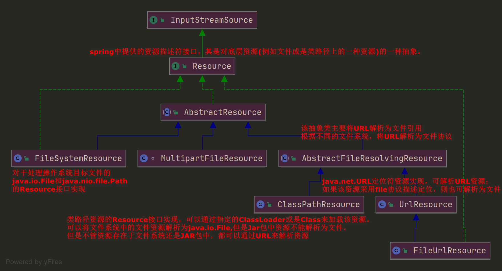
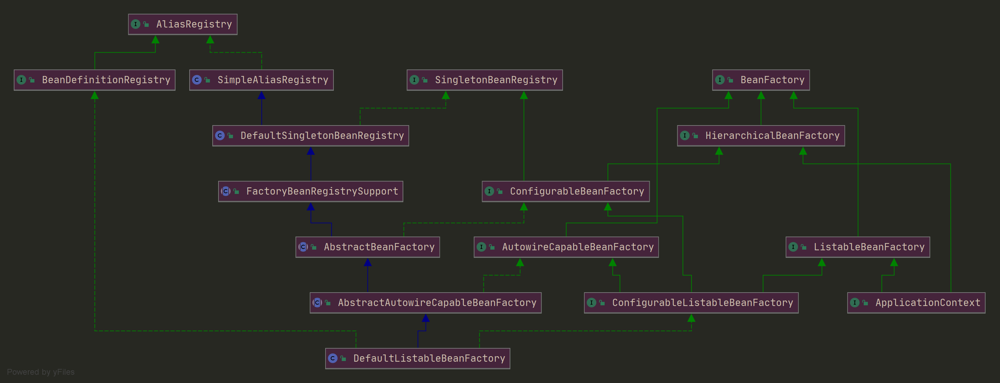

# Spring资源与工厂创建流程

## 1.IOC容器思想

spring中对于对象管理这块引入了一种IOC容器思想。IOC容器即来进行对象的创建、对象的存放、对象的管理等等一系列的事情。

在spring中，通过两种技术手段来实现这个思想：

- IOC控制反转：即spring接手了对象的创建，将对象的创建过程从调用者手中转移到了spring框架中，实现了创建对象这一操作的反转。
- DI依赖注入：在创建对象过程中，不可避免的会需要处理对象间的依赖关系，属性的注入等，在某些情况下，只有一些必要的属性注入后，此对象才是一个真正可用的对象，而DI这种手段就是用来处理对象的属性注入的。

只有经过**控制反转**及**依赖注入**后，对象的创建才真正的完成，再结合一系列的存储、管理等手段，形成了spring的IOC容器基础。

## 2.spring容器管理bean的模式及加载

spring加载bean有这么几步：

​	1.首先需要定义bean，采用xml或者注解的方式。

​	2.需要通过spring提供的资源接口Resource来获取xml配置资源。

​	3.需要声明一个spring工厂，该工厂用来掌控我们自定义配置的各种bean及bean之间的依赖关系。

​	4.需要定义个信息读取器，该读取器用来读取我们配置文件内的信息并将其封装为spring内部可识别的一种信息。

​	5.当读取器读取了我们定义额配置信息后，将会把这些信息组装后前面定义的工厂中。

​	7.通过工厂我们可以获取到我们定义的bean对象(装配完成)。

```Java
public class SpringClient{
	public static void main(String[]args){
        //1.获取资源,类路径下的applicationContext.xml
        Resource resource = new ClassPathResource("applicationContext.xml");

        //2.创建spring创建对象的工厂
        DefaultListableBeanFactory defaultListableBeanFactory = new DefaultListableBeanFactory();

        //3.创建资源读取器，用来读取第一步形成的类路径下的xml资源
        //读取的信息需要放置到工厂中，所以传入一个DefaultListableBeanFactory对象
        BeanDefinitionReader definitionReader = new XmlBeanDefinitionReader(defaultListableBeanFactory);
        //指定读取的资源是哪个
        definitionReader.loadBeanDefinitions(resource);

        //4.从工厂中获取定义的bean对象
        Student student = defaultListableBeanFactory.getBean("student",Student.class);
        System.out.println(student);
    }
}
```

## 3.spring的IOC核心组件

Spring ioc的核心组件有三个：

- 资源处理器
- 工厂
- bean信息定义对象

### 3.1资源处理器

spring中提供的资源处理器是Resource接口。其接口类图如图所示：



其中ClassPathResource用来标识类路径下的资源，FileSystemResource用来具体表示文件系统资源，UrlResource用来表示通过URL资源定位符表示的资源。

注意，在通过ClassPathResource来具体加载资源时，其必须需要一个ClassLoader,该ClassLoader没有被调用者明确指定时，spring通过一系列手段为我们配置了一个类加载器，具体的配置代码如下：

```Java
public static ClassLoader getDefaultClassLoader() {
    ClassLoader cl = null;
    try {
        //获取当前线程中的类加载器，默认为系统类加载器，可以通过setContextClassLoader()来设置
        cl = Thread.currentThread().getContextClassLoader();
    }
    catch (Throwable ex) {
        // Cannot access thread context ClassLoader - falling back...
    }
    if (cl == null) {
        // No thread context class loader -> use class loader of this class.
        //当没有线程加载器时，获取当前类的类加载器
        cl = ClassUtils.class.getClassLoader();
        if (cl == null) {
            //当前类的类加载器为null，意味着当前类是由根类加载器加载的
            // getClassLoader() returning null indicates the bootstrap ClassLoader
            try {
                //最后，如果还没找到类加载器，则由当前应用类加载器来加载
                cl = ClassLoader.getSystemClassLoader();
            }
            catch (Throwable ex) {
                // Cannot access system ClassLoader - oh well, maybe the caller can live with null...
            }
        }
    }
    return cl;
}
```

### 3.2spring的IOC工厂体系

spring中提供了一整套工厂体系，用来完成bean对象的实例化等操作，其定义bean工厂接口为：**BeanFactory,**其体系类图如下所示：




