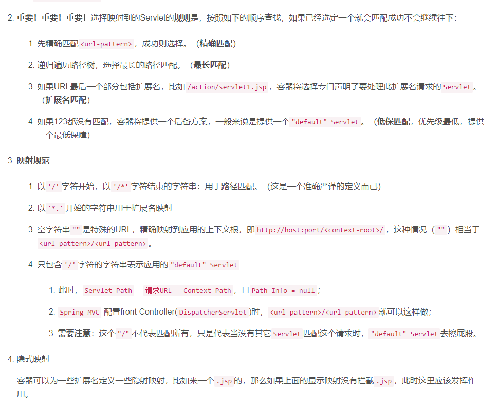
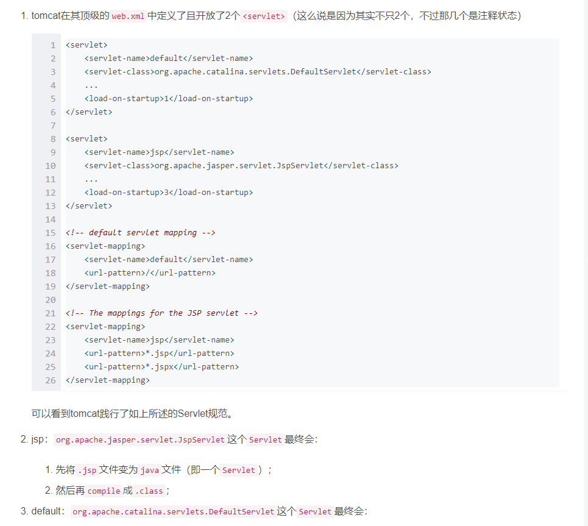
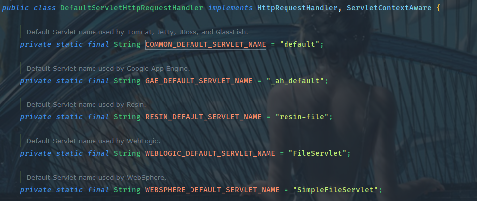

# WebMvcConfigurer类详解

## 1.简介

​	WebMvcConfiguration类是spring提供的用于配置spring mvc的一种基于java-bean方式的配置方式。可以自定义一些handler、interceptor、ViewResolver、messageConvert等。

   在spring boot1.5之前是靠重写WebMvcConfigurerAdapter的方式来实现的，spring boot2.0之后，该类被标记为弃用，官方推荐直接实现WebMvcConfiguration或WebMvcConfigurationSupport来完成这些设置。

## 2.详解

```Java
public interface WebMvcConfigurer {
   //配置路径匹配
    void configurePathMatch(PathMatchConfigurer var1);
   	//配置客户端与后端的内容协商
    void configureContentNegotiation(ContentNegotiationConfigurer var1);
   	//配置异步MVC相关选项
    void configureAsyncSupport(AsyncSupportConfigurer var1);
  	//用来配置处理静态资源，会创建一个DefaultServletHttpRequestHandler,即servlet规范中的defaultServlet
    void configureDefaultServletHandling(DefaultServletHandlerConfigurer var1);
 	//添加转换器和格式化器
    void addFormatters(FormatterRegistry var1);
 	//添加拦截器
    void addInterceptors(InterceptorRegistry var1);
 
    void addResourceHandlers(ResourceHandlerRegistry var1);
 	//配置springmvc的跨域问题
    void addCorsMappings(CorsRegistry var1);
 
    void addViewControllers(ViewControllerRegistry var1);
 
    void configureViewResolvers(ViewResolverRegistry var1);
 
    void addArgumentResolvers(List<HandlerMethodArgumentResolver> var1);
 
    void addReturnValueHandlers(List<HandlerMethodReturnValueHandler> var1);
 
    void configureMessageConverters(List<HttpMessageConverter<?>> var1);
 
    void extendMessageConverters(List<HttpMessageConverter<?>> var1);
 
    void configureHandlerExceptionResolvers(List<HandlerExceptionResolver> var1);
 
    void extendHandlerExceptionResolvers(List<HandlerExceptionResolver> var1);
 
    Validator getValidator();
 
    MessageCodesResolver getMessageCodesResolver();
}
```

### 2.1configurePathMatch方法

​	该方法主要用来帮助配置HandlerMappings的路径匹配规则。其使用实例如下：

```Java
public void configurePathMatch(PathMatchConfigurer configurer) {

        //是否存在尾"/"来匹配URL，例如如果为true代表"/user"等同于"/user/",默认为true
        configurer.setUseTrailingSlashMatch(true);

        //设置路径匹配优化工具类
        /*
        * UrlPathHelper是spring提供的一个处理url地址的帮助类，我们可以继承它，设置自定义的解析方式
        * 该类里面已经提供了一些常用处理，例如将// 换成/，所以我们在访问spring mvc时在地址栏输入//也是没问题的
        */
        UrlPathHelper urlPathHelper = new UrlPathHelper();
        configurer.setUrlPathHelper(urlPathHelper);

        /*
        * 路径匹配器 PathMatcher是一个接口,spring mvc默认使用的就是AntPathMatcher
        */
        configurer.setPathMatcher(new AntPathMatcher());

        /**
         * 配置路径前缀，第一个参数即为要添加的路径，第二个参数是一个函数式接口
         */
        //代表所有包含RequestMapping注解的controller都将添加admin前缀,此处添加的前缀是对RequestMapping前缀的一种补充，其位置在RequestMapping定义的路径之前
        configurer.addPathPrefix("admin", c -> c.isAnnotationPresent(RequestMapping.class));
        configurer.addPathPrefix("api", c -> c.getPackage().getName().contains("com.cyz.controller"));
    }

```

### 2.2configureContentNegotiation方法

该方法主要用来配置客户端(浏览器)与后端的内容协商机制。

所谓"内容协商机制"即客户端想要什么格式的数据，后端支不支持，支持的话即以特定的格式返回。该方法的使用实例如下：

```Java
public void configureContentNegotiation(ContentNegotiationConfigurer configurer) {
    //配置是否通过参数来进行数据格式的标识
    configurer.favorParameter(true).
        //启用参数标识后，标识的参数名配置，默认为format,如果配置了就用配置的该参数名 assjsj
        parameterName("assjsj").
        //忽略accept-header中指定的允许的接收类型
        ignoreAcceptHeader(true).
        //未指定格式时默认返回的数据
        defaultContentType(MediaType.APPLICATION_JSON).
        //设置数据格式参数标识中某个标识对应的媒体类型.例如,assjsj=xml代表返回xml格式数据
        mediaType("xml", MediaType.APPLICATION_ATOM_XML).
        mediaType("json", MediaType.APPLICATION_JSON);
}
```

配置该内容协商机制后，在访问某个接口时，即可带上数据格式标识参数，来进行协商，如：http://localhost:8080/taco/admin/test/negotiation?assjsj=xml

### 2.3configureAsyncSupport方法

该方法主要用来配置异步http请求处理选项，其中配置项主要有两个：

- 配置默认超时时间
- 配置异步请求执行的线程池

Spring mvc异步请求的使用方式详见另一篇笔记。

### 2.4configureDefaultServletHandling方法

该方法会创建一个DefaultServletHttpRequestHandler对象，此时spring mvc会将那些没有被处理的请求转发到该handler中进行处理。

  通常来说，该配置用于在传统项目中，spring mvc会创建一个DispatcherServlet 来处理应用的http请求，而在配置DispatcherServlet时，我们需要配置该servlet的拦截路径，一般来说可配置/或/*。其中，配置/代表让DispatcherServlet处理除.jsp结尾以外的所有请求；而配置/*代表不管什么请求，都交给DispatcherServlet去处理。

  在servlet规范中，对于路径匹配也定义了一些规范，如下：



​	从上图可以看出，当我们的应用配置/*时，用于servlet路径匹配，而当配置/时，会优先查找对应的servlet，如果找不到，会有一个默认的servlet来处理，如果该默认的servlet未定义，才会返回404状态。

  	特别的，在tomcat对servlet的支持中，在其顶级的web.xml中预定义了两个servlet，defaultServlet和jspServlet,其中defaultServlet用来处理那些没被处理的请求，JspServlet处理Jsp转化为一个Java 的servlet，转化的过程中相当于分配了具体的servlet路径，所以，配置/拦截路径时,对jsp不起作用。



在其它的web容器中，也定义了类似的default servlet，其名称分别是：

   	Tomcat, Jetty, JBoss, and GlassFish 自带的默认Servlet的名字 -- "default"

　　Google App Engine 自带的 默认Servlet的名字 -- "_ah_default"

　　Resin 自带的 默认Servlet的名字 -- "resin-file"

　　WebLogic 自带的 默认Servlet的名字 -- "FileServlet"

　　WebSphere 自带的 默认Servlet的名字 -- "SimpleFileServlet"

在DefaultServletHttpRequestHandler中一些默认servlethandler的名称定义，这就对应上了。



所以，configureDefaultServletHandling方法就是要配置一个默认的，web容器支持的默认servlet，用来解决项目中DispatcherServlet的拦截路径配置为/时，一些静态资源处于项目根路径下，但是却404的问题，因为spring mvc不会默认帮我们配置这个defaultServlet，所以通过这个方法让spring mvc帮我们初始化一个defaultServlet。

```Java
@Override
public void configureDefaultServletHandling(DefaultServletHandlerConfigurer configurer) {
    //配置一个指定名称的defaultServlet
    configurer.enable("default");

    //根据容器类型，自动配置一个defaultServlet，如果不能用默认的servlet名称创建，就会抛出异常，此时可能需要使用上面的方法来手动指定名称
    configurer.enable();
}

```

### 2.5addFormatters方法

```Java
@Override
public void addFormatters(FormatterRegistry registry) {
    //注册一个数据转换器，用来将某一类型的数据转换为另一种类型，例如将对象转为字符串
    registry.addConverter(Object::toString);
    //设置一个某种类型字段的转换器，例如日期类字段转换
    registry.addFormatter(new DateFormatter("yyyy-MM-dd"));
    //registry.addParser();
    //registry.addPrinter();
    WebMvcConfigurer.super.addFormatters(registry);
}

```

### 2.6addInterceptors方法

该方法用来对handler添加拦截器，拦截handler的处理前、后等时机。

使用时先定义实现的HandlerInterceptor的拦截器，然后再注册相应的拦截器：

```Java
public class DemoInterceptor implements HandlerInterceptor {

    /**
     *
     * 请求处理之前，即当handlerMapping组件根据url找到特定的handler后，
     * 执行绑定在这个handler上的拦截器链中的preHandle方法，最后执行具体的handler
     *
     * @param request
     * @param response
     * @param handler
     * @return false 中断后续执行
     * @throws Exception
     */
    @Override
    public boolean preHandle(HttpServletRequest request, HttpServletResponse response, Object handler) throws Exception {
        return HandlerInterceptor.super.preHandle(request, response, handler);
    }

    /**
     *
     * 请求处理后，在视图被渲染之前执行该方法，可以在该方法中添加额外的属性到modelAndView中，以便渲染view的时候使用
     * preHandle返回true执行
     *
     * @param request
     * @param response
     * @param handler
     * @param modelAndView
     * @throws Exception
     */
    @Override
    public void postHandle(HttpServletRequest request, HttpServletResponse response, Object handler, ModelAndView modelAndView) throws Exception {
        HandlerInterceptor.super.postHandle(request, response, handler, modelAndView);
    }

    /**
     * 请求完成，渲染页面完成，返回之前
     * preHandle返回true执行
     * @param request
     * @param response
     * @param handler
     * @param ex
     * @throws Exception
     */
    @Override
    public void afterCompletion(HttpServletRequest request, HttpServletResponse response, Object handler,
                                Exception ex) throws Exception {
        HandlerInterceptor.super.afterCompletion(request, response, handler, ex);
    }
}
```

注册拦截器：

```Java
@Override
public void addInterceptors(InterceptorRegistry registry) {
    registry.addInterceptor(new DemoInterceptor()).order(1).addPathPatterns("/toca","/hello").excludePathPatterns("/toca/hello");
    WebMvcConfigurer.super.addInterceptors(registry);
}
```

**注意**：如果handler采用的是异步handler，则其对应的拦截器应该使用 AsyncHandlerInterceptor

