#  Docker学习

## 1.Docker入门

​	Docker是基于GO语言开发的。

​	Docker的主要目标是通过对应用组件的封装、分发、部署、运行等生命周期的管理，达到应用组件级别的“一次封装，导出运行”。

​	Docker引擎的基础是Linux容器技术。

​	Docker在开发和运维过程中，主要有如下几个优势：

- 是开发、测试、运维可以使用同一套环境来完成项目的交付和部署。
- Docker可以更高效的利用资源，Docker容器不需要额外的虚拟化管理程序，它是内核级的虚拟化，可以实现更高的性能，同时对资源的额外需求很低。
- Docker几乎可以在各种平台上运行，较高的兼容性使得Docker可以在不同的平台之间无缝切换。
- 使用Dockerfile，采用增量的方式更新和分发，从而实现自动化并且高效的容器管理。

   Docker于虚拟机的比较：

|          | Docker                                        | 传统虚拟机                       |
| -------- | --------------------------------------------- | -------------------------------- |
| 速度     | 速度快，秒级启动                              | 启动较慢                         |
| 资源需求 | Docker对系统资源占用少                        | 虚拟化管理程序，对系统资源占用高 |
| 学习成本 | Docker通过命令行来操作，类似于git，学习成本低 | 虚拟化相关配置需要大量的只是经验 |
| 部署效率 | 统一通过Dockerfile来进行配置，部署效率高      | 没有统一的配置方式，部署效率低   |

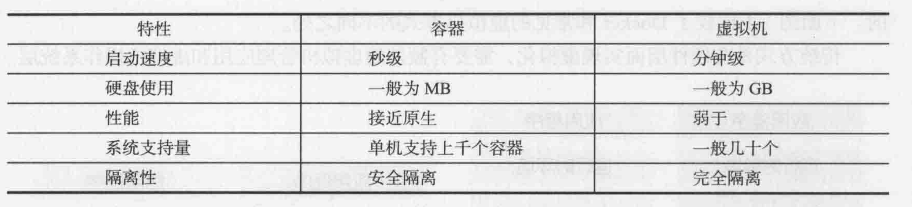


## 2.Docker的核心概念

### 2.1 Docker镜像

​	Docker镜像类似于虚拟机镜像，可以将其理解为一个面向Docker引擎的只读模板，**包含了文件系统**。

​	例如：一个镜像可以只包含了一个完整的Ubuntn操作系统，可以把它称为一个Ubuntn镜像；也可以在Ubuntn中安装了其它的应用(比如Mysql)，这时也可以称其为Mysql镜像。

​	**镜像是创建Docker容器的基础。**

### 2.2Docker容器

​	Docker容器类似于一个轻量级的沙箱，Docker利用容器来运行和隔离应用。

​	容器是从容器创建的应用运行实例。**镜像是静态的一个东西，好像一个模板，而容器在基于镜像的基础上，产生一个实例——容器**。

​	容器才有启动、开始、停止、删除等操作。

​	镜像是不变的，容器在启动的时候，会在镜像的最上层建立一个可写层，而镜像本身是不变的。

### 2.3Docker仓库

​	Docker仓库类似于代码仓库，是Docker集中存放镜像的地方。

​	注册服务器是用来存放Docker仓库的，服务器上存放多个仓库，仓库中存放一类镜像，多个仓库以不同的tag来区分。

​	Docker仓库有公有仓库和私有仓库之分。

​	Docker的仓库管理很像git。自己创建的镜像可以手动push到指定的仓库，也可以从远端仓库中pull一个镜像到本地。

## 3.Docker仓库的安装

​	Docker在主流的操作系统中都是支持的。包括windows、Linux及Mac操作系统。

### 3.1在Ubuntn上安装Docker

​	要在Ubuntn上安装Docker，需要保证Ubuntn版本在14.04以上版本。

```shell
#首先更新安装源
sudo apt-get update

#安装docker.io，此方式安装的可能不是最新的Docker，要安装最新版本可以参照Docker官网
sudo apt-get install -y docker.io

#查看Docker是否安装成功
 docker -v
```

### 3.2在Windows 10上安装Docker

## 4.镜像详解

​	Docker运行容器之前需要本地存在对应的镜像，如果镜像不在本地，则Docker会尝试从默认镜像仓库下载(默认使用Docker Hub)，用户可以自定义。

### 4.1获取镜像

​	通过` docker pull NAME[:tag]`从默认仓库拉取镜像，tag相当于镜像的版本，如果不显示指定，则默认拉取latest版本。 

```shell
#拉取Ubuntu镜像，如果不指定标签，则拉取latest版本，该方式从默认的docker仓库拉取镜像
 docker pull ubuntu

#从指定的镜像仓库拉取镜像
#从dl.dockerpool.com地址的5000端口拉取Ubuntu镜像，镜像版本为latest
docker pull dl.dockerpool.com:5000/ubuntu
```

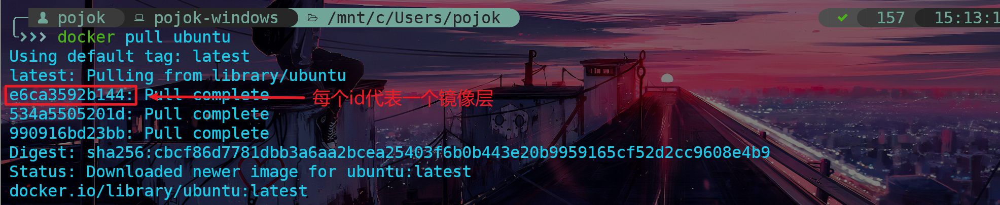

获取镜像后即可创建容器运行该镜像：

```
#运行Ubuntu镜像，运行容器后打开bash-shell
docker run -t -i ubuntu /bin/bash
```

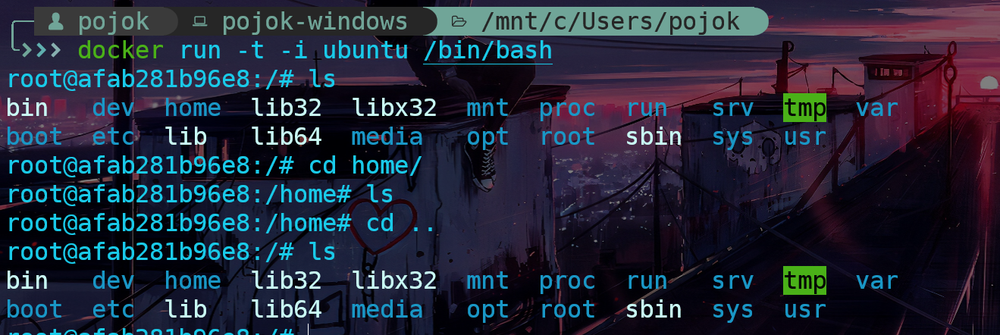

### 4.2查看镜像信息

​	使用` docker images` 列出镜像。

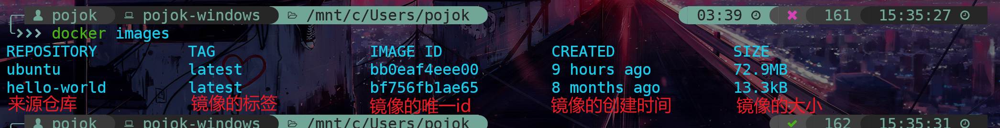

如图所示，当前本地存在两个镜像，一个是Ubuntu镜像，一个是hello-world镜像。

​	使用` docker tag`给本地的镜像重新分配一个标签，主要用来辅助自身对镜像进行标识。

```shell
#将hello-world镜像重新分配标签为1.0
docker tag hello-world:latest hello-world:1.0
```

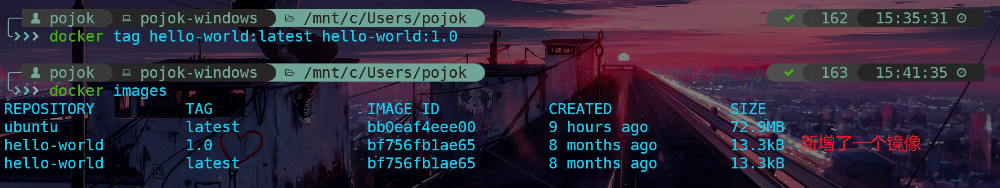

**注意：虽说这里通过` docker images`查看到多个一个镜像，但是看它们的id是完全一致的，所以其实它们是同一个镜像，新增的那个相当于原镜像的一个快捷方式或引用。**

​	使用` docker inspect`命令可以获取镜像的详情。

```shell
#获取Ubuntu镜像的详情，该命令返回一个json格式的展示，包含很多项
docker inspect bb0eaf4eee00
#通过增加-f参数来选取指定的信息项Architecture,获取其信息，bb0e为镜像id的前几位，和git一样
docker inspect -f {{".Architecture"}} bb0e

#获取Config项下的Tty信息
docker inspect -f {{".Config.Tty"}} bb0e
```

```json
[
    {
        "Id": "sha256:bb0eaf4eee00c28cb8ffd54e571dd225f1dd2ed8d8751b2835c31e84188bf2de",
        "RepoTags": [
            "ubuntu:latest"
        ],
        "RepoDigests": [
            "ubuntu@sha256:cbcf86d7781dbb3a6aa2bcea25403f6b0b443e20b9959165cf52d2cc9608e4b9"
        ],
        "Parent": "",
        "Comment": "",
        "Created": "2020-09-16T22:20:25.950751723Z",
        "Container": "6fbeb345a9d4f5184e942758ce74df682a834a8cc03e08b72c5c276cfaf8f05b",
        "ContainerConfig": {
            "Hostname": "6fbeb345a9d4",
            "Domainname": "",
            "User": "",
            "AttachStdin": false,
            "AttachStdout": false,
            "AttachStderr": false,
            "Tty": false,
            "OpenStdin": false,
            "StdinOnce": false,
            "Env": [
                "PATH=/usr/local/sbin:/usr/local/bin:/usr/sbin:/usr/bin:/sbin:/bin"
            ],
            "Cmd": [
                "/bin/sh",
                "-c",
                "#(nop) ",
                "CMD [\"/bin/bash\"]"
            ],
            "ArgsEscaped": true,
            "Image": "sha256:048dce312876ab1dc014622ee7b415d9b6b9cefe00426ddde29f07ddd6f1c786",
            "Volumes": null,
            "WorkingDir": "",
            "Entrypoint": null,
            "OnBuild": null,
            "Labels": {}
        },
        "DockerVersion": "18.09.7",
        "Author": "",
        "Config": {
            "Hostname": "",
            "Domainname": "",
            "User": "",
            "AttachStdin": false,
            "AttachStdout": false,
            "AttachStderr": false,
            "Tty": false,
            "OpenStdin": false,
            "StdinOnce": false,
            "Env": [
                "PATH=/usr/local/sbin:/usr/local/bin:/usr/sbin:/usr/bin:/sbin:/bin"
            ],
            "Cmd": [
                "/bin/bash"
            ],
            "ArgsEscaped": true,
            "Image": "sha256:048dce312876ab1dc014622ee7b415d9b6b9cefe00426ddde29f07ddd6f1c786",
            "Volumes": null,
            "WorkingDir": "",
            "Entrypoint": null,
            "OnBuild": null,
            "Labels": null
        },
        "Architecture": "amd64",
        "Os": "linux",
        "Size": 72873665,
        "VirtualSize": 72873665,
        "GraphDriver": {
            "Data": {
                "LowerDir": "/var/lib/docker/overlay2/cb99ed62689afd9c763fc1e5b824ca0ed8ca95b914745f94afee80dd2f42fc92/diff:/var/lib/docker/overlay2/14e2e26fdc279cc08b7a343e851cd2e5152bef8febbbfc5d10a5417f7542fef8/diff",
                "MergedDir": "/var/lib/docker/overlay2/4cdc90cc3ed3ea523389deb32c6100254cd964fe971a59a979b828256ffe4ec8/merged",
                "UpperDir": "/var/lib/docker/overlay2/4cdc90cc3ed3ea523389deb32c6100254cd964fe971a59a979b828256ffe4ec8/diff",
                "WorkDir": "/var/lib/docker/overlay2/4cdc90cc3ed3ea523389deb32c6100254cd964fe971a59a979b828256ffe4ec8/work"
            },
            "Name": "overlay2"
        },
        "RootFS": {
            "Type": "layers",
            "Layers": [
                "sha256:b2fd17df207168da45a6eefccbf58eca08d05b263b3eeb365b6e4b321b18cdc8",
                "sha256:c0151ca45f2728482ee96827de759393d47cd5b6707c9f3b930cf46bd92f11b8",
                "sha256:128fa0b0fb8154f33be04e9cda2c01e88c03cde4825081ed3e0c1858cb5a3431"
            ]
        },
        "Metadata": {
            "LastTagTime": "0001-01-01T00:00:00Z"
        }
    }
]
```

### 4.3搜寻镜像

​	使用` docker search`命令可以搜搜远端仓库中的镜像。在未配置的情况下默认搜索docker hub仓库中的镜像，该命令也可以有一些额外的参数选项：

- --automated=false: 仅显示自动创建的镜像；
- --no-trunc=false: 输出信息不截断显示；
- -s,--starts=0: 仅显示评价为指定星级以上的镜像。

```shell
#搜搜mysql关键字镜像
docker search mysql
```

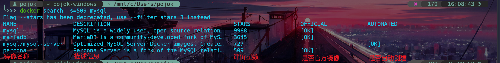

### 4.4删除镜像

​	使用` docker rmi [IMAGE...]`批量删除镜像，其中IMAGE可以为标签或ID。

```shell
#删除hello-world镜像(根据标签删除)
 docker rmi hello-world:latest
```

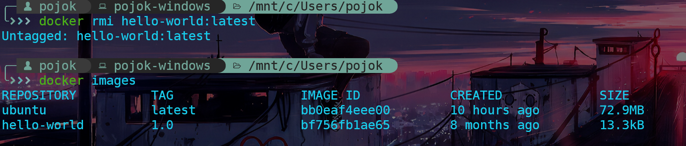

可以从上图中看出，通过标签删除hello-world:latest镜像，原先使用`docker tag`命令创建的那个镜像标签hello-world:1.0还存在。

而如果当前镜像存在引用的话，通过ID删除的时候，会出现下列情况：

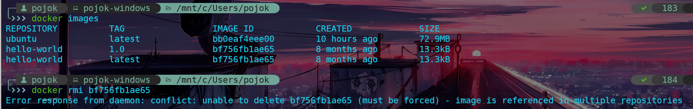

如果一定要想一次性删除这两个hello-world镜像，那么可以加上-f参数，代表强制删除。

```shell
#强制删除hello-world镜像（根据ID删除存在引用的情况）
docker rmi -f bf756fb1ae65
```

同时，如果一个镜像已经创建了一个容器，那么该镜像正常也不能被删除，想要强制删除需要加上-f参数。

### 4.5创建镜像

​	创建镜像的方式有三种：

- 基于已有镜像的容器创建
- 基于本地模板导入
- 基于Dockerfile创建

#### 4.5.1基于已有镜像的容器创建

​	该种形式主要使用` docker commit [OPTIONS] CONTAINER [REPOSITORY[:TAG]]`命令。其主要选项有：

- -a,--author="": 其值为字符串，代表author，作者信息
- -c, --change=[]:其值为list，代表将Dockerfile上的命令应用到该镜像上
- -m,--message="":其值为字符串，创建镜像的描述信息
- -p,--pause=false:创建容器的时候暂停运行中的容器,默认为true

下面是创建一个镜像的流程：

```shell

#1.首先通过一个已有镜像启动一个容器,该容器的id生成为a5568137ef51
 docker run -t -i ubuntu /bin/bash
#2.在进入到这个容器的bash环境后，新建一个文本文件，此时该容器的镜像已不同于之前的镜像 
touch text.txt
#3.创建文件后即可退出容器
#4.通过docker commit来创建一个新的镜像，创建的镜像来自于ID为a5568137ef51的容器，新创建的镜像名称为test，tag为latest
docker commit -m="从容器创建一个test镜像" -a="cyz" -p=true a5568137ef51 test
```

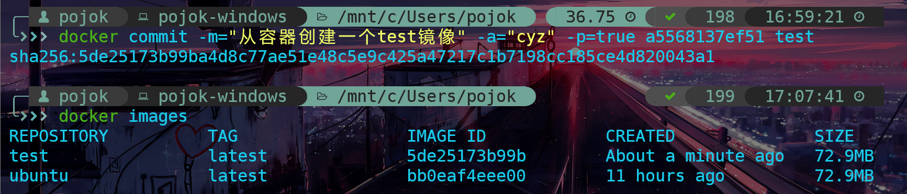

#### 4.5.2基于本地模板导入

​		基于本地模板导入也即从一个操作系统模板文件导入一个镜像。而本地模板其实是一个操作系统模板，可以在一些网站上进行模板下载，如：[openVZ](https://wiki.openvz.org/Download/template/precreated)，我们可以下载一个centOS7的模板来制作其镜像。

​	导入本地模板制作镜像使用` docker import [OPTIONS] file|URL|- [REPOSITORY[:TAG]]`命令。

```shell
#导入本地centos系统模板制作镜像,要特别注意中间的'-'
cat centos-7-x86_64.tar.gz | docker import - centos:latest
```

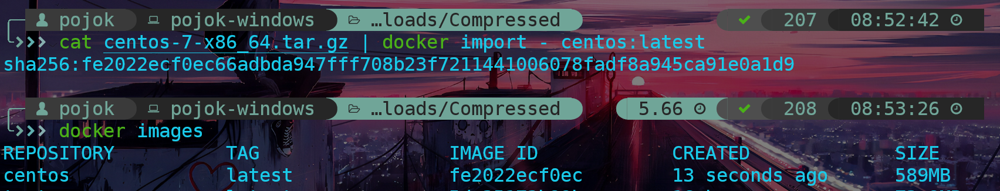

### 4.6存出和载入镜像

​	可以使用` docker save`和` docker load`命令来完成镜像载出和存入操作。

#### 4.6.1 存出镜像

​	使用` docker save`来存出镜像。其语法为：` docker save [OPTIONS] IMAGE [IMAGE...]`，可选options为：

- -o,--output:其值为string类型，将输出写入到一个文件，代替标准输出

```shell
#将centos:latest镜像存出为本地centos.tar包
docker save -o="centos.tar" centos:latest
#可选参数后面的=号可以替换成空格，都是一样的，对其他命令也生效
docker save -o "centos.tar" centos:latest
```

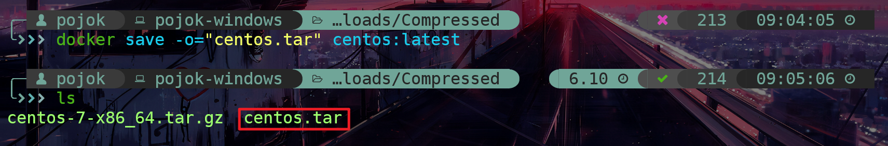

在载出镜像后，原镜像文件还是存在的。

#### 4.6.2载入镜像

​	可以使用` docker load`从存出的本地文件中再导入到本地镜像库中。其语法为：`  docker load [OPTIONS]`，其中可选的options有：

- -i,--input:其值为string，值为先前存出的本地文件
- -q,--quiet：不进行载入输出

```shell
#载入存出的centos镜像
 docker load --input centos.tar
```

​	` docker load`会将镜像本身及其元数据一起导入。

### 4.7上传镜像

​	使用` docker push`命令来上传镜像，默认上传到Docker Hub仓库。其具体的语法为：`  docker push [OPTIONS] NAME[:TAG]`，其中可选的options参数为：

- --disable-content-trust：略过镜像签名，其值为Boolean类型，默认为true。

## 5.容器详解

​	容器是一个镜像的运行实例，相比于镜像来说，它具有额外的可写文件层。

### 5.1创建容器

​	Docker的容器是轻量级的，创建和删除都十分容易。

​	可以使用` docker create`命令新建一个容器，也可以使用` docker start`命令来启动一个处于停止状态的容器。其中` docker create`的语法为：` docker create [OPTIONS] IMAGE [COMMAND] [ARG...]`

```shell
#从centos:latest镜像创建容器，其中/bin/bash就是上述的COMMAND选项
docker create centos:latest /bin/bash
```

**在单纯的使用` docker create`命令时可能出现No command specified错误，此时可以通过` docker inspect`查看一下该镜像的详情，看看Cmd选项是否有值，如果为null就会出现该错误，此时需要指定/bin/bash 的COMMAND选项。**

​	Docker 还可以使用` docker run`命令新建并启动一个容器。该命令等价于先执行`docker create`再执行` docker start`命令。

```shell
#下面命令启动Ubuntu容器并输出hello world后关闭容器
docker run ubuntu /bin/echo 'hello world!'

#下面的命令则在容器中启动一个bash终端
#-t:让Docker分配一个伪终端并绑定到容器的标准输入上
#-i:则让容器的标准输入保持打开
#用户可以通过ctrl+d或者输入exit命令来退出容器内的终端，当输入exit退出后，容器也就终止运行了
docker run -t -i ubuntu /bin/bash
```

当利用` docker run`来创建并启动容器时，Docker在后台运行的标准操作包括：

- 检查本地是否存在指定的镜像，不存在就从公有仓库下载；
- 利用镜像创建并启动一个容器；
- 分配一个文件系统，并在只读的镜像层外面挂载一层可读可写层；
- 从宿主主机配置的网桥接口中桥接一个虚拟接口到容器中去；
- 从地址池配置一个IP给容器；
- 执行用户指定的应用程序；
- 执行完毕后容器被终止。

更多的时候，想要让Docker以守护态运行，可以添加-d参数来实现。

```shell
#用Ubuntu镜像创建一个后台容器
 docker run -d ubuntu /bin/sh -c "while true;do echo hello world;sleep 1;done"
#使用docker ps查看容器
docker ps
```

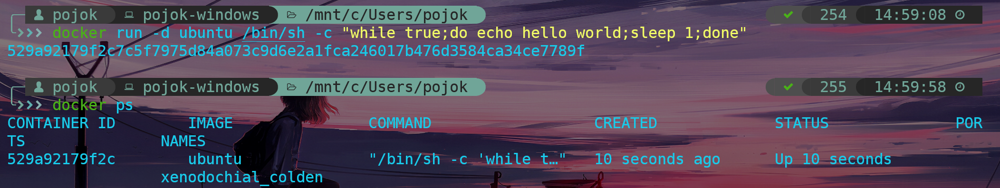

可以通过` docker logs [OPTIONS] CONTAINER`命令查看后台容器的运行输出。

### 5.2终止容器

​	使用` docker stop`命令来终止一个运行中的容器。其语法为：` docker stop [OPTIONS] CONTAINER [CONTAINER...]`，可以加一个-t参数，指定等待几秒后kill it。

```shell
#终止运行中的容器
docker stop 529a
```

该命令的执行程序为，先向容器发送一个SIGTERM信号，等待一段时间后（默认为10秒），再发送SIGKILL信号终止容器。

​	此外，如果容器中运行的所有应用程序都终止时，该容器也自动终止。

​	可以使用` docker ps -a -q`来查看所有终止的容器的ID信息。

​	同时容易也支持` docker start`和` docker restart` 操作。

### 5.3 进入容器

​	当容器处于后台运行的时候，可以通过一些命令来进入内部进行一些操作。可用的命令有` docker attach`,` docker exec`以及` nsenter`等。

​	