# Arthas学习

## 介绍

​	Arthas是阿里开源的Java诊断工具，其支持JDK6+， 采用命令行交互模式，提供 `Tab` 自动补全，可以方便的定位和诊断线上问题。

​	其官网地址为：[Arthas 应用诊断利器 (aliyun.com)](https://arthas.aliyun.com/zh-cn/)

​	其常见的使用场景有：

- 是否有一个全局视角来查看系统的运行状况？
- 为什么 CPU 又升高了，到底是哪里占用了 CPU ？
- 运行的多线程有死锁吗？有阻塞吗？
- 程序运行耗时很长，是哪里耗时比较长呢？如何监测呢？
- 这个类从哪个 jar 包加载的？为什么会报各种类相关的 Exception？
- 我改的代码为什么没有执行到？难道是我没 commit？分支搞错了？
- 遇到问题无法在线上 debug，难道只能通过加日志再重新发布吗？
- 有什么办法可以监控到 JVM 的实时运行状态？

## 使用

### 安装

​	官方推荐使用`arthas-boot`来使用Arthas，所以下载arthas-boot.jar，然后使用` java -jar`启动即可。

### 运行

​	Arthas只是一个Java程序，所以可以直接用 `java -jar` 运行。启动后选择要监控的java进程即可进行后续操作。

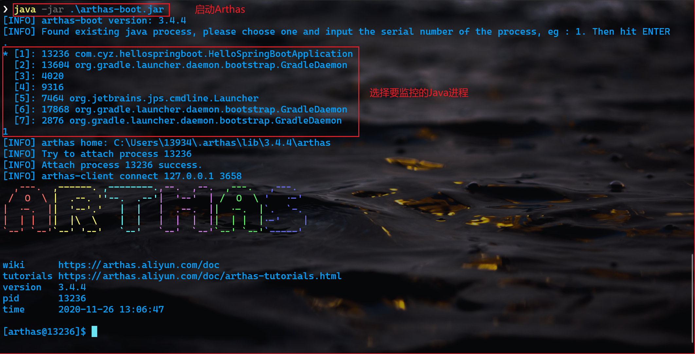

除以` java -jar`的方式启动外，还有下面的方式(更多的启动方式参考help帮助命令)：

```shell
java -jer arthas-boot.jar [PID]
#通过jps命令可以查找与java虚拟机相关的进程PID
```

### 交互

​	Arthas除了可以通过终端与其交互之外，还可以通过web Console的方式，此方式和控制台使用完全一致。

​	在控制台启动Arthas后，即可浏览器访问http://127.0.0.1:8563/地址打开web Console。

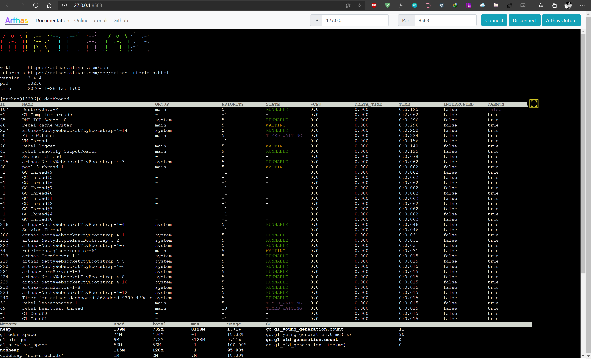

### 常用命令

| 命令        | 介绍                                                         |
| :---------- | :----------------------------------------------------------- |
| dashboard   | 当前系统的实时数据面板                                       |
| thread      | 查看当前 JVM 的线程堆栈信息                                  |
| watch       | 方法执行数据观测                                             |
| trace       | 方法内部调用路径，并输出方法路径上的每个节点上耗时           |
| stack       | 输出当前方法被调用的调用路径                                 |
| tt          | 方法执行数据的时空隧道，记录下指定方法每次调用的入参和返回信息，并能对这些不同的时间下调用进行观测 |
| monitor     | 方法执行监控                                                 |
| jvm         | 查看当前 JVM 信息                                            |
| vmoption    | 查看，更新 JVM 诊断相关的参数                                |
| sc          | 查看 JVM 已加载的类信息                                      |
| sm          | 查看已加载类的方法信息                                       |
| jad         | 反编译指定已加载类的源码                                     |
| classloader | 查看 classloader 的继承树，urls，类加载信息                  |
| heapdump    | 类似 jmap 命令的 heap dump 功能                              |

### 退出

​	在控制台输入` shutdown`即可结束Arthas进程，同时，使用该命令退出时自动重置所有增强过的类。

## Arthas常用操作

​	下面一段demo用来模拟线上问题环境。

```java
package com.cyz.demo;

import lombok.extern.slf4j.Slf4j;

import java.util.HashSet;
import java.util.concurrent.ExecutorService;
import java.util.concurrent.Executors;

/**
 * <p>
 * 模拟线上一些高负载、死锁等场景
 * </p>
 *
 * @author pojok
 * @version v1.0
 * @Package: com.cyz.demo
 * @Class: Arthas
 * @Description:
 * @date 2020/11/26 上午 11:32
 */
@Slf4j
public class Arthas {

    private static HashSet hashSet = new HashSet();
    /**
     * 线程池，大小1
     */
    private static ExecutorService executorService = Executors.newFixedThreadPool(1);

    public static void main(String[] args) {
        // 模拟 CPU 过高，这里注释掉了，测试时可以打开
         cpu();
        // 模拟线程阻塞
        thread();
        // 模拟线程死锁
        deadThread();
        // 不断的向 hashSet 集合增加数据
        addHashSetThread();

    }

    /**
     * 不断的向 hashSet 集合添加数据
     */
    public static void addHashSetThread() {
        // 初始化常量
        new Thread(() -> {
            int count = 0;
            while (true) {
                try {
                    hashSet.add("count" + count);
                    Thread.sleep(10000);
                    count++;
                } catch (InterruptedException e) {
                    e.printStackTrace();
                }
            }
        }).start();
    }

    public static void cpu() {
        cpuHigh();
        cpuNormal();
    }

    /**
     * 极度消耗CPU的线程
     */
    private static void cpuHigh() {
        Thread thread = new Thread(() -> {
            while (true) {
                log.info("cpu start 100");
            }
        });
        // 添加到线程
        executorService.submit(thread);
    }

    /**
     * 普通消耗CPU的线程
     */
    private static void cpuNormal() {
        for (int i = 0; i < 10; i++) {
            new Thread(() -> {
                while (true) {
                    log.info("cpu start");
                    try {
                        Thread.sleep(3000);
                    } catch (InterruptedException e) {
                        e.printStackTrace();
                    }
                }
            }).start();
        }
    }

    /**
     * 模拟线程阻塞,向已经满了的线程池提交线程
     */
    private static void thread() {
        Thread thread = new Thread(() -> {
            while (true) {
                log.debug("thread start");
                try {
                    Thread.sleep(3000);
                } catch (InterruptedException e) {
                    e.printStackTrace();
                }
            }
        });
        // 添加到线程
        executorService.submit(thread);
    }

    /**
     * 死锁
     */
    private static void deadThread() {
        /** 创建资源 */
        Object resourceA = new Object();
        Object resourceB = new Object();
        // 创建线程
        Thread threadA = new Thread(() -> {
            synchronized (resourceA) {
                log.info(Thread.currentThread() + " get ResourceA");
                try {
                    Thread.sleep(1000);
                } catch (InterruptedException e) {
                    e.printStackTrace();
                }
                log.info(Thread.currentThread() + "waiting get resourceB");
                synchronized (resourceB) {
                    log.info(Thread.currentThread() + " get resourceB");
                }
            }
        });

        Thread threadB = new Thread(() -> {
            synchronized (resourceB) {
                log.info(Thread.currentThread() + " get ResourceB");
                try {
                    Thread.sleep(1000);
                } catch (InterruptedException e) {
                    e.printStackTrace();
                }
                log.info(Thread.currentThread() + "waiting get resourceA");
                synchronized (resourceA) {
                    log.info(Thread.currentThread() + " get resourceA");
                }
            }
        });
        threadA.start();
        threadB.start();
    }
}

```

### 全局监控

​	使用` dashboard`命令可以打开全局监控窗口，可以概览程序的 线程、内存、GC、运行环境信息。

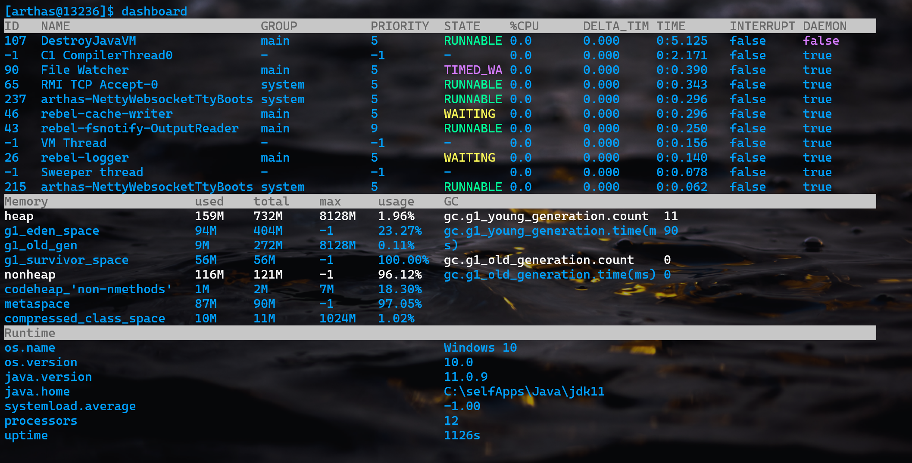

### 排查CPU占用率问题

​	在上面的例子中，cpuHigh()方法创建了一个线程，并让这个线程进行"空转"，这会导致持续占有cpu资源，一段时间后cpu占用率就会飙升。

​	通过`thread`命令可以查看所有线程信息，同时会列出每个线程的 `CPU` 使用率。

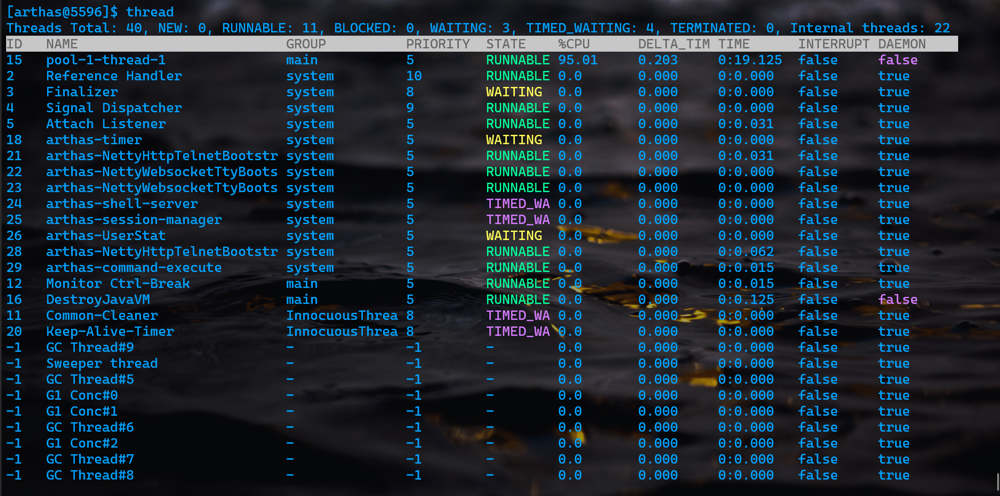

可以看到图中ID为15的线程CPU占用率达到了95%。

​	使用` thread [ID]`可以查看该线程详情，定位到CPU占用率高的方法和行数。

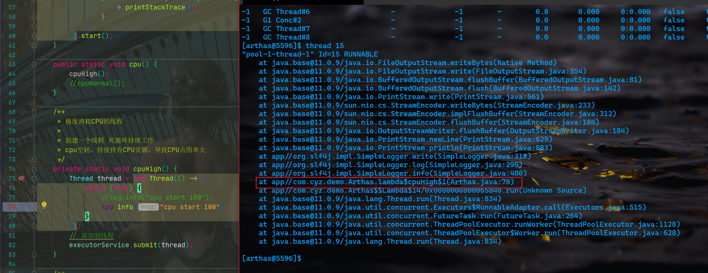

除此之外，还可以通过` thread -n [显示线程个数]`来排序CPU占用率较高的TOP N线程。

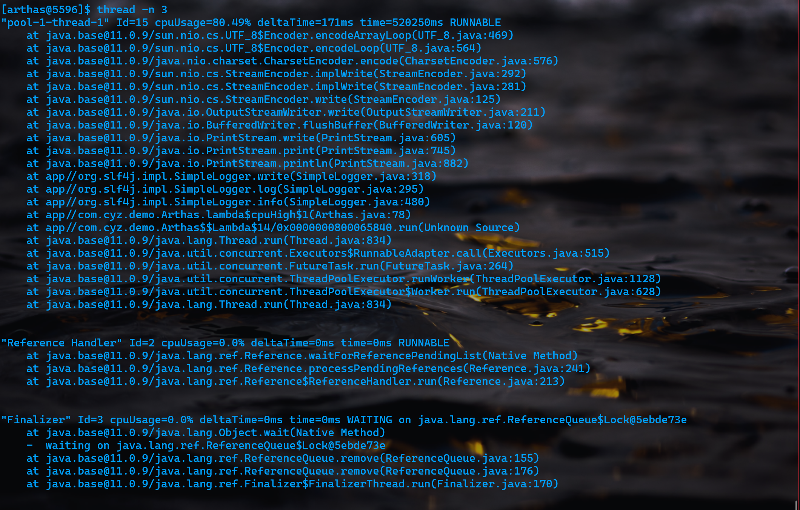

### 查看线程池状态

​	在上面的例子中，创建了一个大小为1的固定线程池，在cpuHigh()方法中创建了一个线程并提交到了线程池中，在thread()方法中又向线程池提交一个一个线程，此时这个线程会被阻塞。

​	通过` thread | grep pool`命令可以查看当前线程池上个线程的状态。

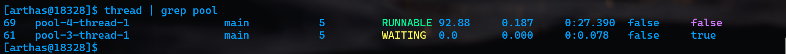

可以看到ID为61的线程被阻塞了，处于WAITING状态。

### 定位死锁问题

​	在上面的代码例子中模拟了一个线程死锁的问题——deadThread()方法。

​	通过` thread -b`命令可以直接定位到线程死锁的方法及代码行数。如图所示：

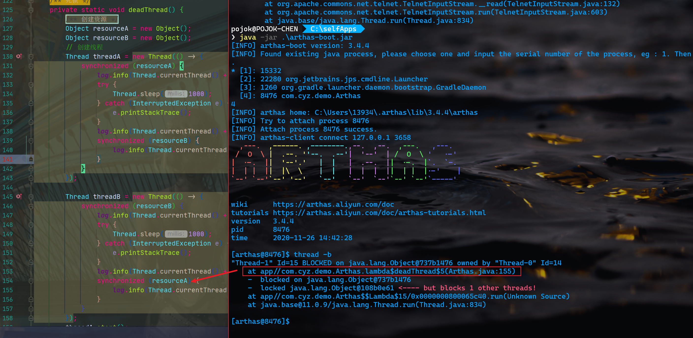

### 反编译

​	假设上面的代码放在了com.cyz.demo包下，在实际环境中，通过日志打印等觉得此时执行的代码不是预想的代码，可以线上反编译当前代码查看。

​	通过` jad [全限定类名]`即可反编译出指定类。

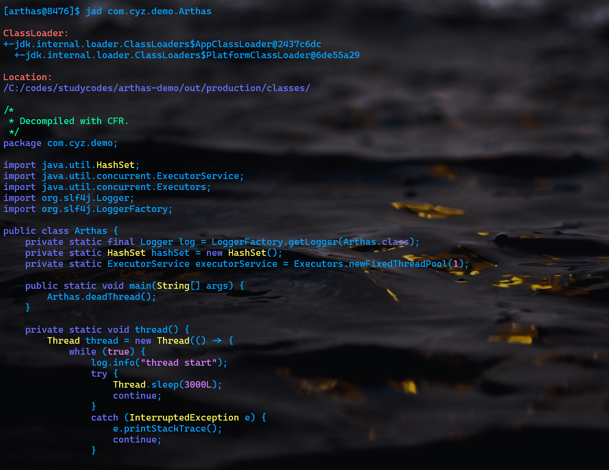

该命令还有一些其它参数：

```shell
# 反编译只显示源码
jad --source-only com.Arthas
# 反编译某个类的某个方法
jad --source-only com.Arthas thread
```

### 跟踪方法统计耗时

​	定义下面一个springboot的web例子：

```java
package com.cyz.hellospringboot;

import org.springframework.boot.SpringApplication;
import org.springframework.boot.autoconfigure.SpringBootApplication;
import org.springframework.web.bind.annotation.RequestMapping;
import org.springframework.web.bind.annotation.RestController;

@SpringBootApplication
@RestController
public class HelloSpringBootApplication {

    public static void main(String[] args) {
        SpringApplication.run(HelloSpringBootApplication.class, args);
    }

    @RequestMapping("/hello")
    public String hello() {
        select_redis();
        select_sql();
        return "hello spring";
    }

    /**
     * 模拟查询
     */
    private void select_sql() {
        int count = 0;
        for (int i = 0; i < 100000; i++) {
            count += i;
        }
        System.out.println("service  end " + count);
    }

    /**
     * 模拟查询
     */
    private void select_redis() {
        int count = 0;
        for (int i = 0; i < 10; i++) {
            count += i;
        }
        System.out.println("service  end " + count);
    }

}

```

其中有两个方法模拟查询操作，然后统计访问接口/hello的耗时。

​	使用`trace [类全限定名] [方法名]`即可统计某个类某个方法的执行时长。

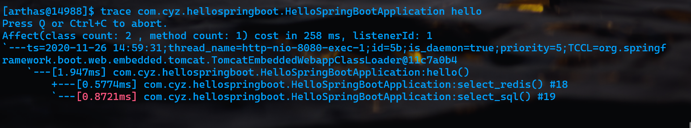

### 运行时修改日志打印级别

​	通过Arthas提供的` logger`命令，我们可以更改线上日志的打印级别，而不必手动更改日志打印级别后再重新发布上线。

​	`logger`命令可以打印出当前系统的全局日志信息。

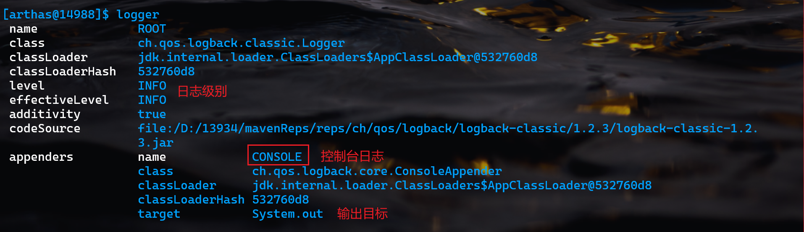

其中appenders即为日志配置文件中的appender配置。

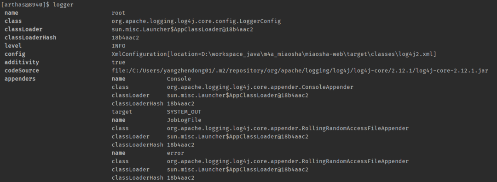

可以使用如下命令来修改名称为ROOT的logger的日志级别为debug级别：

```shell
logger --name ROOT --level debug
```

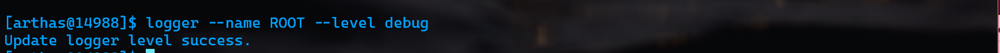

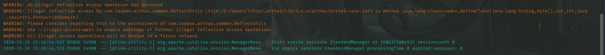

从后面的控制台输出上可以看出，这里是通过字节码增强技术来实时对应用程序进行操作的。